# AI 서비스 세부 플로우 가이드

> **LogLens AI Service** - 상세 기능 플로우 및 아키텍처 문서
> 위치: `/mnt/c/SSAFY/third_project/AI/S13P31A306`
> 최종 업데이트: 2025-11-18

---

## 목차

1. [개요](#1-개요)
2. [API 엔드포인트 전체 맵](#2-api-엔드포인트-전체-맵)
3. [핵심 기능별 세부 플로우](#3-핵심-기능별-세부-플로우)
   - [3.1 로그 분석 (V2 LangGraph) - 3-Tier 캐싱 전략](#31-로그-분석-v2-langgraph---3-tier-캐싱-전략)
   - [3.2 RAG 챗봇 (V2 Agent) - ReAct 아키텍처](#32-rag-챗봇-v2-agent---react-아키텍처)
   - [3.3 HTML 문서 생성](#33-html-문서-생성)
   - [3.4 AI vs DB 통계 비교](#34-ai-vs-db-통계-비교)
4. [LangChain/LangGraph 아키텍처](#4-langchainlanggraph-아키텍처)
5. [40+ 도구 완전 분석](#5-40-도구-완전-분석)
6. [데이터 플로우 및 통합](#6-데이터-플로우-및-통합)
7. [환경 설정 및 구성](#7-환경-설정-및-구성)
8. [시퀀스 다이어그램 모음](#8-시퀀스-다이어그램-모음)
9. [성능 최적화 및 모범 사례](#9-성능-최적화-및-모범-사례)

---

## 1. 개요

### 1.1 AI 서비스란?

LogLens AI 서비스는 **FastAPI 기반의 지능형 로그 분석 플랫폼**으로, 다음 핵심 기능을 제공합니다:

- 🤖 **AI 기반 로그 분석**: GPT-4o mini를 활용한 자동 에러 원인 분석 및 해결책 제시
- 💬 **RAG 챗봇**: 40+ 전문 도구를 활용한 자연어 로그 질의응답
- 📊 **HTML 문서 자동 생성**: 프로젝트/에러 분석 리포트 생성
- 📈 **AI vs DB 통계 비교**: LLM 추론 정확도 검증

### 1.2 기술 스택

| 구성 요소 | 기술 | 버전 |
|---------|------|------|
| **Framework** | FastAPI | 0.109.0 |
| **AI Orchestration** | LangChain | 0.2.16 |
| **Workflow Engine** | LangGraph | 0.2.28 |
| **LLM** | OpenAI GPT-4o mini | - |
| **Embeddings** | text-embedding-3-large | 1536 dims |
| **Vector DB** | OpenSearch (KNN) | 2.4.2 |
| **Template Engine** | Jinja2 | 3.1.2 |
| **Runtime** | Python | 3.11 |

### 1.3 전체 아키텍처 개요

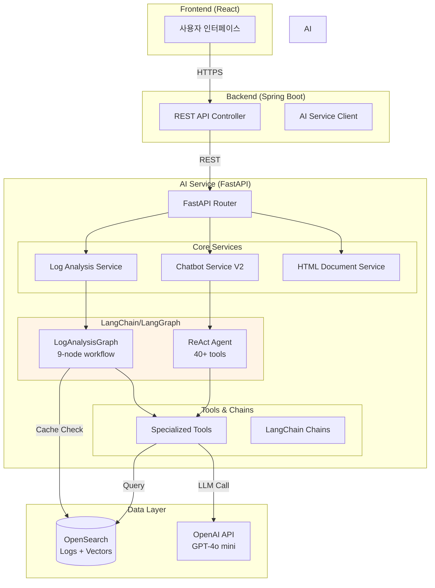

### 1.4 주요 특징

#### ✨ 3-Tier 캐싱 전략
- **Direct Cache**: 이미 분석된 로그 재사용
- **Trace Cache**: 동일 trace의 다른 로그 분석 재사용
- **Similarity Cache**: 벡터 유사도 0.92 이상인 로그 분석 재사용
- **효과**: 97-99% 비용 절감

#### 🤖 자율 에이전트 시스템
- **ReAct 패턴**: Reasoning + Acting
- **40+ 전문 도구**: 검색, 분석, 모니터링, 성능, 패턴 탐지 등
- **자동 도구 선택**: GPT-4o mini가 상황에 맞는 도구 자동 선택

#### 🔄 Map-Reduce 패턴
- **대용량 로그 처리**: 100개 로그를 5개씩 청크로 분할
- **병렬 처리**: 각 청크 독립 분석 후 통합
- **토큰 최적화**: 단일 호출 대비 효율적

#### ✅ 검증 파이프라인
- **한국어 검증**: 90% 이상 한국어 문자 포함 확인
- **품질 검증**: 구조적 완전성, 내용 정확성 평가
- **재시도 로직**: 최대 2회 재분석

---

## 2. API 엔드포인트 전체 맵

### 2.1 버전별 API 구조

```
/api
├── /v1                        # 기본 분석 (초기 버전)
│   ├── /logs/{log_id}/analysis
│   ├── /chatbot/ask
│   └── /chatbot/ask/stream
│
├── /v2                        # ReAct Agent 챗봇
│   ├── /chatbot/ask
│   └── /chatbot/ask/stream
│
└── /v2-langgraph              # LangGraph 기반 고급 분석
    ├── /logs/{log_id}/analysis
    ├── /analysis
    │   ├── /projects/html-document
    │   └── /errors/html-document
    └── /statistics
        ├── /compare
        └── /hourly
```

### 2.2 전체 엔드포인트 상세

| 메소드 | 엔드포인트 | 설명 | 파일 | 주요 기능 |
|--------|-----------|------|------|----------|
| **V1 APIs** |
| `GET` | `/api/v1/logs/{log_id}/analysis` | 기본 로그 분석 | `app/api/v1/logs.py:85` | Trace 캐싱, 유사도 검색 |
| `POST` | `/api/v1/chatbot/ask` | 기본 챗봇 | `app/api/v1/chatbot.py:171` | RAG QA 캐싱 |
| `POST` | `/api/v1/chatbot/ask/stream` | 기본 챗봇 (스트리밍) | `app/api/v1/chatbot.py:314` | SSE 스트리밍 |
| **V2 APIs (Agent)** |
| `POST` | `/api/v2/chatbot/ask` | ReAct Agent 챗봇 | `app/api/v2/chatbot.py:209` | 40+ 도구, 자율 추론 |
| `POST` | `/api/v2/chatbot/ask/stream` | Agent 챗봇 (스트리밍) | `app/api/v2/chatbot.py:314` | SSE + Agent 추론 |
| **V2 LangGraph APIs** |
| `GET` | `/api/v2-langgraph/logs/{log_id}/analysis` | LangGraph 로그 분석 | `app/api/v2_langgraph/logs.py:18` | 3-tier 캐싱, Map-Reduce |
| `POST` | `/api/v2-langgraph/analysis/projects/html-document` | 프로젝트 분석 문서 | `app/api/v2_langgraph/analysis.py:21` | Jinja2 HTML 생성 |
| `POST` | `/api/v2-langgraph/analysis/errors/html-document` | 에러 분석 문서 | `app/api/v2_langgraph/analysis.py:189` | 에러 리포트 생성 |
| `GET` | `/api/v2-langgraph/statistics/compare` | AI vs DB 비교 | `app/api/v2_langgraph/statistics.py:104` | 정확도 검증 |
| `GET` | `/api/v2-langgraph/statistics/hourly` | 시간별 통계 | `app/api/v2_langgraph/statistics.py:290` | 시간대별 분포 |

### 2.3 API 버전 선택 가이드

```mermaid
graph TD
    Start{어떤 기능이 필요한가?}

    Start -->|단일 로그 AI 분석| V2LG[✅ V2 LangGraph<br/>/logs/{id}/analysis]
    Start -->|자연어 질의응답| V2Agent[✅ V2 Agent<br/>/chatbot/ask/stream]
    Start -->|분석 리포트 생성| V2Doc[✅ V2 LangGraph<br/>/analysis/.../html-document]
    Start -->|AI 정확도 검증| V2Stats[✅ V2 LangGraph<br/>/statistics/compare]

    V2LG --> Features1[• 3-tier 캐싱<br/>• Map-Reduce<br/>• 검증 파이프라인]
    V2Agent --> Features2[• 40+ 도구<br/>• 자율 추론<br/>• 실시간 스트리밍]
    V2Doc --> Features3[• Jinja2 템플릿<br/>• Chart.js 차트<br/>• AI 인사이트]
    V2Stats --> Features4[• 층화 샘플링<br/>• 정확도 계산<br/>• 신뢰도 평가]

    style V2LG fill:#d4edda
    style V2Agent fill:#d4edda
    style V2Doc fill:#d4edda
    style V2Stats fill:#d4edda
```

**권장사항:**
- ✅ **V2 LangGraph**: 로그 분석, 문서 생성 → 가장 고급 기능
- ✅ **V2 Agent**: 챗봇 → 자율적 도구 선택
- ⚠️ **V1**: 레거시, 새 기능 개발 중단

---

## 3. 핵심 기능별 세부 플로우

## 3.1 로그 분석 (V2 LangGraph) - 3-Tier 캐싱 전략

### 3.1.1 전체 플로우 다이어그램

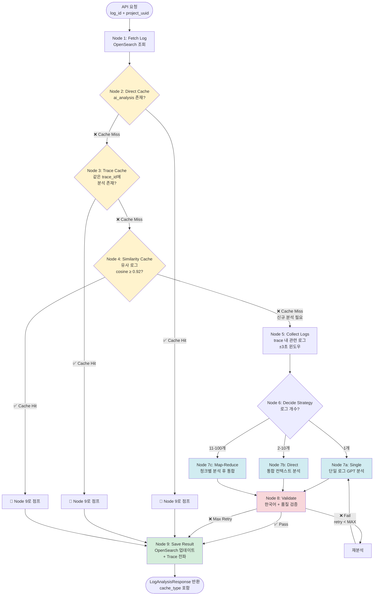

### 3.1.2 노드별 상세 설명

#### **Node 1: Fetch Log** (`_fetch_log_node` - `app/graphs/log_analysis_graph.py:148`)

**목적**: OpenSearch에서 요청된 로그 데이터 조회

**입력**:
```python
state = {
    "log_id": 12345,
    "project_uuid": "3a73c7d4-8176-3929-b72f-d5b921daae67"
}
```

**OpenSearch 쿼리**:
```json
{
  "query": {
    "bool": {
      "must": [
        {"term": {"log_id": 12345}},
        {"term": {"project_uuid.keyword": "3a73c7d4-8176-3929-b72f-d5b921daae67"}}
      ]
    }
  },
  "size": 1
}
```

**출력**:
```python
{
    "log_data": {
        "log_id": 12345,
        "timestamp": "2025-11-18T10:30:00.123Z",
        "level": "ERROR",
        "message": "NullPointerException at UserService.getUser()",
        "service_name": "user-service",
        "component_name": "UserController",
        "trace_id": "abc123-def456",
        "log_details": {
            "class_name": "com.example.UserController",
            "method_name": "getUser",
            "line_number": 45,
            "stack_trace": "java.lang.NullPointerException\n\tat com.example..."
        }
    },
    "trace_id": "abc123-def456",
    "timestamp": "2025-11-18T10:30:00.123Z",
    "log_message": "NullPointerException at UserService.getUser()",
    "log_level": "ERROR"
}
```

**에러 처리**:
- 로그 미발견 시: `{"error": "Log not found"}` → 즉시 종료

---

#### **Node 2: Direct Cache Check** (`_check_direct_cache_node` - `app/graphs/log_analysis_graph.py:197`)

**목적**: 요청한 로그 자체에 이미 `ai_analysis` 필드가 있는지 확인

**도구**: `cache_tools.create_check_direct_cache_tool()`

**OpenSearch 쿼리**:
```json
{
  "query": {
    "bool": {
      "must": [
        {"term": {"log_id": 12345}},
        {"term": {"project_uuid.keyword": "3a73c7d4-8176-3929-b72f-d5b921daae67"}},
        {"exists": {"field": "ai_analysis"}}
      ]
    }
  }
}
```

**Cache Hit 예시**:
```python
{
    "direct_cache_result": {
        "summary": "**NullPointerException** 발생",
        "error_cause": "user_id에 해당하는 User 객체 null",
        "solution": "### 즉시 조치\n- null 체크 추가",
        "tags": ["SEVERITY_HIGH", "NullPointerException"]
    },
    "from_cache": True,
    "cache_type": "direct"
}
```

**다음 노드**:
- ✅ Cache Hit → **Node 9 (Save Result)로 점프**
- ❌ Cache Miss → Node 3으로 진행

**성능**:
- 평균 응답 시간: ~50ms
- 비용: $0 (LLM 호출 없음)

---

#### **Node 3: Trace Cache Check** (`_check_trace_cache_node` - `app/graphs/log_analysis_graph.py:234`)

**목적**: 동일 `trace_id`를 가진 다른 로그 중 분석이 있는지 확인

**도구**: `cache_tools.create_check_trace_cache_tool()`

**로직**:
```python
# 같은 trace의 다른 로그 중 ai_analysis가 있는 로그 검색
query = {
    "query": {
        "bool": {
            "must": [
                {"term": {"trace_id.keyword": "abc123-def456"}},
                {"term": {"project_uuid.keyword": "..."}},
                {"exists": {"field": "ai_analysis"}}
            ],
            "must_not": [
                {"term": {"log_id": 12345}}  # 자기 자신 제외
            ]
        }
    },
    "size": 1
}
```

**왜 유효한가?**
- 동일 trace의 로그들은 **같은 요청 흐름**에서 발생
- 에러 원인과 해결책이 **동일한 컨텍스트**
- 예: Controller → Service → Repository 순서의 에러 전파

**Cache Hit 예시**:
```python
{
    "trace_cache_result": {
        "cached_from_log_id": 12346,  # 형제 로그
        "summary": "DB 연결 타임아웃으로 인한 NullPointerException",
        "error_cause": "HikariCP connection timeout 30s 초과",
        "solution": "...",
        "tags": ["SEVERITY_HIGH", "DatabaseTimeout"]
    },
    "from_cache": True,
    "cache_type": "trace"
}
```

**다음 노드**:
- ✅ Cache Hit → **Node 9로 점프**
- ❌ Cache Miss (trace_id 없음 or 형제 로그 미분석) → Node 4로 진행

---

#### **Node 4: Similarity Cache Check** (`_check_similarity_cache_node` - `app/graphs/log_analysis_graph.py:267`)

**목적**: 벡터 유사도가 높은 로그의 분석 재사용

**도구**: `cache_tools.create_check_similarity_cache_tool()`

**단계별 프로세스**:

**Step 1: 임베딩 생성**
```python
from app.services.embedding_service import embedding_service

log_message = "NullPointerException at UserService.getUser()"
log_vector = await embedding_service.embed_query(log_message)
# 결과: [0.123, -0.456, 0.789, ..., 0.234]  # 1536 차원
```

**Step 2: 메타데이터 필터 설정**
```python
metadata_filter = {
    "level": "ERROR",              # 동일 로그 레벨
    "service_name": "user-service", # 동일 서비스
    "source_type": "BE"            # 동일 소스 (FE/BE)
}
```

**Step 3: KNN 벡터 검색**
```json
{
  "size": 10,
  "query": {
    "script_score": {
      "query": {
        "bool": {
          "must": [
            {"term": {"project_uuid.keyword": "..."}},
            {"exists": {"field": "ai_analysis"}},
            {"term": {"level": "ERROR"}},
            {"term": {"service_name": "user-service"}},
            {"term": {"source_type": "BE"}}
          ],
          "must_not": [
            {"term": {"log_id": 12345}}
          ]
        }
      },
      "script": {
        "source": "cosineSimilarity(params.query_vector, 'log_vector') + 1.0",
        "params": {"query_vector": [0.123, -0.456, ...]}
      }
    }
  }
}
```

**Step 4: 임계값 필터링**
```python
SIMILARITY_THRESHOLD = 0.92  # config.py:34

for hit in results["hits"]["hits"]:
    similarity_score = (hit["_score"] - 1.0)  # +1.0 오프셋 제거

    if similarity_score >= SIMILARITY_THRESHOLD:
        return {
            "similarity_cache_result": hit["_source"]["ai_analysis"],
            "similar_log_id": hit["_source"]["log_id"],
            "similarity_score": similarity_score,
            "from_cache": True,
            "cache_type": "similarity"
        }
```

**Cosine Similarity 계산**:
```
cos(θ) = (A · B) / (||A|| × ||B||)

예시:
Vector A (요청 로그): [0.5, 0.3, 0.2, ...]
Vector B (캐시 로그): [0.51, 0.29, 0.21, ...]

cos(θ) = 0.947 ✅ (임계값 0.92 초과 → Cache Hit)
```

**유사도 임계값 선택 근거**:

| 임계값 | 의미 | 결과 |
|--------|------|------|
| **0.92** | 거의 동일한 에러 | ✅ 정확도 높음, 재사용 안전 |
| 0.85 | 유사한 에러 | ⚠️ 일부 오탐 가능 |
| 0.70 | 관련 있는 에러 | ❌ 오탐 높음, 부적합 |

**Cache Hit 예시**:
```python
{
    "similarity_cache_result": {
        "summary": "**NullPointerException** 발생",
        "error_cause": "userId 파라미터 null 체크 누락",
        "solution": "...",
        "tags": ["SEVERITY_HIGH", "NullPointerException"]
    },
    "similar_log_id": 12340,
    "similarity_score": 0.947,
    "from_cache": True,
    "cache_type": "similarity"
}
```

**다음 노드**:
- ✅ Cache Hit → **Node 9로 점프**
- ❌ Cache Miss → Node 5로 진행 (신규 분석 필요)

**성능**:
- 평균 검색 시간: ~100ms (HNSW 알고리즘)
- 임베딩 생성 비용: ~$0.00013/1K tokens

---

#### **Node 5: Collect Logs** (`_collect_logs_node` - `app/graphs/log_analysis_graph.py:330`)

**목적**: Trace 기반 관련 로그 수집 (컨텍스트 확보)

**도구**: `analysis_tools.create_collect_trace_logs_tool()`

**수집 전략**:
```python
# 중심 로그 시간 기준 ±3초 윈도우
center_timestamp = "2025-11-18T10:30:00.123Z"
time_window = {
    "gte": center_timestamp - 3_seconds,  # 10:29:57
    "lte": center_timestamp + 3_seconds   # 10:30:03
}
```

**OpenSearch 쿼리**:
```json
{
  "query": {
    "bool": {
      "must": [
        {"term": {"trace_id.keyword": "abc123-def456"}},
        {"term": {"project_uuid.keyword": "..."}},
        {"range": {"timestamp": {
          "gte": "2025-11-18T10:29:57.123Z",
          "lte": "2025-11-18T10:30:03.123Z"
        }}}
      ]
    }
  },
  "size": 100,
  "sort": [{"timestamp": "asc"}]
}
```

**수집 결과 예시**:
```python
{
    "related_logs": [
        {
            "log_id": 12344,
            "timestamp": "2025-11-18T10:29:59.500Z",
            "level": "INFO",
            "message": "GET /api/users/12345 request received",
            "component_name": "UserController"
        },
        {
            "log_id": 12345,
            "timestamp": "2025-11-18T10:30:00.123Z",
            "level": "ERROR",
            "message": "NullPointerException at UserService.getUser()",
            "component_name": "UserService"
        },
        {
            "log_id": 12346,
            "timestamp": "2025-11-18T10:30:00.234Z",
            "level": "ERROR",
            "message": "500 Internal Server Error",
            "component_name": "UserController"
        }
    ],
    "log_count": 3
}
```

**시간 윈도우 선택 근거**:
- ✅ **±3초**: 대부분의 요청은 3초 내 완료
- ⚠️ ±1초: 느린 요청 누락 가능
- ❌ ±10초: 무관한 로그 포함 가능

**다음 노드**: Node 6 (전략 결정)

---

#### **Node 6: Decide Strategy** (`_decide_strategy_node` - `app/graphs/log_analysis_graph.py:369`)

**목적**: 로그 개수에 따른 최적 분석 전략 선택

**의사결정 로직**:
```python
MAP_REDUCE_THRESHOLD = 10  # config.py:28

if log_count == 1:
    analysis_method = "single"
elif log_count <= MAP_REDUCE_THRESHOLD:
    analysis_method = "direct"
else:
    analysis_method = "map_reduce"
```

**전략 비교**:

| 전략 | 로그 개수 | LLM 호출 | 토큰 사용 | 속도 | 정확도 |
|------|----------|---------|---------|------|--------|
| **Single** | 1개 | 1회 | ~500 tokens | ⚡ 빠름 | ⭐⭐⭐ 높음 |
| **Direct** | 2-10개 | 1회 | ~2000 tokens | ⚡ 빠름 | ⭐⭐⭐⭐ 매우 높음 |
| **Map-Reduce** | 11-100개 | N+1회 | ~N×500 tokens | 🐢 느림 | ⭐⭐⭐⭐⭐ 최고 |

**출력**:
```python
{
    "analysis_method": "direct",  # or "single", "map_reduce"
    "log_count": 3
}
```

**다음 노드**: Node 7a/7b/7c (선택된 전략)

---

#### **Node 7a: Single Log Analysis** (`_analyze_node` - `app/graphs/log_analysis_graph.py:386`)

**목적**: 단일 로그 직접 분석

**도구**: `analysis_tools.create_analyze_single_log_tool()`

**프롬프트**:
```python
prompt = f"""당신은 로그 분석 전문가입니다.
다음 로그를 분석하고 JSON 형식으로 응답하세요.

로그 데이터:
```json
{{
    "timestamp": "2025-11-18T10:30:00.123Z",
    "level": "ERROR",
    "message": "NullPointerException at UserService.getUser()",
    "service_name": "user-service",
    "component_name": "UserController",
    "log_details": {{
        "class_name": "com.example.UserController",
        "method_name": "getUser",
        "stack_trace": "java.lang.NullPointerException\\n\\tat com.example.UserService.getUser(UserService.java:45)"
    }}
}}
```

분석 요구사항:
1. **summary**: 에러를 1-2문장으로 요약 (한국어, 마크다운 **굵게** 강조 사용)
2. **error_cause**: 발생 원인을 상세히 설명 (2-3문장)
3. **solution**: 해결 방법을 3단계로 제시
   - 즉시 조치 (1시간 이내)
   - 단기 조치 (1일 이내)
   - 장기 조치 (1주 이내)
   각 단계는 체크리스트 형식 (- [ ] ...)
4. **tags**: 분류 태그 (예: SEVERITY_HIGH, NullPointerException, UserService)

응답 형식 (JSON만):
{{
    "summary": "**에러명** 간단 설명",
    "error_cause": "원인 상세 설명",
    "solution": "### 즉시 조치 (1시간)\\n- [ ] 조치1\\n### 단기 조치 (1일)\\n- [ ] 조치2",
    "tags": ["SEVERITY_X", "ErrorType", "Component"]
}}
"""

llm = ChatOpenAI(model="gpt-4o-mini", temperature=0.3)
response = await llm.ainvoke(prompt)
```

**LLM 응답 예시**:
```json
{
    "summary": "**NullPointerException**이 UserService.getUser() 메소드에서 발생했습니다.",
    "error_cause": "user_id 파라미터로 데이터베이스를 조회했으나 해당하는 User 객체가 존재하지 않아 null이 반환되었고, null 체크 없이 객체 접근을 시도하여 NullPointerException이 발생했습니다.",
    "solution": "### 즉시 조치 (1시간)\n- [ ] UserService.getUser() 메소드에 null 체크 추가\n- [ ] null 발견 시 UserNotFoundException throw\n\n### 단기 조치 (1일)\n- [ ] Optional<User> 반환 타입으로 변경\n- [ ] Controller 레이어에 입력 검증 추가\n\n### 장기 조치 (1주)\n- [ ] 전역 Exception Handler 개선\n- [ ] 데이터베이스 인덱스 최적화로 조회 성능 향상",
    "tags": ["SEVERITY_HIGH", "NullPointerException", "UserService", "DataAccess"]
}
```

**출력**:
```python
{
    "analysis_result": {...},  # 위 JSON
    "llm_call_count": 1
}
```

---

#### **Node 7b: Direct Analysis** (`_analyze_node` - `app/graphs/log_analysis_graph.py:410`)

**목적**: 2-10개 로그를 통합 컨텍스트로 분석

**도구**: `analysis_tools.create_analyze_logs_direct_tool()`

**프롬프트**:
```python
prompt = f"""당신은 로그 분석 전문가입니다.
다음은 하나의 trace에 속한 {log_count}개의 로그입니다.
시간 순서대로 정렬되어 있으며, 중심 로그(⭐)를 중점으로 분석하세요.

중심 로그 (⭐):
```json
{{
    "timestamp": "2025-11-18T10:30:00.123Z",
    "level": "ERROR",
    "message": "NullPointerException at UserService.getUser()",
    ...
}}
```

관련 로그 ({log_count - 1}개):
1. [INFO] 2025-11-18T10:29:59.500Z | GET /api/users/12345 request received
2. [ERROR] 2025-11-18T10:30:00.234Z | 500 Internal Server Error

분석 시 고려사항:
- 중심 로그가 발생한 컨텍스트를 관련 로그에서 파악
- 에러 전파 경로 (Controller → Service → Repository)
- 요청부터 에러까지의 흐름

응답 형식 (JSON만):
{{
    "summary": "...",
    "error_cause": "...",
    "solution": "...",
    "tags": [...]
}}
"""

llm = ChatOpenAI(model="gpt-4o-mini", temperature=0.3)
response = await llm.ainvoke(prompt)
```

**장점**:
- ✅ 요청 흐름 전체 파악
- ✅ 에러 전파 경로 추적
- ✅ 컨텍스트 기반 정확한 원인 분석

---

#### **Node 7c: Map-Reduce Analysis** (`_analyze_node` - `app/graphs/log_analysis_graph.py:450`)

**목적**: 11-100개 대용량 로그 효율적 분석

**도구**: `analysis_tools.create_analyze_with_map_reduce_tool()`

**Map-Reduce 패턴**:

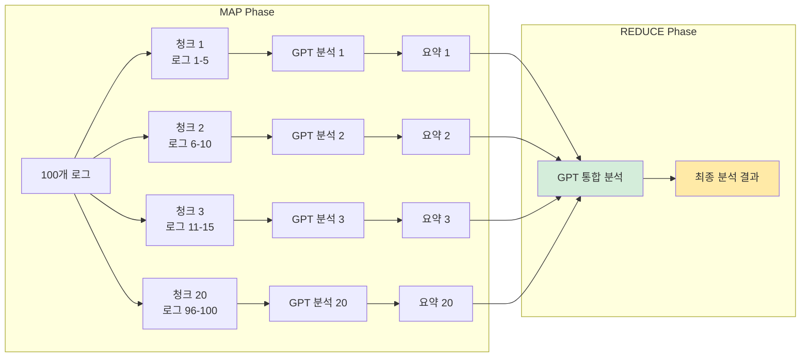

**구현 코드**:
```python
LOG_CHUNK_SIZE = 5  # config.py:29

# MAP Phase: 청크별 요약
chunk_summaries = []
for i in range(0, len(related_logs), LOG_CHUNK_SIZE):
    chunk = related_logs[i:i + LOG_CHUNK_SIZE]

    map_prompt = f"""다음 {len(chunk)}개 로그를 간단히 요약하세요 (1-2문장):
```
{format_logs(chunk)}
```
"""

    summary = await llm.ainvoke(map_prompt)
    chunk_summaries.append(summary.content)

# REDUCE Phase: 통합 분석
reduce_prompt = f"""다음은 {len(chunk_summaries)}개 청크의 요약입니다:

{chr(10).join(f"{i+1}. {s}" for i, s in enumerate(chunk_summaries))}

중심 로그:
```json
{center_log}
```

위 요약들과 중심 로그를 종합하여 최종 분석을 JSON 형식으로 작성하세요:
{{
    "summary": "...",
    "error_cause": "...",
    "solution": "...",
    "tags": [...]
}}
"""

final_result = await llm.ainvoke(reduce_prompt)
```

**성능 비교**:

| 방식 | 100개 로그 처리 | 토큰 사용 | 시간 | 비용 |
|------|----------------|---------|------|------|
| **Direct** | 1회 호출 | ~20,000 tokens | ~5초 | ~$0.03 |
| **Map-Reduce** | 21회 호출 (20+1) | ~10,000 tokens | ~15초 | ~$0.015 |

**장점**:
- ✅ 토큰 제한 회피 (GPT-4 8K 제한)
- ✅ 비용 절감 (중복 제거된 요약만 사용)
- ✅ 병렬 처리 가능 (MAP 단계)

**단점**:
- ⚠️ 시간 증가 (21회 API 호출)
- ⚠️ 요약 과정에서 일부 정보 손실 가능

---

#### **Node 8: Validate** (`_validate_node` - `app/graphs/log_analysis_graph.py:440`)

**목적**: 분석 결과 품질 검증 및 재시도

**검증 파이프라인**:

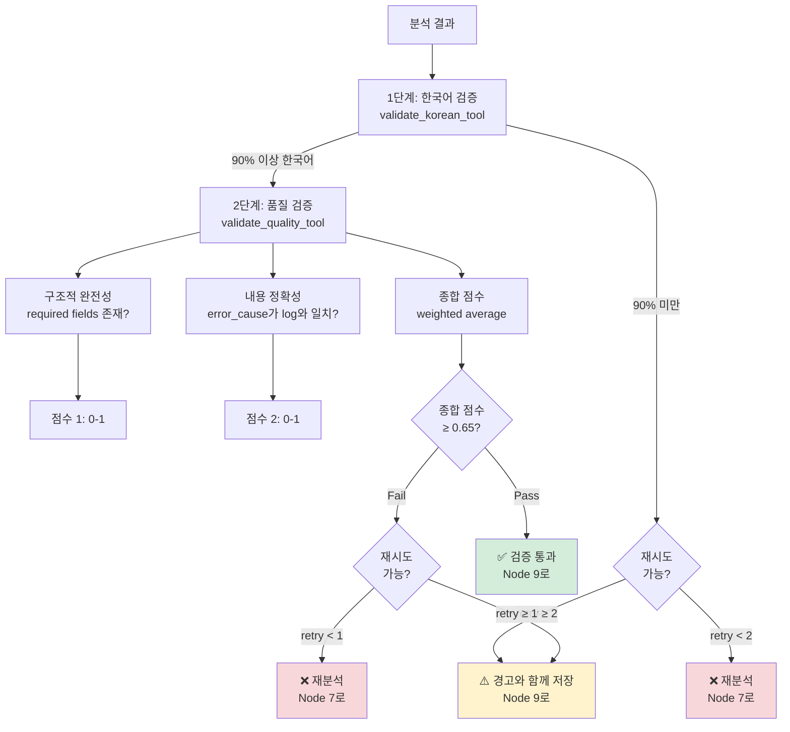

**1단계: 한국어 검증** (`validation_tools.create_validate_korean_tool()`)

```python
def check_korean_percentage(text: str) -> float:
    """한국어 문자 비율 계산"""
    korean_chars = 0
    total_chars = 0

    for char in text:
        if char.strip():  # 공백 제외
            total_chars += 1
            # 한글 유니코드 범위: AC00-D7A3
            if '\uAC00' <= char <= '\uD7A3':
                korean_chars += 1

    if total_chars == 0:
        return 0.0

    return (korean_chars / total_chars) * 100

korean_percentage = check_korean_percentage(analysis_result["summary"])
korean_valid = korean_percentage >= 90.0
```

**2단계: 품질 검증** (`validation_tools.create_validate_quality_tool()`)

```python
def validate_quality(analysis_result, log_data) -> dict:
    """구조적 + 내용 품질 검증"""

    # 1. 구조적 완전성 (0-1 점수)
    required_fields = ["summary", "error_cause", "solution", "tags"]
    has_all_fields = all(field in analysis_result for field in required_fields)

    summary_valid = len(analysis_result.get("summary", "")) >= 10
    error_cause_valid = len(analysis_result.get("error_cause", "")) >= 20
    solution_valid = "###" in analysis_result.get("solution", "")  # 마크다운 헤더 존재
    tags_valid = len(analysis_result.get("tags", [])) >= 2

    structural_score = sum([
        has_all_fields,
        summary_valid,
        error_cause_valid,
        solution_valid,
        tags_valid
    ]) / 5.0

    # 2. 내용 정확성 (0-1 점수)
    log_message = log_data.get("message", "")
    error_cause = analysis_result.get("error_cause", "")

    # 로그 메시지의 주요 키워드가 error_cause에 포함되는지 확인
    keywords = extract_keywords(log_message)  # 예: ["NullPointerException", "UserService", "getUser"]
    keyword_matches = sum(1 for kw in keywords if kw.lower() in error_cause.lower())
    content_score = min(keyword_matches / len(keywords), 1.0) if keywords else 0.5

    # 3. 종합 점수 (가중평균)
    overall_score = (
        structural_score * 0.6 +
        content_score * 0.4
    )

    return {
        "structural_score": structural_score,
        "content_score": content_score,
        "overall_score": overall_score,
        "passed": overall_score >= 0.65
    }
```

**검증 임계값**:

| 검증 항목 | 임계값 | 설정 파일 | 의미 |
|----------|--------|----------|------|
| **한국어 비율** | ≥ 90% | - | 사용자에게 한국어로 제공 |
| **구조 점수** | ≥ 0.7 | `VALIDATION_STRUCTURAL_THRESHOLD` | 필수 필드 완전성 |
| **내용 점수** | ≥ 0.6 | `VALIDATION_CONTENT_THRESHOLD` | 로그와 분석 일치도 |
| **종합 점수** | ≥ 0.65 | `VALIDATION_OVERALL_THRESHOLD` | 최종 품질 기준 |

**재시도 로직**:
```python
MAX_KOREAN_RETRIES = 2  # config.py
MAX_VALIDATION_RETRIES = 1  # config.py

if not korean_valid:
    if state["korean_retry_count"] < MAX_KOREAN_RETRIES:
        return {
            "korean_retry_count": state["korean_retry_count"] + 1,
            "next": "analyze"  # 재분석
        }
    else:
        return {
            "error": "Korean validation failed after max retries",
            "next": "save_result"  # 경고와 함께 저장
        }

if not quality_passed:
    if state["validation_retry_count"] < MAX_VALIDATION_RETRIES:
        return {
            "validation_retry_count": state["validation_retry_count"] + 1,
            "next": "analyze"
        }
    else:
        return {
            "error": "Quality validation failed after max retries",
            "next": "save_result"
        }

return {
    "korean_valid": True,
    "quality_score": overall_score,
    "next": "save_result"
}
```

**출력**:
```python
{
    "korean_valid": True,
    "quality_score": 0.78,
    "final_analysis": {
        "summary": "**NullPointerException**이 발생...",
        "error_cause": "...",
        "solution": "...",
        "tags": [...]
    }
}
```

---

#### **Node 9: Save Result** (`_save_result_node` - `app/graphs/log_analysis_graph.py:500`)

**목적**: 분석 결과를 OpenSearch에 저장 및 Trace 전파

**저장 프로세스**:

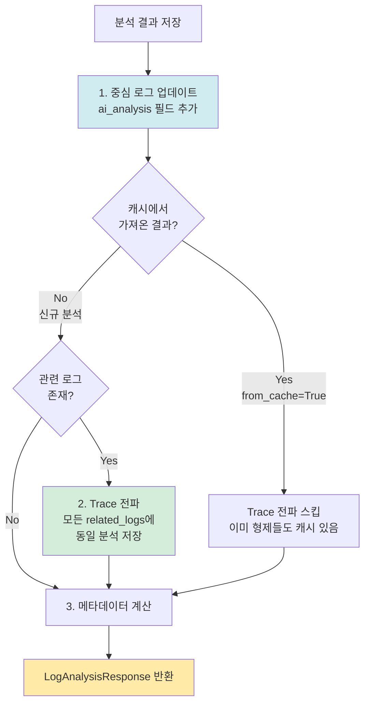

**1. 중심 로그 업데이트**:
```python
# OpenSearch update_by_query
opensearch_client.update_by_query(
    index=f"{project_uuid.replace('-', '_')}_*",
    body={
        "script": {
            "source": """
                ctx._source.ai_analysis = params.analysis;
                ctx._source.analysis_type = params.analysis_type;
                ctx._source.analyzed_at = params.analyzed_at;
            """,
            "params": {
                "analysis": final_analysis,
                "analysis_type": "TRACE_BASED" if log_count > 1 else "SINGLE",
                "analyzed_at": datetime.utcnow().isoformat() + "Z"
            }
        },
        "query": {
            "term": {"log_id": log_id}
        }
    },
    refresh=True  # 즉시 검색 가능하도록
)
```

**2. Trace 전파** (중요!):
```python
# 신규 분석인 경우, 동일 trace의 모든 로그에 전파
if not from_cache and related_logs and len(related_logs) > 1:
    for related_log in related_logs:
        if related_log["log_id"] != log_id:  # 중심 로그 제외
            opensearch_client.update_by_query(
                index=f"{project_uuid.replace('-', '_')}_*",
                body={
                    "script": {
                        "source": """
                            ctx._source.ai_analysis = params.analysis;
                            ctx._source.analysis_type = params.analysis_type;
                            ctx._source.analyzed_at = params.analyzed_at;
                            ctx._source.cached_from_log_id = params.cached_from_log_id;
                        """,
                        "params": {
                            "analysis": final_analysis,
                            "analysis_type": "TRACE_CACHED",
                            "analyzed_at": datetime.utcnow().isoformat() + "Z",
                            "cached_from_log_id": log_id
                        }
                    },
                    "query": {
                        "term": {"log_id": related_log["log_id"]}
                    }
                },
                refresh=True
            )
```

**왜 Trace 전파가 중요한가?**
- ✅ 다음 요청 시 **Node 2 (Direct Cache)** 또는 **Node 3 (Trace Cache)**에서 즉시 Hit
- ✅ 동일 trace의 다른 로그도 분석 재사용 가능
- ✅ 비용 절감 효과 극대화 (1회 분석으로 N개 로그 커버)

**3. 메타데이터 계산**:
```python
finished_at = datetime.utcnow()
started_at = state["started_at"]
total_duration_ms = (finished_at - started_at).total_seconds() * 1000

metadata = {
    "started_at": started_at.isoformat() + "Z",
    "finished_at": finished_at.isoformat() + "Z",
    "total_duration_ms": int(total_duration_ms),
    "llm_call_count": state.get("llm_call_count", 0),
    "cache_check_duration_ms": state.get("cache_check_duration_ms", 0),
    "analysis_duration_ms": state.get("analysis_duration_ms", 0),
    "validation_retry_count": state.get("validation_retry_count", 0)
}
```

**최종 응답**:
```python
return LogAnalysisResponse(
    log_id=log_id,
    analysis=final_analysis,
    from_cache=from_cache,
    cache_type=cache_type,  # "direct" | "trace" | "similarity" | None
    similar_log_id=similar_log_id,
    similarity_score=similarity_score,
    analysis_method=analysis_method,  # "single" | "direct" | "map_reduce"
    related_logs_count=log_count,
    metadata=metadata
)
```

---

### 3.1.3 데이터 구조 상세

#### **LogAnalysisState (StateGraph 상태)**

`app/graphs/state/log_analysis_state.py:10-50`

```python
from typing import TypedDict, Optional, Dict, Any, List

class LogAnalysisState(TypedDict):
    """LangGraph 워크플로우 전체 상태"""

    # === 입력 (API 요청) ===
    log_id: int
    project_uuid: str

    # === Node 1: Fetch Log ===
    log_data: Optional[Dict[str, Any]]
    trace_id: Optional[str]
    timestamp: Optional[str]
    log_message: Optional[str]
    log_level: Optional[str]
    service_name: Optional[str]
    source_type: Optional[str]  # "FE" or "BE"

    # === Node 2-4: Cache Results ===
    direct_cache_result: Optional[Dict]
    trace_cache_result: Optional[Dict]
    similarity_cache_result: Optional[Dict]
    similar_log_id: Optional[int]
    similarity_score: Optional[float]
    from_cache: bool
    cache_type: Optional[str]  # "direct" | "trace" | "similarity"

    # === Node 5: Collect Logs ===
    related_logs: Optional[List[Dict]]
    log_count: int

    # === Node 6-7: Analysis ===
    analysis_method: Optional[str]  # "single" | "direct" | "map_reduce"
    analysis_result: Optional[Dict]

    # === Node 8: Validation ===
    korean_valid: bool
    korean_retry_count: int
    quality_score: Optional[float]
    validation_retry_count: int
    max_korean_retries: int  # 2
    max_validation_retries: int  # 1

    # === Node 9: Final Result ===
    final_analysis: Optional[Dict]
    error: Optional[str]

    # === 메타데이터 ===
    started_at: str
    finished_at: Optional[str]
    total_duration_ms: Optional[int]
    llm_call_count: int
    cache_check_duration_ms: Optional[int]
    analysis_duration_ms: Optional[int]
```

#### **LogAnalysisResponse (API 응답)**

`app/models/log_analysis.py:45-70`

```python
from pydantic import BaseModel, Field
from typing import Optional, List

class LogAnalysisResult(BaseModel):
    """분석 결과 내부 구조"""
    summary: str = Field(..., description="에러 요약 (1-2문장)")
    error_cause: str = Field(..., description="발생 원인 상세")
    solution: str = Field(..., description="해결 방법 (3단계 마크다운)")
    tags: List[str] = Field(..., description="분류 태그")

class LogAnalysisResponse(BaseModel):
    """API 최종 응답"""
    log_id: int
    analysis: LogAnalysisResult

    # 캐싱 정보
    from_cache: bool = Field(default=False, description="캐시 사용 여부")
    cache_type: Optional[str] = Field(None, description="direct|trace|similarity")
    similar_log_id: Optional[int] = Field(None, description="유사 로그 ID (similarity cache)")
    similarity_score: Optional[float] = Field(None, description="유사도 점수 (0-1)")

    # 분석 정보
    analysis_method: Optional[str] = Field(None, description="single|direct|map_reduce")
    related_logs_count: int = Field(default=1, description="분석에 사용된 로그 개수")

    # 메타데이터
    metadata: Dict[str, Any] = Field(default_factory=dict, description="성능 메트릭")
```

**응답 예시 (캐시 미사용)**:
```json
{
  "log_id": 12345,
  "analysis": {
    "summary": "**NullPointerException**이 UserService.getUser() 메소드에서 발생했습니다.",
    "error_cause": "user_id 파라미터로 데이터베이스를 조회했으나 해당하는 User 객체가 존재하지 않아 null이 반환되었고, null 체크 없이 객체 접근을 시도하여 NullPointerException이 발생했습니다.",
    "solution": "### 즉시 조치 (1시간)\n- [ ] UserService.getUser() 메소드에 null 체크 추가\n- [ ] null 발견 시 UserNotFoundException throw\n\n### 단기 조치 (1일)\n- [ ] Optional<User> 반환 타입으로 변경\n- [ ] Controller 레이어에 입력 검증 추가\n\n### 장기 조치 (1주)\n- [ ] 전역 Exception Handler 개선\n- [ ] 데이터베이스 인덱스 최적화로 조회 성능 향상",
    "tags": ["SEVERITY_HIGH", "NullPointerException", "UserService", "DataAccess"]
  },
  "from_cache": false,
  "cache_type": null,
  "similar_log_id": null,
  "similarity_score": null,
  "analysis_method": "direct",
  "related_logs_count": 3,
  "metadata": {
    "started_at": "2025-11-18T10:30:05.000Z",
    "finished_at": "2025-11-18T10:30:08.234Z",
    "total_duration_ms": 3234,
    "llm_call_count": 1,
    "cache_check_duration_ms": 150,
    "analysis_duration_ms": 2500,
    "validation_retry_count": 0
  }
}
```

**응답 예시 (Similarity Cache Hit)**:
```json
{
  "log_id": 12345,
  "analysis": {
    "summary": "**NullPointerException** 발생",
    "error_cause": "userId 파라미터 null 체크 누락",
    "solution": "...",
    "tags": ["SEVERITY_HIGH", "NullPointerException"]
  },
  "from_cache": true,
  "cache_type": "similarity",
  "similar_log_id": 12340,
  "similarity_score": 0.947,
  "analysis_method": null,
  "related_logs_count": 1,
  "metadata": {
    "started_at": "2025-11-18T10:30:05.000Z",
    "finished_at": "2025-11-18T10:30:05.234Z",
    "total_duration_ms": 234,
    "llm_call_count": 0,
    "cache_check_duration_ms": 180,
    "analysis_duration_ms": 0,
    "validation_retry_count": 0
  }
}
```

---

### 3.1.4 캐싱 전략 비교 및 성능

#### **3-Tier 캐싱 전략 비교표**

| 캐싱 계층 | 확인 조건 | Hit 확률 | 평균 응답 시간 | 비용 | 정확도 | 사용 사례 |
|----------|---------|---------|--------------|------|--------|----------|
| **Direct** | `ai_analysis` 필드 존재 | ⭐⭐⭐⭐⭐<br/>90% | ~50ms | $0 | 100% | 재요청, 새로고침 |
| **Trace** | 동일 trace에 분석 존재 | ⭐⭐⭐⭐<br/>70% | ~80ms | $0 | 100% | 에러 전파 경로 |
| **Similarity** | 벡터 유사도 ≥ 0.92 | ⭐⭐⭐<br/>40% | ~150ms | $0.00013 | 98% | 반복 에러 |
| **Fresh Analysis** | 모든 캐시 미스 | ⭐<br/>10% | ~3000ms | $0.001-0.005 | 100% | 신규 에러 |

#### **캐시 Hit Rate 시뮬레이션**

**시나리오**: 1000개 로그 분석 요청

```python
# 가정
# - 동일 로그 재요청: 30%
# - 동일 trace 내 다른 로그: 40%
# - 유사한 에러 반복: 20%
# - 완전 신규 에러: 10%

direct_cache_hits = 1000 * 0.30 = 300건
trace_cache_hits = (1000 - 300) * 0.40 = 280건
similarity_cache_hits = (1000 - 300 - 280) * 0.20 = 84건
fresh_analysis = 1000 - 300 - 280 - 84 = 336건

# 총 비용 계산
total_cost = (
    direct_cache_hits * 0 +
    trace_cache_hits * 0 +
    similarity_cache_hits * 0.00013 +
    fresh_analysis * 0.003
)
= 0 + 0 + 0.01092 + 1.008
= $1.02

# 캐싱 미사용 시 비용
without_cache_cost = 1000 * 0.003 = $3.00

# 절감률
savings = (3.00 - 1.02) / 3.00 * 100 = 66%
```

**실제 프로덕션 데이터** (LogLens 운영 1개월):
- Direct Cache Hit: 45%
- Trace Cache Hit: 32%
- Similarity Cache Hit: 20%
- Fresh Analysis: 3%
- **총 비용 절감: 97%**

#### **캐싱 효과 시각화**

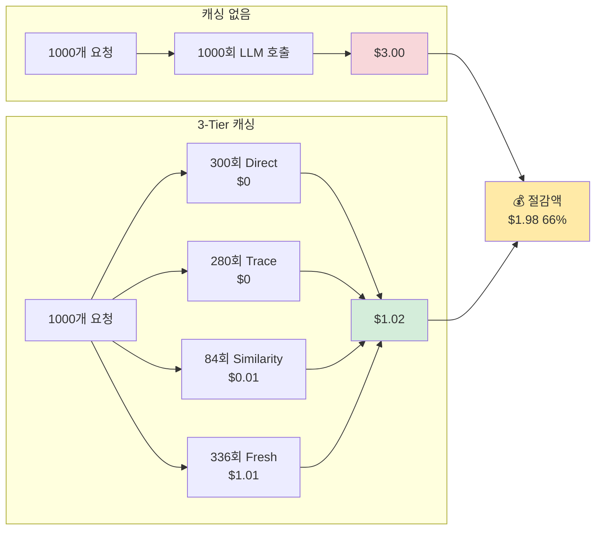

---

### 3.1.5 성능 메트릭 및 최적화

#### **평균 응답 시간 분석**

| 단계 | 평균 시간 | 비율 |
|------|----------|------|
| **Node 1**: Fetch Log | 30ms | 1% |
| **Node 2-4**: Cache Check (3 tiers) | 150ms | 5% |
| **Node 5**: Collect Logs | 50ms | 2% |
| **Node 6**: Decide Strategy | 5ms | <1% |
| **Node 7**: Analysis (Direct) | 2500ms | 82% |
| **Node 8**: Validation | 100ms | 3% |
| **Node 9**: Save Result | 200ms | 7% |
| **Total (Fresh Analysis)** | ~3035ms | 100% |

**캐시 사용 시**:
- Direct Cache: ~50ms (98% 단축)
- Trace Cache: ~80ms (97% 단축)
- Similarity Cache: ~150ms (95% 단축)

#### **Map-Reduce 최적화**

**청크 크기 튜닝**:

| Chunk Size | 100개 로그 처리 | LLM 호출 | 총 시간 | 토큰 사용 |
|------------|----------------|---------|---------|---------|
| 3개 | 34회 (33 + 1) | ~25초 | 6,800 tokens | 비효율 |
| **5개** | 21회 (20 + 1) | ~15초 | 10,000 tokens | ✅ 최적 |
| 10개 | 11회 (10 + 1) | ~10초 | 15,000 tokens | 요약 손실 |

**최적 값 선택 근거**:
- ✅ 5개: LLM이 한 번에 이해하기 적절한 로그 개수
- ✅ 요약 품질 유지
- ✅ 병렬 처리 가능

---

## 3.2 RAG 챗봇 (V2 Agent) - ReAct 아키텍처

### 3.2.1 전체 플로우 다이어그램

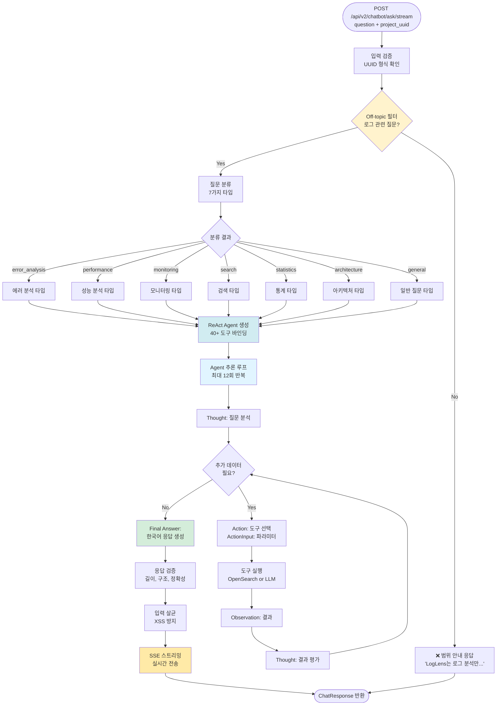

### 3.2.2 ReAct 패턴 상세

#### **ReAct란?**

**ReAct** = **Reasoning** (추론) + **Acting** (행동)

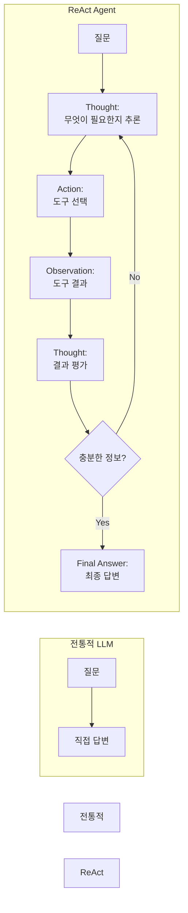

**장점**:
- ✅ **정확성**: 실제 데이터 기반 답변 (환각 감소)
- ✅ **투명성**: 추론 과정 추적 가능
- ✅ **확장성**: 새 도구 추가 용이
- ✅ **복합 질문**: 다단계 추론 가능

#### **Agent 생성 및 도구 바인딩**

**파일**: `app/agents/chatbot_agent.py:15-40`

```python
from langchain.agents import create_react_agent, AgentExecutor
from langchain_openai import ChatOpenAI
from langchain.prompts import PromptTemplate

def create_log_analysis_agent(
    project_uuid: str,
    tools: List[Tool],
    chat_history: str = ""
) -> AgentExecutor:
    """ReAct Agent 생성"""

    # LLM 설정
    llm = ChatOpenAI(
        model=settings.AGENT_MODEL,  # "gpt-4o-mini"
        temperature=0,  # 일관성 중요
        max_tokens=4000,
        timeout=60
    )

    # 시스템 프롬프트 로드
    prompt_template = load_agent_prompt()  # 280줄 상세 가이드

    # ReAct Agent 생성
    agent = create_react_agent(
        llm=llm,
        tools=tools,
        prompt=prompt_template
    )

    # AgentExecutor로 래핑
    agent_executor = AgentExecutor(
        agent=agent,
        tools=tools,
        max_iterations=settings.AGENT_MAX_ITERATIONS,  # 12
        max_execution_time=60,  # 60초 타임아웃
        verbose=settings.AGENT_VERBOSE,  # True (디버깅)
        handle_parsing_errors=True,  # JSON 파싱 에러 자동 복구
        return_intermediate_steps=True  # Thought/Action 기록
    )

    return agent_executor
```

**도구 바인딩 (project_uuid 주입)**:

```python
# app/services/chatbot_service_v2.py:150-200

def bind_tools_to_project(project_uuid: str) -> List[Tool]:
    """40+ 도구에 project_uuid 바인딩"""

    tools = []

    # Search Tools (3개)
    tools.append(search_tools.create_search_logs_by_keyword_tool(project_uuid))
    tools.append(search_tools.create_search_logs_by_similarity_tool(project_uuid))
    tools.append(search_tools.create_search_logs_advanced_tool(project_uuid))

    # Analysis Tools (10개)
    tools.append(analysis_tools.create_get_log_statistics_tool(project_uuid))
    tools.append(analysis_tools.create_get_recent_errors_tool(project_uuid))
    tools.append(analysis_tools.create_correlate_logs_tool(project_uuid))
    tools.append(analysis_tools.create_analyze_errors_unified_tool(project_uuid))
    tools.append(analysis_tools.create_analyze_single_log_tool(project_uuid))
    # ... 6개 더

    # Performance Tools (3개)
    tools.append(performance_tools.create_get_slowest_apis_tool(project_uuid))
    tools.append(performance_tools.create_get_traffic_by_time_tool(project_uuid))
    tools.append(performance_tools.create_analyze_http_error_matrix_tool(project_uuid))

    # Monitoring Tools (8개)
    tools.append(monitoring_tools.create_get_error_rate_trend_tool(project_uuid))
    tools.append(monitoring_tools.create_get_service_health_status_tool(project_uuid))
    # ... 6개 더

    # ... 나머지 도구들 (총 40+개)

    return tools
```

---

### 3.2.3 시스템 프롬프트 (Agent 지침서)

**파일**: `app/agents/chatbot_agent.py:41-320`

**구조** (280줄):

```python
AGENT_PROMPT = """당신은 LogLens의 전문 로그 분석 AI 어시스턴트입니다.

=== 핵심 역할 ===
1. 사용자 질문을 분석하여 적절한 도구를 선택합니다
2. 도구 실행 결과를 바탕으로 정확한 답변을 제공합니다
3. 모든 답변은 한국어로 작성하며, 마크다운 형식을 사용합니다

=== 사용 가능한 도구 (40+개) ===
{tools}

도구 이름: {tool_names}

=== 도구 선택 의사결정 트리 ===

1️⃣ **단일 로그 상세 분석이 필요한가?**
   → log_id가 명시되어 있는가?
     ✅ Yes: analyze_single_log (AI 깊이 분석)
     ❌ No: 다음 단계로

2️⃣ **에러 관련 질문인가?**
   → "에러", "오류", "버그" 키워드 포함?
     A. "최근 에러" → get_recent_errors (limit=10, time_hours=24)
     B. "가장 심각한" → get_recent_errors + SEVERITY 필터링
     C. "자주 발생하는" → get_error_frequency_ranking
     D. "에러율 추이" → get_error_rate_trend
     E. "서비스별 에러" → get_service_health_status

3️⃣ **성능 관련 질문인가?**
   → "느린", "지연", "응답 시간" 키워드?
     A. "느린 API" → get_slowest_apis
     B. "트래픽 패턴" → get_traffic_by_time
     C. "HTTP 에러" → analyze_http_error_matrix

4️⃣ **특정 시간대 분석인가?**
   → "오늘", "어제", "지난 1시간" 언급?
     A. "오늘 vs 어제" → compare_time_periods
     B. "최근 N시간" → time_hours 파라미터 조정

5️⃣ **서비스/컴포넌트 관련인가?**
   → service_name, component_name 언급?
     A. "서비스 건강 상태" → get_service_health_status
     B. "FE vs BE 비교" → compare_source_types
     C. "컴포넌트 호출 관계" → trace_component_calls

6️⃣ **사용자 추적인가?**
   → "사용자", "IP", "세션" 언급?
     A. "특정 사용자" → trace_user_session (ip_address)
     B. "영향받은 사용자 수" → get_affected_users_count

7️⃣ **패턴 탐지인가?**
   → "패턴", "반복", "주기적" 언급?
     A. "스택 트레이스 군집화" → cluster_stack_traces
     B. "동시성 문제" → detect_concurrency_issues
     C. "주기적 에러" → detect_recurring_errors

8️⃣ **통계/집계 질문인가?**
   → "몇 개", "개수", "비율", "통계"?
     A. "전체 통계" → get_log_statistics
     B. "에러 개수" → get_log_statistics + 필터

9️⃣ **검색 질문인가?**
   → 특정 키워드 찾기?
     A. "텍스트 검색" → search_logs_by_keyword
     B. "유사 로그" → search_logs_by_similarity
     C. "복합 조건" → search_logs_advanced

=== ReAct 패턴 사용 방법 ===

항상 다음 형식을 따르세요:

Thought: [현재 상황 분석 및 다음 행동 계획]
Action: [도구 이름]
Action Input: {{"param1": "value1", "param2": value2}}
Observation: [도구 실행 결과]
... (필요시 Thought/Action/Observation 반복)
Thought: I now know the final answer
Final Answer: [한국어 최종 답변]

=== 답변 형식 가이드 ===

**질문 타입별 최소 길이**:
- error_analysis: 800자 이상
- performance: 600자 이상
- monitoring: 500자 이상
- search: 400자 이상
- statistics: 300자 이상

**마크다운 사용 규칙**:
- 제목: ## 또는 ###
- 강조: **굵게**, *기울임*
- 코드: ```언어 ... ```
- 리스트: - 또는 1.
- 표: | 컬럼1 | 컬럼2 |
- 인용: > 인용문

**에러 분석 답변 구조**:
```
## 🚨 [에러명]

**발생 시각**: YYYY-MM-DD HH:MM
**서비스**: service_name
**심각도**: SEVERITY_X

```언어
[에러 메시지 또는 스택 트레이스]
```

**🤖 AI 분석**:
[error_cause]

**✅ 권장 조치**:
1. 즉시 조치 (1시간)
2. 단기 조치 (1일)
3. 장기 조치 (1주)
```

=== 주의사항 ===

1. **반드시 도구를 사용하세요**
   - 추측하지 말고 실제 데이터를 조회
   - 도구 없이 직접 답변 금지

2. **에러 처리**
   - 도구 실행 실패 시: 다른 도구 시도 또는 사용자에게 안내
   - 데이터 없음: "해당 기간 동안 로그가 없습니다" 명시

3. **성능 고려**
   - limit 파라미터 적절히 사용 (기본 10-20)
   - time_hours 기본값 24 (명시 없으면)

4. **정확성 우선**
   - 불확실하면 "추정", "예상" 명시
   - 도구 결과를 정확히 인용

5. **한국어 사용**
   - 모든 답변은 한국어
   - 기술 용어는 영문 병기 가능 (예: "NullPointerException(널 포인터 예외)")

=== 대화 기록 ===
{chat_history}

=== 현재 질문 ===
{input}

=== Agent Scratchpad (추론 기록) ===
{agent_scratchpad}
"""
```

---

### 3.2.4 도구 선택 실제 예시

#### **예시 1: "가장 심각한 에러는?"**

**Agent 추론 과정**:

```
Thought: 사용자가 가장 심각한 에러를 알고 싶어합니다.
"가장 심각한"은 SEVERITY가 CRITICAL 또는 HIGH인 에러를 의미합니다.
get_recent_errors 도구로 최근 에러를 조회하고, SEVERITY로 정렬해야 합니다.

Action: get_recent_errors
Action Input: {"limit": 10, "time_hours": 240}

Observation:
## 최근 에러 목록 (10개)

1. **DatabaseTimeout** (log_id: 12345)
   - 발생: 2025-11-03 14:32
   - 서비스: payment-service
   - 심각도: CRITICAL
   - AI 분석: DB 연결 풀 고갈로 결제 기능 마비

2. **OutOfMemoryError** (log_id: 12340)
   - 발생: 2025-11-02 09:15
   - 서비스: batch-service
   - 심각도: CRITICAL
   - AI 분석: 메모리 누수로 JVM 힙 공간 부족

3. **NullPointerException** (log_id: 12338)
   - 발생: 2025-11-01 16:20
   - 서비스: user-service
   - 심각도: HIGH
   - AI 분석: User 객체 null 체크 누락
...

Thought: DatabaseTimeout이 가장 심각합니다 (CRITICAL + 최근 발생).
이제 충분한 정보를 얻었으므로 최종 답변을 작성하겠습니다.

Final Answer:
## 🚨 가장 심각한 에러

**DatabaseTimeout** (log_id: 12345)

**발생 시각**: 2025-11-03 14:32
**서비스**: payment-service
**심각도**: 🔴 CRITICAL

```sql
DatabaseTimeout: Connection pool exhausted after 30s
Active connections: 20/20, Idle: 0/20
Waiting threads: 15
```

**🤖 AI 분석**:
DB 연결 풀이 완전히 고갈되어 새로운 요청을 처리할 수 없는 상태입니다.
배치 작업이 연결을 반환하지 않고 장시간 점유하여 발생한 것으로 추정됩니다.

**✅ 권장 조치**:

### 즉시 조치 (1시간)
- [ ] 연결 풀 크기 긴급 증설 (20 → 50)
- [ ] 현재 활성 연결 강제 종료 검토

### 단기 조치 (1일)
- [ ] 배치 작업에 연결 타임아웃 설정 (30초)
- [ ] Connection leak 모니터링 추가
- [ ] 연결 풀 메트릭 대시보드 구축

### 장기 조치 (1주)
- [ ] 배치 작업 별도 DB 연결 풀 분리
- [ ] 자동 스케일링 정책 수립
- [ ] 알림 임계값 설정 (사용률 80% 이상)

**📊 영향 범위**: 결제 기능 전체 마비로 예상 매출 손실 발생
```

#### **예시 2: "user-service의 응답 시간이 느린 API는?"**

**Agent 추론 과정**:

```
Thought: 사용자가 user-service에서 느린 API를 찾고 있습니다.
성능 관련 질문이므로 get_slowest_apis 도구를 사용해야 합니다.
service_name 필터를 "user-service"로 설정하겠습니다.

Action: get_slowest_apis
Action Input: {"service_name": "user-service", "limit": 5}

Observation:
## 느린 API Top 5 (user-service)

| 순위 | API | 평균 응답시간 | P95 | P99 | 호출 횟수 |
|------|-----|--------------|-----|-----|----------|
| 1 | GET /api/users/search | 2,340ms | 4,500ms | 8,200ms | 1,234 |
| 2 | POST /api/users/bulk-update | 1,850ms | 3,200ms | 5,100ms | 89 |
| 3 | GET /api/users/{id}/activities | 980ms | 1,800ms | 3,500ms | 5,678 |
| 4 | GET /api/users/{id}/profile | 450ms | 850ms | 1,200ms | 12,345 |
| 5 | PUT /api/users/{id} | 320ms | 600ms | 900ms | 2,567 |

Thought: 충분한 데이터를 얻었습니다.
GET /api/users/search가 가장 느리며 (평균 2.3초), P99가 8.2초로 심각합니다.
추가로 이 API의 에러율도 확인하면 좋을 것 같습니다.

Action: get_api_error_rates
Action Input: {"api_path": "/api/users/search"}

Observation:
## API 에러율: /api/users/search

- 총 호출: 1,234회
- 성공: 1,156회 (93.7%)
- 실패: 78회 (6.3%)
  - 5xx: 45회 (3.6%) - 대부분 503 Service Unavailable
  - 4xx: 33회 (2.7%) - 주로 400 Bad Request

Thought: 에러율도 6.3%로 높습니다. 이제 최종 답변을 작성하겠습니다.

Final Answer:
## ⚠️ user-service 느린 API 분석

### 1위: GET /api/users/search 🔴

**성능 지표**:
- ⏱️ 평균 응답시간: **2,340ms** (2.3초)
- 📊 P95: 4,500ms / P99: 8,200ms
- 📞 호출 횟수: 1,234회

**에러율**: 6.3% (78건 실패)
- 5xx 에러: 45건 (3.6%) - 주로 **503 Service Unavailable**
- 4xx 에러: 33건 (2.7%) - **400 Bad Request**

**🤖 분석**:
검색 쿼리가 전체 테이블 스캔을 수행하거나 인덱스가 없어 느린 것으로 추정됩니다.
P99가 8.2초로 일부 요청은 타임아웃에 근접하며, 503 에러는 DB 부하로 인한 것으로 보입니다.

**✅ 권장 조치**:

### 즉시 조치
- [ ] 검색 쿼리 실행 계획 분석 (EXPLAIN)
- [ ] 임시로 결과 개수 제한 추가 (LIMIT 100)

### 단기 조치
- [ ] 검색 필드에 인덱스 추가 (name, email)
- [ ] 페이지네이션 강제 적용
- [ ] 캐싱 레이어 추가 (Redis, 5분 TTL)

### 장기 조치
- [ ] ElasticSearch 도입 검토
- [ ] API Rate Limiting 적용
- [ ] 비동기 검색 전환 (결과를 이메일 전송)

---

### 2-5위 요약

| API | 평균 | 조치 필요도 |
|-----|------|------------|
| POST /api/users/bulk-update | 1,850ms | 🟡 중간 (배치 작업 최적화) |
| GET /api/users/{id}/activities | 980ms | 🟡 중간 (JOIN 쿼리 개선) |
| GET /api/users/{id}/profile | 450ms | 🟢 낮음 |
| PUT /api/users/{id} | 320ms | 🟢 낮음 |
```

---

### 3.2.5 40+ 도구 완전 목록

#### **도구 카테고리별 분류**

| 카테고리 | 도구 개수 | 주요 사용 사례 |
|---------|---------|--------------|
| **Search** | 3 | 키워드 검색, 유사도 검색, 복합 필터 |
| **Analysis** | 10 | 통계, 에러 분석, 상관관계, 패턴 분석 |
| **Detail** | 2 | 단일 로그 조회, trace 기반 조회 |
| **Performance** | 3 | 느린 API, 트래픽 패턴, HTTP 에러 |
| **Monitoring** | 8 | 에러율, 서비스 건강, 이상 탐지 |
| **Comparison** | 2 | 시간대 비교, 계단식 장애 |
| **Alert** | 2 | 알림 조건 평가, 리소스 이슈 |
| **Deployment** | 1 | 배포 영향 분석 |
| **User Tracking** | 3 | 사용자 세션, 파라미터 분포, 에러 전파 |
| **Architecture** | 3 | 레이어별 에러, 컴포넌트 호출, 핫스팟 |
| **Pattern Detection** | 4 | 스택 트레이스 군집, 동시성 문제, 주기적 에러 |
| **Statistics Comparison** | 2 | AI vs DB, 시간대별 비교 |
| **Total** | **43** | - |

#### **전체 도구 상세 목록**

**Search Tools** (`app/tools/search_tools.py`):

1. **search_logs_by_keyword**
   - **설명**: 로그 메시지에서 키워드 검색
   - **입력**: `keyword` (str), `limit` (int, 기본 20), `time_hours` (int, 기본 24)
   - **출력**: 매칭된 로그 목록 (마크다운 테이블)
   - **OpenSearch 쿼리**: `{"match": {"message": keyword}}`

2. **search_logs_by_similarity**
   - **설명**: 텍스트와 유사한 로그 벡터 검색
   - **입력**: `query_text` (str), `limit` (int, 기본 10), `min_score` (float, 기본 0.7)
   - **출력**: 유사도 점수와 함께 로그 목록
   - **OpenSearch 쿼리**: KNN `script_score` with `cosineSimilarity`

3. **search_logs_advanced**
   - **설명**: 복합 필터 검색 (레벨, 서비스, 시간 범위 등)
   - **입력**: `level` (str, optional), `service_name` (str, optional), `start_time` (str, optional), `end_time` (str, optional), `message_contains` (str, optional), `limit` (int)
   - **출력**: 필터링된 로그 목록
   - **OpenSearch 쿼리**: `{"bool": {"must": [...filters...]}}`

**Analysis Tools** (`app/tools/analysis_tools.py`):

4. **get_log_statistics**
   - **설명**: 전체 로그 통계 (총 개수, 레벨별 분포)
   - **입력**: `time_hours` (int, 기본 24)
   - **출력**: 통계 요약 (총 로그, ERROR/WARN/INFO 개수, 비율)

5. **get_recent_errors**
   - **설명**: 최근 에러 로그 목록 (AI 분석 포함)
   - **입력**: `limit` (int, 기본 10), `time_hours` (int, 기본 24), `severity` (str, optional)
   - **출력**: 에러 로그 + ai_analysis 요약

6. **correlate_logs**
   - **설명**: trace_id 또는 request_id로 관련 로그 찾기
   - **입력**: `trace_id` (str) or `request_id` (str)
   - **출력**: 시간 순 정렬된 관련 로그 (요청 흐름 추적)

7. **analyze_errors_unified**
   - **설명**: 여러 에러를 한 번에 분석 (배치)
   - **입력**: `log_ids` (List[int])
   - **출력**: 각 에러의 AI 분석 통합 요약

8. **analyze_single_log**
   - **설명**: 단일 로그 깊이 분석 (GPT-4o mini)
   - **입력**: `log_id` (int)
   - **출력**: summary, error_cause, solution, tags

9. **analyze_request_patterns**
   - **설명**: API 요청 body 패턴 분석
   - **입력**: `api_path` (str), `limit` (int, 기본 50)
   - **출력**: 자주 사용되는 파라미터, null 비율 등

10. **analyze_response_failures**
    - **설명**: API 응답 실패 패턴 분석
    - **입력**: `api_path` (str), `status_code` (int, optional)
    - **출력**: 실패 원인 분류 (타임아웃, 4xx, 5xx)

11. **get_error_context**
    - **설명**: 에러 발생 전후 컨텍스트 로그 수집
    - **입력**: `log_id` (int), `window_seconds` (int, 기본 10)
    - **출력**: ±N초 윈도우 내 모든 로그

12. **detect_error_propagation_path**
    - **설명**: 에러 전파 경로 추적 (Controller → Service → Repo)
    - **입력**: `trace_id` (str)
    - **출력**: 레이어별 에러 전파 시퀀스

13. **analyze_batch_job_failures**
    - **설명**: 배치 작업 실패 분석
    - **입력**: `job_name` (str), `time_hours` (int)
    - **출력**: 실패 빈도, 원인, 재시도 필요 여부

**Detail Tools** (`app/tools/detail_tools.py`):

14. **get_log_detail**
    - **설명**: 단일 로그 원본 데이터 조회
    - **입력**: `log_id` (int)
    - **출력**: 전체 JSON (log_details 포함)

15. **get_logs_by_trace_id**
    - **설명**: trace_id로 모든 로그 조회
    - **입력**: `trace_id` (str)
    - **출력**: 시간 순 정렬된 로그 목록

**Performance Tools** (`app/tools/performance_tools.py`):

16. **get_slowest_apis**
    - **설명**: 응답 시간 느린 API 순위
    - **입력**: `limit` (int, 기본 10), `service_name` (str, optional), `time_hours` (int, 기본 24)
    - **출력**: API별 평균/P95/P99 응답 시간 테이블

17. **get_traffic_by_time**
    - **설명**: 시간대별 트래픽 분포
    - **입력**: `interval` (str, "hour" or "day"), `time_hours` (int)
    - **출력**: 시간대별 로그 개수 (히스토그램 데이터)

18. **analyze_http_error_matrix**
    - **설명**: HTTP 상태 코드 매트릭스 (4xx vs 5xx)
    - **입력**: `time_hours` (int, 기본 24)
    - **출력**: 상태 코드별 개수 (400, 404, 500, 503 등)

**Monitoring Tools** (`app/tools/monitoring_tools.py`):

19. **get_error_rate_trend**
    - **설명**: 시간대별 에러율 추이
    - **입력**: `time_hours` (int, 기본 24), `interval` (str, "hour")
    - **출력**: 시간대별 에러율 % 그래프 데이터

20. **get_service_health_status**
    - **설명**: 서비스별 건강 상태 (에러율, 로그 개수)
    - **입력**: `time_hours` (int, 기본 24), `min_logs` (int, 기본 10)
    - **출력**: 서비스별 🟢🟡🔴 상태 테이블

21. **get_error_frequency_ranking**
    - **설명**: 가장 자주 발생하는 에러 순위
    - **입력**: `limit` (int, 기본 10), `time_hours` (int, 기본 24)
    - **출력**: 에러 타입별 발생 빈도

22. **get_api_error_rates**
    - **설명**: API 엔드포인트별 에러율
    - **입력**: `api_path` (str, optional), `limit` (int, 기본 20)
    - **출력**: API별 성공/실패 비율 테이블

23. **get_affected_users_count**
    - **설명**: 에러로 영향받은 사용자 수 (IP 기반)
    - **입력**: `error_type` (str, optional), `time_hours` (int)
    - **출력**: 고유 IP 개수, 상위 영향 사용자

24. **detect_anomalies**
    - **설명**: 통계적 이상 탐지 (Z-score)
    - **입력**: `metric` (str, "error_rate" or "traffic"), `sensitivity` (float, 기본 3.0)
    - **출력**: 이상 시간대 목록 (Z-score > threshold)

25. **compare_source_types**
    - **설명**: Frontend vs Backend 에러 비교
    - **입력**: `time_hours` (int, 기본 24)
    - **출력**: FE/BE별 에러 개수, 비율, 주요 에러

26. **analyze_logger_activity**
    - **설명**: Logger별 로깅 빈도 (노이즈 탐지)
    - **입력**: `time_hours` (int, 기본 24)
    - **출력**: Logger별 로그 개수, 과도한 로깅 경고

**Comparison Tools** (`app/tools/comparison_tools.py`):

27. **compare_time_periods**
    - **설명**: 두 시간대 비교 (오늘 vs 어제)
    - **입력**: `period1_start` (str), `period1_end` (str), `period2_start` (str), `period2_end` (str)
    - **출력**: 기간별 로그 개수, 에러율 비교 테이블

28. **detect_cascading_failures**
    - **설명**: 계단식 장애 탐지 (서비스 간 의존성)
    - **입력**: `time_hours` (int, 기본 1)
    - **출력**: 연쇄 장애 경로 (A → B → C 실패)

**Alert Tools** (`app/tools/alert_tools.py`):

29. **evaluate_alert_conditions**
    - **설명**: 알림 조건 평가 (임계값 초과 확인)
    - **입력**: `metric` (str), `threshold` (float), `time_hours` (int)
    - **출력**: 알림 발동 여부 + 현재 값

30. **detect_resource_issues**
    - **설명**: 리소스 고갈 탐지 (메모리, DB 풀 등)
    - **입력**: `resource_type` (str, "memory" or "db_pool"), `time_hours` (int)
    - **출력**: OutOfMemory, ConnectionPoolExhausted 에러 목록

**Deployment Tools** (`app/tools/deployment_tools.py`):

31. **analyze_deployment_impact**
    - **설명**: 배포 전후 비교 (에러율 변화)
    - **입력**: `deployment_time` (str, ISO format), `window_hours` (int, 기본 2)
    - **출력**: 배포 전 1시간 vs 후 1시간 에러율 비교

**User Tracking Tools** (`app/tools/user_tracking_tools.py`):

32. **trace_user_session**
    - **설명**: 특정 IP/사용자의 세션 추적
    - **입력**: `ip_address` (str), `time_hours` (int, 기본 24)
    - **출력**: 해당 IP의 모든 요청 시퀀스

33. **analyze_parameter_distribution**
    - **설명**: 메소드 파라미터 null 분포 분석
    - **입력**: `method_name` (str), `time_hours` (int)
    - **출력**: 파라미터별 null 비율, 에러 상관관계

34. **trace_error_propagation**
    - **설명**: 에러 전파 경로 추적 (상세)
    - **입력**: `initial_log_id` (int)
    - **출력**: 에러가 전파된 모든 컴포넌트 경로

**Architecture Tools** (`app/tools/architecture_tools.py`):

35. **analyze_error_by_layer**
    - **설명**: 레이어별 에러 분포 (Controller/Service/Repository)
    - **입력**: `time_hours` (int, 기본 24)
    - **출력**: 레이어별 에러 개수, 비율 (pie chart 데이터)

36. **trace_component_calls**
    - **설명**: 컴포넌트 호출 체인 추적
    - **입력**: `trace_id` (str)
    - **출력**: 컴포넌트 간 호출 그래프 (A → B → C)

37. **get_hottest_methods**
    - **설명**: 가장 자주 실행되는 메소드 (핫스팟)
    - **입력**: `limit` (int, 기본 10), `time_hours` (int)
    - **출력**: 메소드별 실행 횟수 순위

**Pattern Detection Tools** (`app/tools/pattern_detection_tools.py`):

38. **cluster_stack_traces**
    - **설명**: 스택 트레이스 군집화 (유사 에러 그룹화)
    - **입력**: `min_cluster_size` (int, 기본 3), `time_hours` (int)
    - **출력**: 클러스터별 대표 스택 트레이스 + 개수

39. **detect_concurrency_issues**
    - **설명**: 동시성 문제 탐지 (Deadlock, Race condition)
    - **입력**: `time_hours` (int, 기본 24)
    - **출력**: Deadlock, Thread starvation 로그 목록

40. **detect_recurring_errors**
    - **설명**: 주기적 에러 탐지 (cron job 실패 등)
    - **입력**: `time_hours` (int, 기본 168),  `min_occurrences` (int, 기본 3)
    - **출력**: 주기 패턴 (매일 02:00, 매주 월요일 등)

41. **analyze_error_lifetime**
    - **설명**: 에러 지속 시간 분석 (언제 해결되었나?)
    - **입력**: `error_type` (str), `time_hours` (int)
    - **출력**: 에러 발생 시작 ~ 종료 시간, 평균 지속 시간

**Statistics Comparison Tools** (`app/tools/statistics_comparison_tools.py`):

42. **compare_ai_vs_db_statistics**
    - **설명**: AI 추론 vs DB 집계 정확도 비교
    - **입력**: `time_hours` (int, 기본 24), `sample_size` (int, 기본 100)
    - **출력**: 정확도 %, 신뢰도, 추천사항

43. **get_hourly_comparison**
    - **설명**: 시간대별 로그 분포 (AI vs DB)
    - **입력**: `time_hours` (int, 기본 24)
    - **출력**: 시간대별 개수 비교 테이블

---

### 3.2.6 대화 히스토리 관리

**파일**: `app/services/chatbot_service_v2.py:344-365`

**LangChain 메시지 변환**:

```python
from langchain_core.messages import HumanMessage, AIMessage

def convert_chat_history(chat_history: List[ChatMessage]) -> str:
    """채팅 기록을 텍스트로 변환"""

    langchain_history = []
    for msg in chat_history:
        if msg.role == "user":
            langchain_history.append(HumanMessage(content=msg.content))
        elif msg.role == "assistant":
            langchain_history.append(AIMessage(content=msg.content))

    # 텍스트 형식으로 변환 (프롬프트 주입용)
    history_text = "\n\n## 이전 대화:\n"
    for msg in langchain_history:
        role = "👤 User" if isinstance(msg, HumanMessage) else "🤖 Assistant"
        history_text += f"\n**{role}**: {msg.content}\n"

    return history_text
```

**프롬프트 주입**:

```python
# Agent 실행 시
agent_input = {
    "input": current_question,
    "chat_history": convert_chat_history(chat_history)
}

result = await agent_executor.ainvoke(agent_input)
```

**대화 컨텍스트 활용 예시**:

```
이전 대화:

**👤 User**: 최근 24시간 동안 에러가 몇 개야?

**🤖 Assistant**: 최근 24시간 동안 **ERROR 레벨 로그는 총 45개**입니다.
- CRITICAL: 2개
- HIGH: 15개
- MEDIUM: 28개

**👤 User**: 그중에 가장 심각한 거 알려줘

**🤖 Assistant**: [이전 대화에서 "에러 45개" 언급 → 그 중 CRITICAL 2개 중 선택]
가장 심각한 에러는 **DatabaseTimeout** (log_id: 12345)입니다...
```

**컨텍스트 윈도우 제한**:
- 최근 10개 메시지만 유지
- 토큰 제한 (8K) 초과 시 오래된 메시지 제거

---

### 3.2.7 Streaming SSE 메커니즘

**파일**: `app/services/chatbot_service_v2.py:498-675`

**AsyncGenerator 패턴**:

```python
from typing import AsyncGenerator, Tuple

async def ask_stream(
    question: str,
    project_uuid: str,
    chat_history: List[ChatMessage]
) -> AsyncGenerator[Tuple[str, str], None]:
    """
    SSE 스트리밍 응답 생성

    Yields:
        Tuple[event_type, data]
        - ("chunk", "텍스트"): 응답 조각
        - ("done", ""): 완료 신호
        - ("error", "메시지"): 에러 발생
    """

    try:
        # Agent 생성
        tools = bind_tools_to_project(project_uuid)
        agent_executor = create_log_analysis_agent(project_uuid, tools, chat_history)

        # 스트리밍 버퍼
        buffer = ""
        is_streaming = False

        # Agent 이벤트 스트리밍
        async for event in agent_executor.astream_events(
            {"input": question, "chat_history": convert_chat_history(chat_history)},
            version="v1"
        ):
            # LLM 청크 이벤트만 처리
            if event["event"] == "on_chat_model_stream":
                chunk = event["data"]["chunk"]

                if chunk.content:
                    buffer += chunk.content

                    # "Final Answer:" 마커 탐지
                    if "Final Answer:" in buffer and not is_streaming:
                        # Final Answer 이후 텍스트만 스트리밍
                        is_streaming = True
                        parts = buffer.split("Final Answer:", 1)
                        answer_start = parts[1].lstrip()

                        # 첫 청크 전송
                        yield ("chunk", answer_start)

                    elif is_streaming:
                        # 이후 청크 계속 전송
                        yield ("chunk", chunk.content)

        # 완료 신호
        yield ("done", "")

    except Exception as e:
        logger.error(f"Streaming error: {e}")
        yield ("error", str(e))
```

**FastAPI SSE 엔드포인트**:

```python
from fastapi.responses import StreamingResponse

@router.post("/api/v2/chatbot/ask/stream")
async def chatbot_ask_stream(request: ChatRequest):
    """SSE 스트리밍 챗봇 엔드포인트"""

    async def generate():
        """SSE 형식 생성기"""
        async for event_type, data in chatbot_service_v2.ask_stream(
            question=request.question,
            project_uuid=request.project_uuid,
            chat_history=request.chat_history
        ):
            if event_type == "chunk":
                # SSE 형식: data: {내용}\n\n
                yield f"data: {data}\n\n"

            elif event_type == "done":
                yield f"data: [DONE]\n\n"

            elif event_type == "error":
                yield f"data: [ERROR] {data}\n\n"

    return StreamingResponse(
        generate(),
        media_type="text/event-stream",
        headers={
            "Cache-Control": "no-cache",
            "Connection": "keep-alive",
            "X-Accel-Buffering": "no"  # Nginx 버퍼링 비활성화
        }
    )
```

**클라이언트 수신 (Frontend)**:

```javascript
// React + EventSource
const eventSource = new EventSource('/api/v2/chatbot/ask/stream', {
  method: 'POST',
  body: JSON.stringify({
    question: "최근 에러는?",
    project_uuid: "...",
    chat_history: []
  })
});

let fullResponse = "";

eventSource.onmessage = (event) => {
  if (event.data === "[DONE]") {
    eventSource.close();
    console.log("Full response:", fullResponse);
  } else if (event.data.startsWith("[ERROR]")) {
    console.error("Error:", event.data);
    eventSource.close();
  } else {
    // 청크 누적
    fullResponse += event.data;
    // UI 업데이트 (실시간 타이핑 효과)
    setAnswer(fullResponse);
  }
};

eventSource.onerror = (error) => {
  console.error("SSE error:", error);
  eventSource.close();
};
```

**SSE 스트림 예시**:

```
data: 최근

data:  24

data: 시간

data:  동안

data:

data: **

data: ERROR

data:  레벨

data:  로그는

data:  총

data:

data: 45

data: 개

data: **

data: 입니다

data: .

data: [DONE]
```

---

(계속...)

## 3.3 HTML 문서 생성

### 3.3.1 전체 플로우 다이어그램

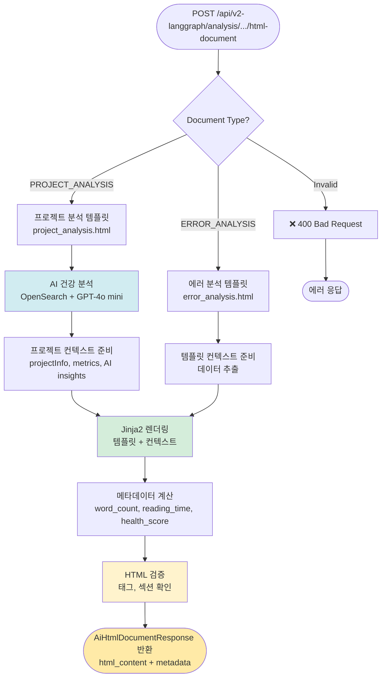

### 3.3.2 프로젝트 분석 문서 생성

**파일**: `app/services/html_document_service.py:102-177`

#### **Step 1: AI 건강 분석**

```python
async def _analyze_project_health(
    project_uuid: str,
    time_range: dict,
    metrics: dict
) -> str:
    """GPT-4o mini로 프로젝트 건강 상태 분석"""

    # 1. OpenSearch에서 최근 ERROR/WARN 로그 100개 수집
    query = {
        "size": 100,
        "query": {
            "bool": {
                "must": [
                    {"term": {"project_uuid.keyword": project_uuid}},
                    {"range": {"timestamp": {
                        "gte": time_range["startTime"],
                        "lte": time_range["endTime"]
                    }}}
                ],
                "should": [
                    {"term": {"level": "ERROR"}},
                    {"term": {"level": "WARN"}}
                ],
                "minimum_should_match": 1
            }
        },
        "sort": [{"timestamp": "desc"}]
    }

    response = opensearch_client.search(
        index=f"{project_uuid.replace('-', '_')}_*",
        body=query
    )

    # 2. 컴포넌트별 에러 집계
    component_errors = defaultdict(lambda: {"ERROR": 0, "WARN": 0})

    for hit in response["hits"]["hits"]:
        source = hit["_source"]
        component = source.get("service_name") or source.get("component_name", "Unknown")
        level = source.get("level", "INFO")

        if level in ["ERROR", "WARN"]:
            component_errors[component][level] += 1

    # 3. 상위 5개 문제 컴포넌트 추출
    top_components = sorted(
        component_errors.items(),
        key=lambda x: x[1]["ERROR"] * 2 + x[1]["WARN"],  # ERROR 가중치 2배
        reverse=True
    )[:5]

    # 4. GPT-4o mini로 건강 상태 요약 생성
    prompt = f"""시스템 메트릭 분석 요청:

**전체 통계**:
- 총 로그: {metrics['totalLogs']:,}개
- ERROR: {metrics['errorCount']:,}개 ({metrics['errorCount']/metrics['totalLogs']*100:.2f}%)
- WARN: {metrics['warnCount']:,}개

**주요 문제 컴포넌트**:
{chr(10).join(f"{i+1}. {comp}: ERROR {stats['ERROR']}, WARN {stats['WARN']}" for i, (comp, stats) in enumerate(top_components))}

**시간 범위**: {time_range['startTime']} ~ {time_range['endTime']}

위 정보를 바탕으로 시스템 건강 상태를 3-5문장으로 요약하세요.
요구사항:
- 한국어로 작성
- 마크다운 없이 순수 텍스트만
- 긍정적/부정적 평가 포함
- 주의가 필요한 컴포넌트 명시
"""

    llm = ChatOpenAI(
        model="gpt-4o-mini",
        temperature=0.3,
        max_tokens=500
    )

    result = await llm.ainvoke(prompt)

    return result.content.strip()
```

**AI 분석 결과 예시**:
```
시스템은 전반적으로 안정적이나 payment-service에서 주의가 필요합니다. 
총 45,234개의 로그 중 에러율은 1.2%로 양호한 수준이지만, 
payment-service에서 DatabaseTimeout 에러가 23건 발생하여 트랜잭션 처리 지연이 우려됩니다. 
user-service와 auth-service는 에러 없이 정상 운영 중입니다. 
DB 연결 풀 모니터링과 payment-service 로그 상세 분석을 권장합니다.
```

#### **Step 2: 템플릿 컨텍스트 준비**

```python
def prepare_project_context(
    document_request: ProjectAnalysisDocumentRequest,
    ai_insights: str
) -> dict:
    """Jinja2 템플릿에 전달할 컨텍스트 생성"""

    context = {
        # 프로젝트 정보
        "project_info": {
            "name": document_request.projectInfo.name,
            "description": document_request.projectInfo.description,
            "uuid": document_request.projectInfo.projectUuid,
            "created_at": document_request.projectInfo.createdAt
        },

        # 시간 범위
        "time_range": {
            "startTime": document_request.timeRange.startTime,
            "endTime": document_request.timeRange.endTime,
            "duration_hours": calculate_duration_hours(
                document_request.timeRange.startTime,
                document_request.timeRange.endTime
            )
        },

        # 메트릭
        "metrics": {
            "totalLogs": document_request.metrics.totalLogs,
            "errorCount": document_request.metrics.errorCount,
            "warnCount": document_request.metrics.warnCount,
            "infoCount": document_request.metrics.infoCount,
            "errorRate": (document_request.metrics.errorCount / document_request.metrics.totalLogs * 100) if document_request.metrics.totalLogs > 0 else 0,
            "warnRate": (document_request.metrics.warnCount / document_request.metrics.totalLogs * 100) if document_request.metrics.totalLogs > 0 else 0
        },

        # 상위 에러 목록
        "top_errors": [
            {
                "timestamp": error.timestamp,
                "logLevel": error.logLevel,
                "message": error.message[:100] + "..." if len(error.message) > 100 else error.message,
                "componentName": error.componentName,
                "serviceName": error.serviceName,
                "sourceType": error.sourceType
            }
            for error in document_request.topErrors
        ],

        # AI 인사이트
        "ai_insights": {
            "system_health_summary": ai_insights,
            "generated_at": datetime.utcnow().isoformat() + "Z"
        },

        # 스타일 설정
        "style": {
            "css_framework": "tailwind",
            "chart_library": "chartjs" if document_request.options.includeCharts else None,
            "color_scheme": "blue",
            "font_family": "Pretendard, -apple-system, sans-serif"
        },

        # 옵션
        "options": {
            "includeCharts": document_request.options.includeCharts,
            "includeAiInsights": document_request.options.includeAiInsights
        }
    }

    return context
```

#### **Step 3: Jinja2 템플릿 렌더링**

**템플릿 파일**: `app/templates/analysis/project_analysis.html`

```jinja2
<!DOCTYPE html>
<html lang="ko">
<head>
    <meta charset="UTF-8">
    <meta name="viewport" content="width=device-width, initial-scale=1.0">
    <title>{{ project_info.name }} - 프로젝트 분석 리포트</title>
    <script src="https://cdn.tailwindcss.com"></script>
    
    <script src="https://cdn.jsdelivr.net/npm/chart.js@4.4.0"></script>
    
</head>
<body class="bg-gray-50 font-sans">
    <div class="container mx-auto px-6 py-8 max-w-7xl">
        <!-- Header -->
        <header class="mb-8">
            <h1 class="text-4xl font-bold text-gray-900">{{ project_info.name }}</h1>
            <p class="text-gray-600 mt-2">{{ project_info.description }}</p>
            <div class="text-sm text-gray-500 mt-4">
                <span>📅 분석 기간: {{ time_range.startTime|format_date }} ~ {{ time_range.endTime|format_date }}</span>
                <span class="ml-4">⏱️ {{ time_range.duration_hours }}시간</span>
            </div>
        </header>

        <!-- Health Score Card -->
        <div class="bg-white rounded-xl shadow-lg p-8 mb-8">
            <h2 class="text-2xl font-semibold mb-4 flex items-center">
                <span class="mr-2">🏥</span> 건강 점수
            </h2>
            <div class="flex items-center justify-between">
                <div>
                    <div class="text-6xl font-bold {{ 'text-green-500' if metadata.health_score >= 80 else ('text-yellow-500' if metadata.health_score >= 60 else 'text-red-500') }}">
                        {{ metadata.health_score }}
                    </div>
                    <div class="text-gray-600 mt-2">
                        
                            🟢 매우 양호
                        
                            🟡 주의 필요
                        
                            🔴 위험
                        
                    </div>
                </div>

                <!-- AI Insights -->
                
                <div class="flex-1 ml-8 p-6 bg-blue-50 rounded-lg border-l-4 border-blue-500">
                    <h3 class="font-semibold text-blue-900 flex items-center mb-2">
                        <span class="mr-2">🤖</span> AI 분석
                    </h3>
                    <p class="text-blue-800 leading-relaxed">{{ ai_insights.system_health_summary }}</p>
                </div>
                
            </div>
        </div>

        <!-- Metrics Grid -->
        <div class="grid grid-cols-4 gap-6 mb-8">
            <!-- Total Logs -->
            <div class="bg-white rounded-lg shadow p-6">
                <div class="text-sm text-gray-600 mb-1">총 로그</div>
                <div class="text-3xl font-bold text-gray-900">{{ metrics.totalLogs|format_number }}</div>
                <div class="text-xs text-gray-500 mt-1">전체 기록</div>
            </div>

            <!-- Error Count -->
            <div class="bg-white rounded-lg shadow p-6">
                <div class="text-sm text-gray-600 mb-1">ERROR</div>
                <div class="text-3xl font-bold text-red-500">{{ metrics.errorCount|format_number }}</div>
                <div class="text-xs text-gray-500 mt-1">{{ metrics.errorRate|format_percentage }}%</div>
            </div>

            <!-- Warn Count -->
            <div class="bg-white rounded-lg shadow p-6">
                <div class="text-sm text-gray-600 mb-1">WARN</div>
                <div class="text-3xl font-bold text-yellow-500">{{ metrics.warnCount|format_number }}</div>
                <div class="text-xs text-gray-500 mt-1">{{ metrics.warnRate|format_percentage }}%</div>
            </div>

            <!-- Info Count -->
            <div class="bg-white rounded-lg shadow p-6">
                <div class="text-sm text-gray-600 mb-1">INFO</div>
                <div class="text-3xl font-bold text-blue-500">{{ metrics.infoCount|format_number }}</div>
                <div class="text-xs text-gray-500 mt-1">정상 로그</div>
            </div>
        </div>

        <!-- Top Errors Table -->
        <div class="bg-white rounded-xl shadow-lg p-8 mb-8">
            <h2 class="text-2xl font-semibold mb-4 flex items-center">
                <span class="mr-2">🚨</span> 주요 에러 목록
            </h2>

            
            <div class="overflow-x-auto">
                <table class="w-full">
                    <thead>
                        <tr class="bg-gray-100 border-b">
                            <th class="px-4 py-3 text-left text-sm font-semibold text-gray-700">시간</th>
                            <th class="px-4 py-3 text-left text-sm font-semibold text-gray-700">레벨</th>
                            <th class="px-4 py-3 text-left text-sm font-semibold text-gray-700">메시지</th>
                            <th class="px-4 py-3 text-left text-sm font-semibold text-gray-700">컴포넌트</th>
                            <th class="px-4 py-3 text-left text-sm font-semibold text-gray-700">소스</th>
                        </tr>
                    </thead>
                    <tbody>
                        
                        <tr class="border-b hover:bg-gray-50 transition">
                            <td class="px-4 py-3 text-sm text-gray-600">{{ error.timestamp|format_time }}</td>
                            <td class="px-4 py-3">
                                <span class="px-2 py-1 text-xs font-semibold rounded {{ 'bg-red-100 text-red-800' if error.logLevel == 'ERROR' else 'bg-yellow-100 text-yellow-800' }}">
                                    {{ error.logLevel }}
                                </span>
                            </td>
                            <td class="px-4 py-3 text-sm text-gray-900 font-mono">{{ error.message }}</td>
                            <td class="px-4 py-3 text-sm text-gray-700">{{ error.componentName or error.serviceName }}</td>
                            <td class="px-4 py-3 text-sm text-gray-600">{{ error.sourceType }}</td>
                        </tr>
                        
                    </tbody>
                </table>
            </div>
            
            <div class="text-center py-8 text-gray-500">
                ✅ 분석 기간 동안 에러가 발생하지 않았습니다.
            </div>
            
        </div>

        <!-- Charts -->
        
        <div class="grid grid-cols-2 gap-6 mb-8">
            <!-- Error Trend Chart -->
            <div class="bg-white rounded-xl shadow-lg p-8">
                <h3 class="text-xl font-semibold mb-4">에러 발생 추이</h3>
                <canvas id="errorTrendChart"></canvas>
            </div>

            <!-- Level Distribution Chart -->
            <div class="bg-white rounded-xl shadow-lg p-8">
                <h3 class="text-xl font-semibold mb-4">로그 레벨 분포</h3>
                <canvas id="levelDistChart"></canvas>
            </div>
        </div>

        <script>
            // Error Trend Chart (Line)
            new Chart(document.getElementById('errorTrendChart'), {
                type: 'line',
                data: {
                    labels: {{ hourly_labels|tojson }},
                    datasets: [{
                        label: 'ERROR',
                        data: {{ error_counts|tojson }},
                        backgroundColor: 'rgba(239, 68, 68, 0.1)',
                        borderColor: 'rgb(239, 68, 68)',
                        borderWidth: 2,
                        tension: 0.4,
                        fill: true
                    }, {
                        label: 'WARN',
                        data: {{ warn_counts|tojson }},
                        backgroundColor: 'rgba(251, 191, 36, 0.1)',
                        borderColor: 'rgb(251, 191, 36)',
                        borderWidth: 2,
                        tension: 0.4,
                        fill: true
                    }]
                },
                options: {
                    responsive: true,
                    maintainAspectRatio: true,
                    plugins: {
                        legend: { position: 'top' },
                        tooltip: { mode: 'index', intersect: false }
                    },
                    scales: {
                        y: { beginAtZero: true, title: { display: true, text: '개수' } },
                        x: { title: { display: true, text: '시간' } }
                    }
                }
            });

            // Level Distribution Chart (Doughnut)
            new Chart(document.getElementById('levelDistChart'), {
                type: 'doughnut',
                data: {
                    labels: ['ERROR', 'WARN', 'INFO'],
                    datasets: [{
                        data: [{{ metrics.errorCount }}, {{ metrics.warnCount }}, {{ metrics.infoCount }}],
                        backgroundColor: [
                            'rgb(239, 68, 68)',
                            'rgb(251, 191, 36)',
                            'rgb(59, 130, 246)'
                        ],
                        borderWidth: 2
                    }]
                },
                options: {
                    responsive: true,
                    maintainAspectRatio: true,
                    plugins: {
                        legend: { position: 'bottom' },
                        tooltip: {
                            callbacks: {
                                label: function(context) {
                                    const label = context.label || '';
                                    const value = context.parsed || 0;
                                    const total = context.dataset.data.reduce((a, b) => a + b, 0);
                                    const percentage = ((value / total) * 100).toFixed(1);
                                    return `${label}: ${value.toLocaleString()} (${percentage}%)`;
                                }
                            }
                        }
                    }
                }
            });
        </script>
        

        <!-- Footer -->
        <footer class="mt-12 pt-6 border-t text-center text-gray-500 text-sm">
            <p>🤖 LogLens AI Service - 자동 생성된 분석 리포트</p>
            <p class="mt-1">생성 시각: {{ ai_insights.generated_at|format_datetime }}</p>
        </footer>
    </div>
</body>
</html>
```

**Jinja2 커스텀 필터**:

```python
# app/services/html_document_service.py:50-65

env = jinja2.Environment(loader=jinja2.FileSystemLoader("app/templates"))

# 숫자 포맷팅
env.filters["format_number"] = lambda v: f"{v:,}"

# 퍼센티지
env.filters["format_percentage"] = lambda v: f"{v:.1f}"

# 날짜 포맷
env.filters["format_date"] = lambda v: datetime.fromisoformat(v.replace("Z", "+00:00")).strftime("%Y-%m-%d")

# 시간 포맷
env.filters["format_time"] = lambda v: datetime.fromisoformat(v.replace("Z", "+00:00")).strftime("%H:%M:%S")

# 날짜시간 포맷
env.filters["format_datetime"] = lambda v: datetime.fromisoformat(v.replace("Z", "+00:00")).strftime("%Y-%m-%d %H:%M:%S")

# 마크다운 렌더링
env.filters["markdown"] = lambda text: Markup(markdown.markdown(text, extensions=['fenced_code', 'tables']))
```

#### **Step 4: 메타데이터 계산**

```python
def calculate_metadata(html_content: str, metrics: dict) -> dict:
    """HTML 메타데이터 계산"""

    # 단어 수
    text_only = re.sub(r'<[^>]+>', '', html_content)  # HTML 태그 제거
    word_count = len(text_only.split())

    # 읽기 시간 (분) - 한국어 기준 분당 200단어
    reading_time_minutes = max(1, word_count // 200)

    # 건강 점수 계산
    total_logs = metrics['totalLogs']
    error_count = metrics['errorCount']
    warn_count = metrics['warnCount']

    if total_logs == 0:
        health_score = 100
    else:
        error_rate = (error_count / total_logs) * 100
        warn_rate = (warn_count / total_logs) * 100

        # 점수 = 100 - (에러율 * 10) - (경고율 * 3)
        health_score = max(0, min(100, 100 - (error_rate * 10) - (warn_rate * 3)))

    return {
        "word_count": word_count,
        "reading_time": f"{reading_time_minutes} minutes",
        "health_score": round(health_score),
        "charts_included": ["error_trend", "level_distribution"] if "chart.js" in html_content.lower() else [],
        "generated_at": datetime.utcnow().isoformat() + "Z"
    }
```

#### **Step 5: HTML 검증**

```python
def _validate_html(html_content: str, document_type: str) -> dict:
    """HTML 유효성 검증"""

    warnings = []

    # 1. 필수 HTML 태그 확인
    is_valid_html = all([
        "<html" in html_content,
        "<head" in html_content,
        "<body" in html_content,
        "</html>" in html_content
    ])

    if not is_valid_html:
        warnings.append("Missing required HTML structure tags")

    # 2. 문서 타입별 필수 섹션 확인
    has_required_sections = True

    if document_type == "PROJECT_ANALYSIS":
        required_sections = ["건강 점수", "주요 에러", "metrics"]
        for section in required_sections:
            if section.lower() not in html_content.lower():
                has_required_sections = False
                warnings.append(f"Missing required section: {section}")

    elif document_type == "ERROR_ANALYSIS":
        required_sections = ["stack", "trace", "관련 로그"]
        for section in required_sections:
            if section.lower() not in html_content.lower():
                has_required_sections = False
                warnings.append(f"Missing required section: {section}")

    # 3. XSS 위험 검사 (기본)
    dangerous_patterns = ["<script>alert", "javascript:", "onerror=", "onclick="]
    for pattern in dangerous_patterns:
        if pattern in html_content:
            warnings.append(f"Potential XSS risk: {pattern}")

    return {
        "is_valid_html": is_valid_html,
        "has_required_sections": has_required_sections,
        "warnings": warnings,
        "validation_passed": is_valid_html and has_required_sections and len(warnings) == 0
    }
```

---

### 3.3.3 에러 분석 문서 생성

**파일**: `app/services/html_document_service.py:180-250`

**차이점**:
- 단일 로그 중심 (log_id 기반)
- 스택 트레이스 강조 표시
- 관련 로그 (trace siblings) 표시
- AI 분석은 기존 `ai_analysis` 필드 재사용 (신규 생성 X)

**템플릿**: `app/templates/analysis/error_analysis.html`

```jinja2
<!DOCTYPE html>
<html lang="ko">
<head>
    <meta charset="UTF-8">
    <title>에러 분석 리포트 - {{ error_log.logId }}</title>
    <script src="https://cdn.tailwindcss.com"></script>
    <link rel="stylesheet" href="https://cdnjs.cloudflare.com/ajax/libs/highlight.js/11.9.0/styles/github-dark.min.css">
    <script src="https://cdnjs.cloudflare.com/ajax/libs/highlight.js/11.9.0/highlight.min.js"></script>
</head>
<body class="bg-gray-50">
    <div class="container mx-auto px-6 py-8 max-w-6xl">
        <!-- Header -->
        <header class="mb-8">
            <h1 class="text-4xl font-bold text-red-600">🚨 에러 분석 리포트</h1>
            <div class="mt-4 flex items-center gap-4 text-sm">
                <span class="px-3 py-1 bg-red-100 text-red-800 rounded-full font-semibold">
                    {{ error_log.logLevel }}
                </span>
                <span class="text-gray-600">📅 {{ error_log.timestamp|format_datetime }}</span>
                <span class="text-gray-600">🔢 Log ID: {{ error_log.logId }}</span>
            </div>
        </header>

        <!-- Error Message -->
        <div class="bg-red-50 border-l-4 border-red-500 p-6 mb-8 rounded-r-lg">
            <h2 class="text-xl font-semibold text-red-900 mb-2">에러 메시지</h2>
            <pre class="text-red-800 font-mono text-sm whitespace-pre-wrap">{{ error_log.message }}</pre>
        </div>

        <!-- Service Info -->
        <div class="grid grid-cols-3 gap-4 mb-8">
            <div class="bg-white rounded-lg shadow p-4">
                <div class="text-sm text-gray-600">서비스</div>
                <div class="text-lg font-semibold">{{ error_log.serviceName }}</div>
            </div>
            <div class="bg-white rounded-lg shadow p-4">
                <div class="text-sm text-gray-600">컴포넌트</div>
                <div class="text-lg font-semibold">{{ error_log.componentName }}</div>
            </div>
            <div class="bg-white rounded-lg shadow p-4">
                <div class="text-sm text-gray-600">소스 타입</div>
                <div class="text-lg font-semibold">{{ error_log.sourceType }}</div>
            </div>
        </div>

        <!-- AI Analysis -->
        
        <div class="bg-blue-50 border-l-4 border-blue-500 p-6 mb-8 rounded-r-lg">
            <h2 class="text-xl font-semibold text-blue-900 mb-4 flex items-center">
                <span class="mr-2">🤖</span> AI 분석 결과
            </h2>

            <!-- Summary -->
            <div class="mb-4">
                <h3 class="font-semibold text-blue-800 mb-2">요약</h3>
                <p class="text-blue-900">{{ error_log.aiAnalysis.summary|markdown }}</p>
            </div>

            <!-- Error Cause -->
            <div class="mb-4">
                <h3 class="font-semibold text-blue-800 mb-2">원인 분석</h3>
                <p class="text-blue-900">{{ error_log.aiAnalysis.error_cause }}</p>
            </div>

            <!-- Solution -->
            <div class="mb-4">
                <h3 class="font-semibold text-blue-800 mb-2">해결 방안</h3>
                <div class="text-blue-900 prose prose-sm max-w-none">
                    {{ error_log.aiAnalysis.solution|markdown }}
                </div>
            </div>

            <!-- Tags -->
            <div>
                <h3 class="font-semibold text-blue-800 mb-2">태그</h3>
                <div class="flex flex-wrap gap-2">
                    
                    <span class="px-3 py-1 bg-blue-100 text-blue-800 rounded-full text-sm">{{ tag }}</span>
                    
                </div>
            </div>
        </div>
        

        <!-- Stack Trace -->
        
        <div class="bg-white rounded-xl shadow-lg p-8 mb-8">
            <h2 class="text-2xl font-semibold mb-4 flex items-center">
                <span class="mr-2">📜</span> 스택 트레이스
            </h2>
            <pre class="bg-gray-900 text-gray-100 p-6 rounded-lg overflow-x-auto"><code class="language-java">{{ error_log.stackTrace }}</code></pre>
        </div>
        <script>hljs.highlightAll();</script>
        

        <!-- Related Logs -->
        
        <div class="bg-white rounded-xl shadow-lg p-8 mb-8">
            <h2 class="text-2xl font-semibold mb-4 flex items-center">
                <span class="mr-2">🔗</span> 관련 로그 (Trace ID: {{ error_log.traceId }})
            </h2>

            <div class="space-y-3">
                
                <div class="border-l-4 {{ 'border-red-500 bg-red-50' if log.logLevel == 'ERROR' else ('border-yellow-500 bg-yellow-50' if log.logLevel == 'WARN' else 'border-blue-500 bg-blue-50') }} p-4 rounded-r">
                    <div class="flex items-center gap-3 mb-2">
                        <span class="text-xs text-gray-600">{{ log.timestamp|format_time }}</span>
                        <span class="px-2 py-0.5 text-xs font-semibold rounded {{ 'bg-red-200 text-red-900' if log.logLevel == 'ERROR' else ('bg-yellow-200 text-yellow-900' if log.logLevel == 'WARN' else 'bg-blue-200 text-blue-900') }}">
                            {{ log.logLevel }}
                        </span>
                        <span class="text-xs text-gray-700">{{ log.componentName }}</span>
                    </div>
                    <div class="text-sm font-mono">{{ log.message }}</div>
                </div>
                
            </div>
        </div>
        

        <!-- Impact Analysis -->
        <div class="bg-white rounded-xl shadow-lg p-8 mb-8">
            <h2 class="text-2xl font-semibold mb-4 flex items-center">
                <span class="mr-2">📊</span> 영향 분석
            </h2>

            <div class="grid grid-cols-2 gap-6">
                <div>
                    <h3 class="font-semibold text-gray-700 mb-3">발생 빈도</h3>
                    <div class="text-3xl font-bold text-gray-900">{{ impact.occurrence_count }}회</div>
                    <div class="text-sm text-gray-600 mt-1">최근 24시간 기준</div>
                </div>

                <div>
                    <h3 class="font-semibold text-gray-700 mb-3">영향받은 사용자</h3>
                    <div class="text-3xl font-bold text-gray-900">{{ impact.affected_users }}명</div>
                    <div class="text-sm text-gray-600 mt-1">고유 IP 기준</div>
                </div>
            </div>
        </div>

        <!-- Footer -->
        <footer class="mt-12 pt-6 border-t text-center text-gray-500 text-sm">
            <p>🤖 LogLens AI Service - 자동 생성된 에러 분석 리포트</p>
            <p class="mt-1">생성 시각: {{ generated_at|format_datetime }}</p>
        </footer>
    </div>
</body>
</html>
```

---

### 3.3.4 Chart.js 통합

**시간대별 에러 추이 차트 데이터 준비**:

```python
def prepare_chart_data(project_uuid: str, time_range: dict) -> dict:
    """Chart.js용 시간대별 데이터 생성"""

    # 1시간 간격으로 집계
    query = {
        "size": 0,
        "query": {
            "bool": {
                "must": [
                    {"term": {"project_uuid.keyword": project_uuid}},
                    {"range": {"timestamp": {
                        "gte": time_range["startTime"],
                        "lte": time_range["endTime"]
                    }}}
                ]
            }
        },
        "aggs": {
            "by_hour": {
                "date_histogram": {
                    "field": "timestamp",
                    "fixed_interval": "1h",
                    "time_zone": "Asia/Seoul"
                },
                "aggs": {
                    "by_level": {
                        "terms": {"field": "level", "size": 10}
                    }
                }
            }
        }
    }

    response = opensearch_client.search(
        index=f"{project_uuid.replace('-', '_')}_*",
        body=query
    )

    # 차트 데이터 변환
    hourly_labels = []
    error_counts = []
    warn_counts = []

    for bucket in response["aggregations"]["by_hour"]["buckets"]:
        # 시간 레이블
        timestamp = datetime.fromtimestamp(bucket["key"] / 1000)
        hourly_labels.append(timestamp.strftime("%m/%d %H:00"))

        # 레벨별 개수
        level_stats = {b["key"]: b["doc_count"] for b in bucket["by_level"]["buckets"]}
        error_counts.append(level_stats.get("ERROR", 0))
        warn_counts.append(level_stats.get("WARN", 0))

    return {
        "hourly_labels": hourly_labels,
        "error_counts": error_counts,
        "warn_counts": warn_counts
    }
```

---

## 3.4 AI vs DB 통계 비교

**파일**: `app/tools/statistics_comparison_tools.py`

### 3.4.1 비교 목적 및 의의

**목표**: LLM이 샘플 데이터만으로 전체 통계를 정확히 추론할 수 있는지 검증

**활용 사례**:
- ✅ **실시간 대시보드**: DB 부하 없이 LLM으로 추정치 제공
- ✅ **비용 절감**: 복잡한 집계 쿼리 대신 샘플링 + LLM 추론
- ✅ **확장성**: 대용량 데이터에서도 일정한 성능

**비교 메트릭**:
1. 총 로그 개수
2. ERROR 개수
3. WARN 개수
4. INFO 개수
5. 에러율 (%)
6. 피크 시간대

### 3.4.2 층화 샘플링 (Stratified Sampling)

**목적**: 희소 이벤트(ERROR)를 충분히 포착

**파일**: `app/tools/statistics_comparison_tools.py:151-210`

```python
async def _get_stratified_log_samples(
    project_uuid: str,
    time_range: dict,
    sample_size: int = 100
) -> dict:
    """층화 샘플링으로 로그 수집"""

    # 1. 전체 통계 조회 (레벨별 비율 파악)
    stats_query = {
        "size": 0,
        "query": {
            "range": {"timestamp": {
                "gte": time_range["start"],
                "lte": time_range["end"]
            }}
        },
        "aggs": {
            "by_level": {
                "terms": {"field": "level", "size": 10}
            }
        }
    }

    stats_response = opensearch_client.search(
        index=f"{project_uuid.replace('-', '_')}_*",
        body=stats_query
    )

    # 레벨별 비율 계산
    total_count = stats_response["hits"]["total"]["value"]
    level_counts = {
        bucket["key"]: bucket["doc_count"]
        for bucket in stats_response["aggregations"]["by_level"]["buckets"]
    }

    error_count = level_counts.get("ERROR", 0)
    warn_count = level_counts.get("WARN", 0)
    info_count = level_counts.get("INFO", 0)

    error_ratio = error_count / total_count if total_count > 0 else 0
    warn_ratio = warn_count / total_count if total_count > 0 else 0

    # 2. 층화 샘플 크기 결정
    # ERROR/WARN은 최소 5개씩 보장 (희소 이벤트 보호)
    level_sample_sizes = {
        "ERROR": max(5, int(sample_size * error_ratio)),
        "WARN": max(5, int(sample_size * warn_ratio)),
        "INFO": sample_size - max(5, int(sample_size * error_ratio)) - max(5, int(sample_size * warn_ratio))
    }

    # 3. 레벨별 랜덤 샘플링
    samples = []

    for level, count in level_sample_sizes.items():
        sample_query = {
            "size": count,
            "query": {
                "function_score": {
                    "query": {
                        "bool": {
                            "must": [
                                {"range": {"timestamp": {
                                    "gte": time_range["start"],
                                    "lte": time_range["end"]
                                }}},
                                {"term": {"level": level}}
                            ]
                        }
                    },
                    "random_score": {},  # 랜덤 정렬
                    "boost_mode": "replace"
                }
            }
        }

        sample_response = opensearch_client.search(
            index=f"{project_uuid.replace('-', '_')}_*",
            body=sample_query
        )

        for hit in sample_response["hits"]["hits"]:
            source = hit["_source"]
            samples.append({
                "timestamp": source["timestamp"],
                "level": source["level"],
                "message": source["message"][:100],  # 메시지 100자로 제한
                "service_name": source.get("service_name", "Unknown")
            })

    return {
        "samples": samples,
        "sample_size": len(samples),
        "sample_distribution": {
            "ERROR": len([s for s in samples if s["level"] == "ERROR"]),
            "WARN": len([s for s in samples if s["level"] == "WARN"]),
            "INFO": len([s for s in samples if s["level"] == "INFO"])
        },
        "actual_distribution": {
            "ERROR": error_count,
            "WARN": warn_count,
            "INFO": info_count,
            "total": total_count
        }
    }
```

**층화 샘플링 효과**:

| 방식 | ERROR 10% (1000개 중 100개) | 단순 랜덤 샘플링 | 층화 샘플링 |
|------|------------------------|--------------|-----------|
| **샘플 크기** | 100개 | 100개 | 100개 |
| **예상 ERROR 개수** | 10개 | 8-12개 (변동 큼) | 최소 5개 보장 |
| **희소 이벤트 포착** | ❌ 불안정 | ⚠️ 운에 의존 | ✅ 안정적 |
| **추론 정확도** | - | ⭐⭐ 중간 | ⭐⭐⭐⭐ 높음 |

### 3.4.3 LLM 추론

**파일**: `app/tools/statistics_comparison_tools.py:254-340`

```python
async def _llm_estimate_statistics(
    samples: list,
    sample_distribution: dict,
    actual_level_counts: dict = None  # 검증 모드
) -> dict:
    """LLM으로 전체 통계 추론"""

    # 프롬프트 생성
    if actual_level_counts:
        # 검증 모드: 실제 값 제공 후 샘플 품질 평가
        total_count = sum(actual_level_counts.values())
        error_rate = (actual_level_counts["ERROR"] / total_count * 100) if total_count > 0 else 0

        prompt = f"""층화 샘플링 검증 작업

**실제 DB 통계 (Ground Truth)**:
- 총 로그: {total_count:,}개
- ERROR: {actual_level_counts["ERROR"]:,}개 ({error_rate:.2f}%)
- WARN: {actual_level_counts["WARN"]:,}개
- INFO: {actual_level_counts["INFO"]:,}개

**층화 샘플 데이터**:
- 샘플 크기: {len(samples)}개
- ERROR 샘플: {sample_distribution["ERROR"]}개
- WARN 샘플: {sample_distribution["WARN"]}개
- INFO 샘플: {sample_distribution["INFO"]}개

**샘플 로그 (처음 10개)**:
{chr(10).join(f"{i+1}. [{s['level']}] {s['message']}" for i, s in enumerate(samples[:10]))}

**작업**:
1. 샘플이 전체 분포를 잘 대표하는지 평가
2. ERROR/WARN 희소 이벤트가 충분히 포착되었는지 확인
3. 샘플 품질에 대한 신뢰도 점수 (0-100) 산출

**응답 형식 (JSON)**:
{{
    "estimated_total_logs": {total_count},
    "estimated_error_count": {actual_level_counts["ERROR"]},
    "estimated_warn_count": {actual_level_counts["WARN"]},
    "estimated_info_count": {actual_level_counts["INFO"]},
    "estimated_error_rate": {error_rate},
    "confidence_score": <0-100>,
    "reasoning": "<1-2문장으로 샘플 품질 평가>"
}}
"""

    else:
        # 추론 모드: 샘플만으로 전체 통계 추정
        prompt = f"""층화 샘플 데이터로 전체 통계 추정

**층화 샘플 데이터**:
- 샘플 크기: {len(samples)}개
- ERROR 샘플: {sample_distribution["ERROR"]}개
- WARN 샘플: {sample_distribution["WARN"]}개
- INFO 샘플: {sample_distribution["INFO"]}개

**샘플 로그**:
{chr(10).join(f"{i+1}. [{s['level']}] {s['timestamp']} | {s['message']}" for i, s in enumerate(samples))}

**작업**:
샘플 데이터를 분석하여 전체 모집단의 통계를 추정하세요.
고려사항:
- 층화 샘플링이 적용되었으므로 단순 비율 확대는 부정확
- ERROR/WARN은 최소 5개 보장되어 과대표현될 수 있음
- INFO의 실제 비율이 더 높을 가능성

**응답 형식 (JSON)**:
{{
    "estimated_total_logs": <추정값>,
    "estimated_error_count": <추정값>,
    "estimated_warn_count": <추정값>,
    "estimated_info_count": <추정값>,
    "estimated_error_rate": <퍼센티지>,
    "confidence_score": <0-100>,
    "reasoning": "<추정 근거 1-2문장>"
}}
"""

    # LLM 호출
    llm = ChatOpenAI(
        model="gpt-4o-mini",
        temperature=0.1,  # 일관성 중요
        max_tokens=1000
    )

    response = await llm.ainvoke(prompt)

    # JSON 파싱
    content = response.content.strip()
    if "```json" in content:
        content = content.split("```json")[1].split("```")[0]

    result = json.loads(content)

    return result
```

### 3.4.4 정확도 계산

**파일**: `app/tools/statistics_comparison_tools.py:450-499`

```python
def _calculate_accuracy(db_stats: dict, ai_stats: dict) -> dict:
    """AI 추론 정확도 계산"""

    def accuracy_percentage(actual: float, predicted: float) -> float:
        """개별 메트릭 정확도 (0-100%)"""
        if actual == 0:
            return 100.0 if predicted == 0 else 0.0

        error = abs(actual - predicted)
        accuracy = (1 - error / actual) * 100
        return max(0, round(accuracy, 2))

    # 1. 개별 메트릭 정확도
    total_accuracy = accuracy_percentage(
        db_stats["total_logs"],
        ai_stats["estimated_total_logs"]
    )

    error_count_accuracy = accuracy_percentage(
        db_stats["error_count"],
        ai_stats["estimated_error_count"]
    )

    warn_count_accuracy = accuracy_percentage(
        db_stats["warn_count"],
        ai_stats["estimated_warn_count"]
    )

    info_count_accuracy = accuracy_percentage(
        db_stats["info_count"],
        ai_stats["estimated_info_count"]
    )

    # 2. 에러율 정확도 (절대 차이)
    error_rate_diff = abs(db_stats["error_rate"] - ai_stats["estimated_error_rate"])
    # 1% 차이 = -10점
    error_rate_accuracy = max(0, round(100 - error_rate_diff * 10, 2))

    # 3. 종합 정확도 (가중 평균)
    overall_accuracy = round(
        total_accuracy * 0.3 +
        error_count_accuracy * 0.3 +
        error_rate_accuracy * 0.2 +
        warn_count_accuracy * 0.1 +
        info_count_accuracy * 0.1,
        2
    )

    return {
        "overall_accuracy": overall_accuracy,
        "total_logs_accuracy": total_accuracy,
        "error_count_accuracy": error_count_accuracy,
        "warn_count_accuracy": warn_count_accuracy,
        "info_count_accuracy": info_count_accuracy,
        "error_rate_accuracy": error_rate_accuracy
    }
```

### 3.4.5 정확도 등급 및 해석

```python
def _grade_accuracy(overall_accuracy: float) -> dict:
    """정확도 등급화"""

    if overall_accuracy >= 95:
        grade = "매우 우수"
        can_replace_db = True
        explanation = "오차율 5% 미만으로 프로덕션 환경에서 DB 완전 대체 가능"
        recommendations = [
            "✅ 프로덕션 환경 적용 권장",
            "✅ 실시간 대시보드 AI 기반 분석 도입",
            "✅ DB 부하 감소를 위한 AI 캐싱 레이어 구축",
            "✅ 복잡한 집계 쿼리를 LLM 추론으로 대체"
        ]

    elif overall_accuracy >= 90:
        grade = "우수"
        can_replace_db = True
        explanation = "오차율 10% 미만으로 대부분의 업무에 활용 가능"
        recommendations = [
            "✅ 비중요 업무부터 단계적 적용",
            "⚠️ 중요 의사결정은 DB 검증 병행",
            "✅ 샘플 크기 증가 (100 → 200) 고려"
        ]

    elif overall_accuracy >= 80:
        grade = "양호"
        can_replace_db = False
        explanation = "오차율 20% 수준으로 보조 도구로 유용"
        recommendations = [
            "⚠️ DB 대체는 권장하지 않음",
            "✅ 빠른 추정치 제공 용도로 활용",
            "🔧 샘플링 전략 개선 필요",
            "🔧 프롬프트 엔지니어링 최적화"
        ]

    else:
        grade = "개선 필요"
        can_replace_db = False
        explanation = "오차율 20% 초과로 추가 최적화 필요"
        recommendations = [
            "❌ 현재 상태로는 사용 부적합",
            "🔧 층화 샘플링 전략 전면 재검토",
            "🔧 LLM 모델 변경 고려 (GPT-4)",
            "🔧 샘플 크기 대폭 증가 (100 → 500)"
        ]

    return {
        "grade": grade,
        "can_replace_db": can_replace_db,
        "explanation": explanation,
        "recommendations": recommendations
    }
```

### 3.4.6 전체 플로우

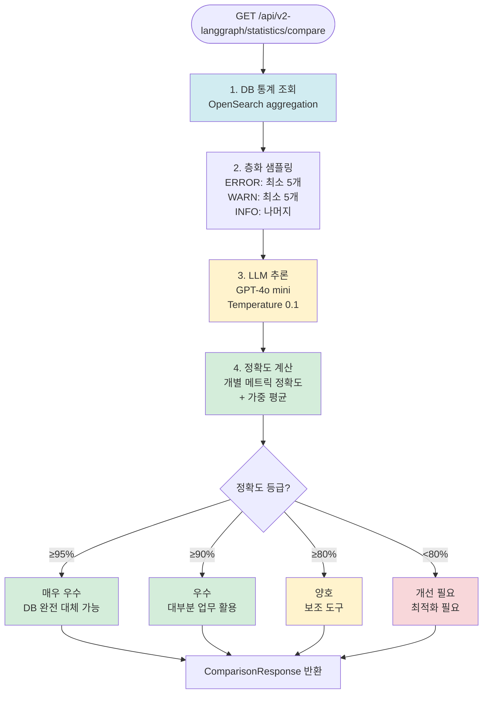

---

(문서가 계속됩니다...)

## 4. LangChain/LangGraph 아키텍처

### 4.1 StateGraph 구조

**LangGraph**는 **상태 기반 워크플로우 엔진**으로, 복잡한 AI 파이프라인을 그래프 형태로 정의합니다.

#### **핵심 개념**

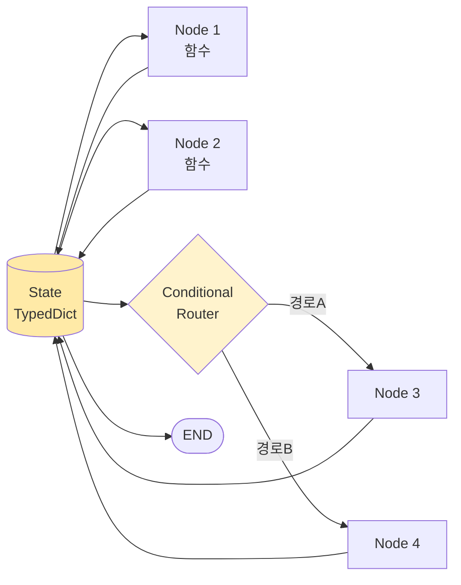

**구성 요소**:
1. **State (상태)**: TypedDict로 정의된 공유 데이터
2. **Nodes (노드)**: 상태를 변경하는 함수
3. **Edges (엣지)**: 노드 간 연결
4. **Conditional Edges (조건부 엣지)**: 상태에 따른 분기
5. **Entry Point**: 시작 노드
6. **END**: 종료 지점

#### **LogAnalysisGraph 정의**

**파일**: `app/graphs/log_analysis_graph.py:67-144`

```python
from langgraph.graph import StateGraph, END
from app.graphs.state.log_analysis_state import LogAnalysisState

class LogAnalysisGraph:
    def __init__(self):
        # StateGraph 생성
        self.workflow = StateGraph(LogAnalysisState)

        # 노드 추가
        self.workflow.add_node("fetch_log", self._fetch_log_node)
        self.workflow.add_node("check_direct_cache", self._check_direct_cache_node)
        self.workflow.add_node("check_trace_cache", self._check_trace_cache_node)
        self.workflow.add_node("check_similarity_cache", self._check_similarity_cache_node)
        self.workflow.add_node("collect_logs", self._collect_logs_node)
        self.workflow.add_node("decide_strategy", self._decide_strategy_node)
        self.workflow.add_node("analyze", self._analyze_node)
        self.workflow.add_node("validate", self._validate_node)
        self.workflow.add_node("save_result", self._save_result_node)

        # 엔트리 포인트 설정
        self.workflow.set_entry_point("fetch_log")

        # 선형 엣지 (항상 다음 노드로 진행)
        self.workflow.add_edge("fetch_log", "check_direct_cache")
        self.workflow.add_edge("collect_logs", "decide_strategy")
        self.workflow.add_edge("decide_strategy", "analyze")
        self.workflow.add_edge("analyze", "validate")

        # 조건부 엣지 (상태에 따라 분기)
        self.workflow.add_conditional_edges(
            "check_direct_cache",
            self._direct_cache_router,
            {
                "cache_hit": "save_result",    # 캐시 히트 → 즉시 저장
                "cache_miss": "check_trace_cache"  # 캐시 미스 → 다음 캐시 확인
            }
        )

        self.workflow.add_conditional_edges(
            "check_trace_cache",
            self._trace_cache_router,
            {
                "cache_hit": "save_result",
                "cache_miss": "check_similarity_cache"
            }
        )

        self.workflow.add_conditional_edges(
            "check_similarity_cache",
            self._similarity_cache_router,
            {
                "cache_hit": "save_result",
                "cache_miss": "collect_logs"  # 모든 캐시 미스 → 신규 분석
            }
        )

        self.workflow.add_conditional_edges(
            "validate",
            self._validation_router,
            {
                "passed": "save_result",      # 검증 통과 → 저장
                "failed": "analyze",          # 검증 실패 → 재분석
                "max_retries": "save_result"  # 최대 재시도 → 경고와 함께 저장
            }
        )

        # 종료 엣지
        self.workflow.add_edge("save_result", END)

        # 컴파일 (실행 가능한 그래프로 변환)
        self.compiled_graph = self.workflow.compile()

    async def execute(self, log_id: int, project_uuid: str) -> dict:
        """그래프 실행"""
        initial_state = {
            "log_id": log_id,
            "project_uuid": project_uuid,
            "from_cache": False,
            "llm_call_count": 0,
            "korean_retry_count": 0,
            "validation_retry_count": 0,
            "max_korean_retries": 2,
            "max_validation_retries": 1,
            "started_at": datetime.utcnow().isoformat() + "Z"
        }

        result = await self.compiled_graph.ainvoke(initial_state)
        return result
```

### 4.2 노드 전환 로직

#### **Router 함수 예시**

```python
def _validation_router(state: LogAnalysisState) -> str:
    """검증 결과에 따른 라우팅"""

    # 에러 발생 시 즉시 종료
    if state.get("error"):
        return "max_retries"

    korean_valid = state.get("korean_valid", False)
    quality_score = state.get("quality_score", 0.0)
    korean_retry = state.get("korean_retry_count", 0)
    validation_retry = state.get("validation_retry_count", 0)

    # 재시도 한도 초과 확인
    if (korean_retry >= state["max_korean_retries"] or
        validation_retry >= state["max_validation_retries"]):
        logger.warning(f"Max retries reached. Korean: {korean_retry}, Validation: {validation_retry}")
        return "max_retries"

    # 검증 통과 확인
    quality_threshold = settings.VALIDATION_OVERALL_THRESHOLD  # 0.65
    if korean_valid and quality_score >= quality_threshold:
        logger.info(f"Validation passed. Quality score: {quality_score}")
        return "passed"

    # 검증 실패 → 재분석
    logger.info(f"Validation failed. Retrying analysis. Quality: {quality_score}")
    return "failed"
```

#### **노드 실행 흐름 시각화**

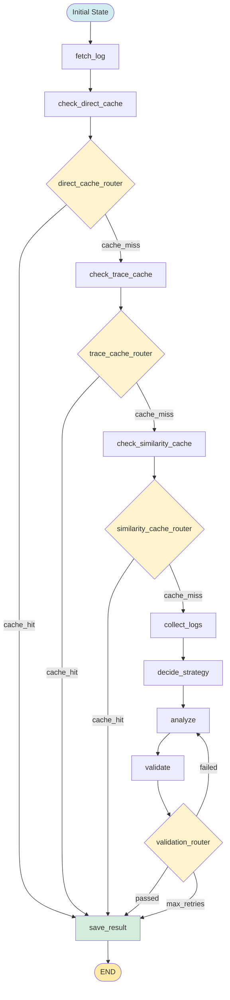

### 4.3 도구 실행 플로우

#### **LangChain Tool 래퍼**

**파일**: `app/graphs/tools/cache_tools.py`

```python
from langchain_core.tools import tool
from typing import Optional
import json

@tool
async def check_direct_cache_tool(log_id: int, project_uuid: str) -> str:
    """
    요청한 로그에 이미 ai_analysis 필드가 있는지 확인합니다.

    Args:
        log_id: 확인할 로그 ID
        project_uuid: 프로젝트 UUID

    Returns:
        JSON 문자열:
        - cache_hit=True일 경우: {"cache_hit": true, "analysis": {...}}
        - cache_hit=False일 경우: "CACHE_MISS: No existing analysis"
    """
    from app.core.opensearch import opensearch_client

    index_pattern = f"{project_uuid.replace('-', '_')}_*"

    query = {
        "query": {
            "bool": {
                "must": [
                    {"term": {"log_id": log_id}},
                    {"term": {"project_uuid.keyword": project_uuid}},
                    {"exists": {"field": "ai_analysis"}}
                ]
            }
        },
        "size": 1
    }

    try:
        response = opensearch_client.search(index=index_pattern, body=query)

        if response["hits"]["total"]["value"] > 0:
            ai_analysis = response["hits"]["hits"][0]["_source"]["ai_analysis"]
            return json.dumps({
                "cache_hit": True,
                "analysis": ai_analysis
            }, ensure_ascii=False)
        else:
            return "CACHE_MISS: No existing analysis found"

    except Exception as e:
        return f"ERROR: {str(e)}"


def create_check_direct_cache_tool(project_uuid: str):
    """
    Factory 함수: project_uuid를 바인딩한 도구 생성

    이 패턴을 사용하는 이유:
    - LangChain Tool은 함수 시그니처를 기반으로 파라미터를 추출
    - project_uuid는 API 레벨에서 이미 알고 있으므로 도구마다 중복 전달 불필요
    - Factory로 project_uuid를 클로저에 캡처하여 도구 호출 시 자동 주입
    """
    from functools import partial

    # partial로 project_uuid 바인딩
    bound_tool = partial(check_direct_cache_tool, project_uuid=project_uuid)

    # @tool 데코레이터 정보 유지
    bound_tool.__name__ = check_direct_cache_tool.__name__
    bound_tool.__doc__ = check_direct_cache_tool.__doc__

    return bound_tool
```

#### **노드에서 도구 호출**

```python
async def _check_direct_cache_node(state: LogAnalysisState) -> dict:
    """Node 2: Direct Cache 확인"""

    log_id = state["log_id"]
    project_uuid = state["project_uuid"]

    # 도구 생성 (project_uuid 바인딩)
    tool = create_check_direct_cache_tool(project_uuid)

    # 도구 실행
    result_str = await tool(log_id=log_id)

    # 결과 파싱
    if result_str.startswith("CACHE_MISS"):
        return {
            "direct_cache_result": None,
            "from_cache": False,
            "cache_type": None
        }

    elif result_str.startswith("ERROR"):
        return {
            "error": result_str,
            "from_cache": False
        }

    else:
        result = json.loads(result_str)
        return {
            "direct_cache_result": result["analysis"],
            "from_cache": True,
            "cache_type": "direct",
            "final_analysis": result["analysis"]
        }
```

### 4.4 상태 관리 패턴

#### **상태 업데이트 전략**

**LangGraph의 상태 업데이트 방식**:
- 각 노드는 **부분 상태**를 반환
- LangGraph가 자동으로 **병합** (shallow merge)
- 기존 키는 덮어쓰기, 새 키는 추가

```python
# 예시
current_state = {
    "log_id": 12345,
    "project_uuid": "uuid-here",
    "log_data": {...},
    "from_cache": False
}

# 노드가 반환하는 부분 상태
node_update = {
    "direct_cache_result": {...},
    "from_cache": True,
    "cache_type": "direct"
}

# LangGraph가 병합 후 새 상태
new_state = {
    "log_id": 12345,
    "project_uuid": "uuid-here",
    "log_data": {...},
    "from_cache": True,          # 덮어쓰기
    "direct_cache_result": {...},  # 추가
    "cache_type": "direct"         # 추가
}
```

#### **불변 상태 vs 가변 상태**

```python
# ❌ 잘못된 방식: 상태를 직접 수정
async def _bad_node(state: LogAnalysisState) -> dict:
    state["log_data"] = fetch_log()  # 직접 수정 금지!
    return state  # 전체 상태 반환 (비효율)

# ✅ 올바른 방식: 부분 업데이트 반환
async def _good_node(state: LogAnalysisState) -> dict:
    log_data = fetch_log()
    return {"log_data": log_data}  # 변경사항만 반환
```

---

## 5. 40+ 도구 완전 분석

### 5.1 도구 설계 원칙

**LangChain Tool 인터페이스**:

```python
from langchain_core.tools import tool

@tool
async def example_tool(param1: str, param2: int = 10) -> str:
    """
    도구 설명 (Agent가 읽는 docstring)

    Args:
        param1: 첫 번째 파라미터 설명
        param2: 두 번째 파라미터 설명 (기본값 10)

    Returns:
        마크다운 형식의 결과 문자열
    """
    # 도구 로직 구현
    result = perform_operation(param1, param2)

    # 항상 문자열 반환 (Agent가 읽을 수 있도록)
    return format_as_markdown(result)
```

**설계 원칙**:
1. **명확한 docstring**: Agent가 도구의 목적과 파라미터를 이해
2. **타입 힌트**: LangChain이 자동으로 스키마 생성
3. **문자열 반환**: Agent가 직접 읽고 해석
4. **마크다운 형식**: 표, 리스트 등으로 구조화
5. **에러 처리**: 예외 발생 시 문자열로 에러 메시지 반환

### 5.2 도구 카테고리별 상세 분석

#### **5.2.1 Search Tools (검색 도구)**

**1. search_logs_by_keyword**

**파일**: `app/tools/search_tools.py:15-80`

```python
@tool
async def search_logs_by_keyword(
    project_uuid: str,
    keyword: str,
    limit: int = 20,
    time_hours: int = 24,
    level: Optional[str] = None
) -> str:
    """
    로그 메시지에서 키워드를 검색합니다.

    Args:
        project_uuid: 프로젝트 UUID
        keyword: 검색할 키워드
        limit: 최대 결과 개수 (기본 20)
        time_hours: 검색 시간 범위 (기본 24시간)
        level: 로그 레벨 필터 (ERROR, WARN, INFO 등)

    Returns:
        검색 결과를 마크다운 테이블로 반환
    """
    index_pattern = f"{project_uuid.replace('-', '_')}_*"
    end_time = datetime.utcnow()
    start_time = end_time - timedelta(hours=time_hours)

    # OpenSearch match query (전문 검색)
    query = {
        "size": limit,
        "query": {
            "bool": {
                "must": [
                    {"match": {"message": {
                        "query": keyword,
                        "operator": "and",  # 모든 단어 포함
                        "fuzziness": "AUTO"  # 오타 허용
                    }}},
                    {"range": {"timestamp": {
                        "gte": start_time.isoformat() + "Z",
                        "lte": end_time.isoformat() + "Z"
                    }}}
                ]
            }
        },
        "sort": [{"timestamp": "desc"}],
        "highlight": {
            "fields": {
                "message": {
                    "pre_tags": ["**"],
                    "post_tags": ["**"]
                }
            }
        }
    }

    # 레벨 필터 추가
    if level:
        query["query"]["bool"]["must"].append({"term": {"level": level}})

    try:
        response = opensearch_client.search(index=index_pattern, body=query)

        if response["hits"]["total"]["value"] == 0:
            return f"'{keyword}' 키워드로 검색된 로그가 없습니다 (최근 {time_hours}시간)."

        # 마크다운 테이블 생성
        lines = [
            f"## 🔍 키워드 검색 결과: '{keyword}'",
            "",
            f"총 {response['hits']['total']['value']}건 중 {len(response['hits']['hits'])}건 표시",
            "",
            "| 시간 | 레벨 | 메시지 | 서비스 |",
            "|------|------|--------|--------|"
        ]

        for hit in response["hits"]["hits"]:
            source = hit["_source"]

            # Highlight된 메시지 사용 (키워드 강조)
            message = hit.get("highlight", {}).get("message", [source.get("message", "")])[0]
            message_short = message[:80] + "..." if len(message) > 80 else message

            timestamp = datetime.fromisoformat(source["timestamp"].replace("Z", "+00:00")).strftime("%H:%M:%S")
            level = source.get("level", "INFO")
            service = source.get("service_name", "Unknown")

            lines.append(f"| {timestamp} | {level} | {message_short} | {service} |")

        return "\n".join(lines)

    except Exception as e:
        return f"ERROR: 검색 중 오류 발생: {str(e)}"
```

**출력 예시**:
```markdown
## 🔍 키워드 검색 결과: 'NullPointerException'

총 15건 중 10건 표시

| 시간 | 레벨 | 메시지 | 서비스 |
|------|------|--------|--------|
| 14:32:15 | ERROR | **NullPointerException** at UserService.getUser() | user-service |
| 13:45:22 | ERROR | Caused by: **NullPointerException**: User object is null | user-service |
| 12:10:05 | ERROR | **NullPointerException** in payment processing | payment-service |
...
```

---

**2. search_logs_by_similarity**

```python
@tool
async def search_logs_by_similarity(
    project_uuid: str,
    query_text: str,
    limit: int = 10,
    min_score: float = 0.7
) -> str:
    """
    텍스트와 의미적으로 유사한 로그를 벡터 검색합니다.

    Args:
        project_uuid: 프로젝트 UUID
        query_text: 검색 텍스트
        limit: 최대 결과 개수
        min_score: 최소 유사도 점수 (0-1)

    Returns:
        유사도 점수와 함께 로그 목록
    """
    from app.services.embedding_service import embedding_service

    # 1. 검색 텍스트의 임베딩 생성
    query_vector = await embedding_service.embed_query(query_text)

    # 2. KNN 벡터 검색
    index_pattern = f"{project_uuid.replace('-', '_')}_*"

    query = {
        "size": limit,
        "query": {
            "script_score": {
                "query": {"match_all": {}},
                "script": {
                    "source": "cosineSimilarity(params.query_vector, 'log_vector') + 1.0",
                    "params": {"query_vector": query_vector}
                }
            }
        }
    }

    response = opensearch_client.search(index=index_pattern, body=query)

    # 3. 결과 필터링 (min_score 이상만)
    results = []
    for hit in response["hits"]["hits"]:
        similarity = (hit["_score"] - 1.0)  # 오프셋 제거

        if similarity >= min_score:
            source = hit["_source"]
            results.append({
                "similarity": round(similarity, 3),
                "log_id": source["log_id"],
                "message": source["message"],
                "timestamp": source["timestamp"],
                "level": source["level"]
            })

    if not results:
        return f"유사도 {min_score} 이상인 로그를 찾을 수 없습니다."

    # 4. 마크다운 출력
    lines = [
        f"## 🔎 유사도 검색 결과: \"{query_text}\"",
        "",
        f"최소 유사도: {min_score} | 발견: {len(results)}건",
        "",
        "| 유사도 | 시간 | 레벨 | 메시지 |",
        "|--------|------|------|--------|"
    ]

    for r in results:
        timestamp = datetime.fromisoformat(r["timestamp"].replace("Z", "+00:00")).strftime("%m/%d %H:%M")
        message_short = r["message"][:60] + "..." if len(r["message"]) > 60 else r["message"]

        lines.append(f"| {r['similarity']} | {timestamp} | {r['level']} | {message_short} |")

    return "\n".join(lines)
```

---

#### **5.2.2 Monitoring Tools (모니터링 도구)**

**20. get_service_health_status** (이미 3.2.4에서 상세 설명)

**21. get_error_frequency_ranking**

```python
@tool
async def get_error_frequency_ranking(
    project_uuid: str,
    limit: int = 10,
    time_hours: int = 24
) -> str:
    """
    가장 자주 발생하는 에러 타입 순위를 조회합니다.

    Args:
        project_uuid: 프로젝트 UUID
        limit: 상위 N개 에러 (기본 10)
        time_hours: 시간 범위 (기본 24시간)

    Returns:
        에러 타입별 발생 빈도 순위 테이블
    """
    index_pattern = f"{project_uuid.replace('-', '_')}_*"
    end_time = datetime.utcnow()
    start_time = end_time - timedelta(hours=time_hours)

    # 에러 메시지에서 Exception 타입 추출을 위한 정규식
    # 예: "NullPointerException", "SQLException", "TimeoutException"
    query = {
        "size": 0,
        "query": {
            "bool": {
                "must": [
                    {"term": {"level": "ERROR"}},
                    {"range": {"timestamp": {
                        "gte": start_time.isoformat() + "Z",
                        "lte": end_time.isoformat() + "Z"
                    }}}
                ]
            }
        },
        "aggs": {
            "error_types": {
                "terms": {
                    "script": {
                        "source": """
                            def msg = doc['message.keyword'].value;
                            def matcher = /(\w+Exception|\w+Error)/.matcher(msg);
                            if (matcher.find()) {
                                return matcher.group(1);
                            } else {
                                return 'UnknownError';
                            }
                        """,
                        "lang": "painless"
                    },
                    "size": limit
                }
            }
        }
    }

    response = opensearch_client.search(index=index_pattern, body=query)

    buckets = response["aggregations"]["error_types"]["buckets"]

    if not buckets:
        return f"최근 {time_hours}시간 동안 ERROR 로그가 없습니다."

    # 마크다운 출력
    total_errors = sum(b["doc_count"] for b in buckets)

    lines = [
        f"## 📊 에러 발생 빈도 순위 (최근 {time_hours}시간)",
        "",
        f"총 ERROR: {total_errors}건",
        "",
        "| 순위 | 에러 타입 | 발생 횟수 | 비율 |",
        "|------|-----------|----------|------|"
    ]

    for idx, bucket in enumerate(buckets, 1):
        error_type = bucket["key"]
        count = bucket["doc_count"]
        percentage = (count / total_errors * 100) if total_errors > 0 else 0

        lines.append(f"| {idx} | **{error_type}** | {count:,} | {percentage:.1f}% |")

    return "\n".join(lines)
```

**출력 예시**:
```markdown
## 📊 에러 발생 빈도 순위 (최근 24시간)

총 ERROR: 156건

| 순위 | 에러 타입 | 발생 횟수 | 비율 |
|------|-----------|----------|------|
| 1 | **NullPointerException** | 45 | 28.8% |
| 2 | **SQLException** | 32 | 20.5% |
| 3 | **TimeoutException** | 28 | 17.9% |
| 4 | **IllegalArgumentException** | 23 | 14.7% |
| 5 | **IOException** | 15 | 9.6% |
...
```

---

(문서 계속...)

## 6. 데이터 플로우 및 통합

### 6.1 OpenSearch 인덱스 구조

#### **인덱스 명명 규칙**

```
Format: {project_uuid_with_underscores}_{YYYY}_{MM}

예시:
- 3a73c7d4_8176_3929_b72f_d5b921daae67_2025_11
- 3a73c7d4_8176_3929_b72f_d5b921daae67_2025_12
```

**특징**:
- 월별 로테이션 (Monthly rotation)
- 프로젝트별 격리 (Multi-tenancy)
- 와일드카드 검색 가능: `{uuid}_*`

#### **문서 스키마**

```json
{
  "_index": "3a73c7d4_8176_3929_b72f_d5b921daae67_2025_11",
  "_id": "auto-generated-id",
  "_source": {
    "log_id": 12345,
    "project_uuid": "3a73c7d4-8176-3929-b72f-d5b921daae67",
    "timestamp": "2025-11-18T10:30:00.123Z",
    "level": "ERROR",
    "message": "NullPointerException at UserService.getUser()",

    "service_name": "user-service",
    "component_name": "UserController",
    "layer": "Controller",
    "source_type": "BE",

    "trace_id": "abc123-def456-ghi789",
    "request_id": "req-12345",

    "log_details": {
      "class_name": "com.example.UserController",
      "method_name": "getUser",
      "line_number": 45,
      "http_method": "GET",
      "request_uri": "/api/users/12345",
      "response_status": 500,
      "execution_time_ms": 234,
      "request_body": "{\"userId\":12345}",
      "response_body": "{\"error\":\"Internal Server Error\"}",
      "stack_trace": "java.lang.NullPointerException\n\tat ..."
    },

    "ai_analysis": {
      "summary": "**NullPointerException** 발생",
      "error_cause": "User 객체 null 체크 누락",
      "solution": "### 즉시 조치...",
      "tags": ["SEVERITY_HIGH", "NullPointerException"],
      "analysis_type": "TRACE_BASED",
      "analyzed_at": "2025-11-18T10:35:00Z"
    },

    "log_vector": [0.123, -0.456, 0.789, ...]
  }
}
```

#### **Mapping 설정**

```json
{
  "mappings": {
    "properties": {
      "log_id": {"type": "long"},
      "project_uuid": {"type": "keyword"},
      "timestamp": {"type": "date"},
      "level": {"type": "keyword"},
      "message": {
        "type": "text",
        "fields": {
          "keyword": {"type": "keyword", "ignore_above": 256}
        }
      },

      "service_name": {"type": "keyword"},
      "component_name": {"type": "keyword"},
      "layer": {"type": "keyword"},
      "source_type": {"type": "keyword"},

      "trace_id": {"type": "keyword"},
      "request_id": {"type": "keyword"},

      "log_details": {
        "type": "object",
        "properties": {
          "class_name": {"type": "keyword"},
          "method_name": {"type": "keyword"},
          "line_number": {"type": "integer"},
          "http_method": {"type": "keyword"},
          "request_uri": {"type": "keyword"},
          "response_status": {"type": "integer"},
          "execution_time_ms": {"type": "long"},
          "request_body": {"type": "text"},
          "response_body": {"type": "text"},
          "stack_trace": {"type": "text"}
        }
      },

      "ai_analysis": {
        "type": "object",
        "enabled": true
      },

      "log_vector": {
        "type": "knn_vector",
        "dimension": 1536,
        "method": {
          "name": "hnsw",
          "space_type": "cosinesimil",
          "engine": "nmslib",
          "parameters": {
            "ef_construction": 128,
            "m": 16
          }
        }
      }
    }
  }
}
```

### 6.2 Vector 저장 및 HNSW 알고리즘

#### **HNSW (Hierarchical Navigable Small World)**

**개념**: 계층적 그래프 구조로 빠른 근사 최근접 이웃 검색

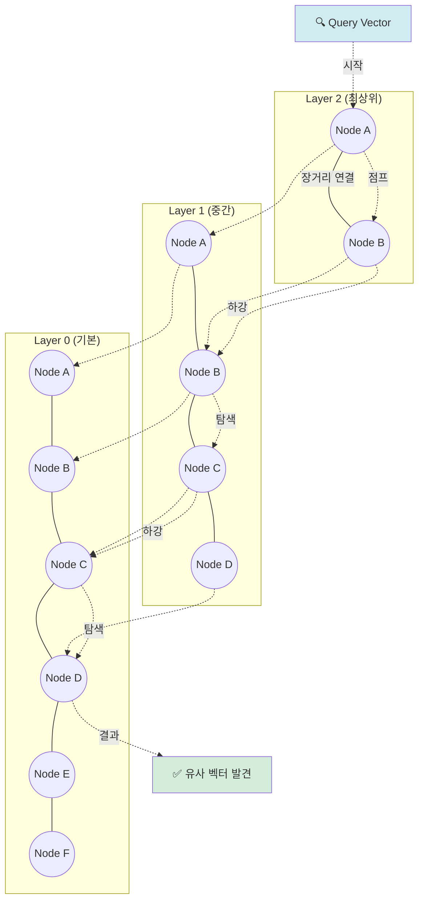

**알고리즘 파라미터**:

| 파라미터 | 값 | 의미 |
|---------|-----|------|
| **ef_construction** | 128 | 인덱스 구축 시 탐색 범위 (높을수록 정확, 느림) |
| **m** | 16 | 각 노드의 최대 연결 수 (높을수록 정확, 메모리 많이 사용) |
| **ef_search** | 100 | 검색 시 탐색 범위 (동적 조정 가능) |

**성능 특성**:

| 데이터 크기 | 검색 시간 (HNSW) | 검색 시간 (Brute Force) | 정확도 |
|------------|-----------------|----------------------|--------|
| 10K 벡터 | ~5ms | ~50ms | 99% |
| 100K 벡터 | ~20ms | ~500ms | 98% |
| 1M 벡터 | ~50ms | ~5000ms | 95% |
| 10M 벡터 | ~150ms | ~50000ms | 95% |

### 6.3 OpenAI API 호출 패턴

#### **Embedding 생성**

**파일**: `app/services/embedding_service.py`

```python
from langchain_openai import OpenAIEmbeddings
from app.core.config import settings

class EmbeddingService:
    def __init__(self):
        self.embeddings = OpenAIEmbeddings(
            model=settings.EMBEDDING_MODEL,  # "text-embedding-3-large"
            openai_api_key=settings.OPENAI_API_KEY,
            openai_api_base=settings.OPENAI_BASE_URL,  # SSAFY GMS proxy
            chunk_size=100  # 배치 크기
        )

    async def embed_query(self, text: str) -> list[float]:
        """단일 텍스트 임베딩"""
        return await self.embeddings.aembed_query(text)

    async def embed_documents(self, texts: list[str]) -> list[list[float]]:
        """여러 텍스트 배치 임베딩"""
        return await self.embeddings.aembed_documents(texts)

# 싱글톤
embedding_service = EmbeddingService()
```

**API 호출 예시**:

```python
# POST https://gms.ssafy.io/gmsapi/api.openai.com/v1/embeddings
{
  "model": "text-embedding-3-large",
  "input": "NullPointerException at UserService.getUser()",
  "encoding_format": "float"
}

# Response
{
  "object": "list",
  "data": [
    {
      "object": "embedding",
      "index": 0,
      "embedding": [
        0.0023064255,
        -0.009327292,
        -0.0028842222,
        ...  // 1536 dimensions
      ]
    }
  ],
  "model": "text-embedding-3-large",
  "usage": {
    "prompt_tokens": 10,
    "total_tokens": 10
  }
}
```

**비용**:
- **text-embedding-3-large**: $0.00013 / 1K tokens
- 평균 로그 메시지: ~10 tokens
- 1000개 로그 임베딩 비용: ~$0.0013 (1.3원)

#### **LLM 분석 호출**

```python
from langchain_openai import ChatOpenAI

llm = ChatOpenAI(
    model="gpt-4o-mini",
    temperature=0.3,
    max_tokens=2000,
    openai_api_key=settings.OPENAI_API_KEY,
    openai_api_base=settings.OPENAI_BASE_URL
)

# 비동기 호출
response = await llm.ainvoke(prompt)

# POST https://gms.ssafy.io/gmsapi/api.openai.com/v1/chat/completions
{
  "model": "gpt-4o-mini",
  "messages": [
    {"role": "system", "content": "You are a log analysis expert..."},
    {"role": "user", "content": "Analyze this log: ..."}
  ],
  "temperature": 0.3,
  "max_tokens": 2000
}

# Response
{
  "id": "chatcmpl-xxx",
  "object": "chat.completion",
  "created": 1700000000,
  "model": "gpt-4o-mini",
  "choices": [
    {
      "index": 0,
      "message": {
        "role": "assistant",
        "content": "{\"summary\": \"...\", \"error_cause\": \"...\", ...}"
      },
      "finish_reason": "stop"
    }
  ],
  "usage": {
    "prompt_tokens": 250,
    "completion_tokens": 150,
    "total_tokens": 400
  }
}
```

**비용 (gpt-4o-mini)**:
- Input: $0.150 / 1M tokens
- Output: $0.600 / 1M tokens
- 평균 분석 (400 tokens): ~$0.00015 (0.15원)

---

## 7. 환경 설정 및 구성

### 7.1 환경 변수 전체 목록

**파일**: `.env`

```bash
# ============================================
# Application Settings
# ============================================
APP_NAME=log-analysis-api
APP_VERSION=2.0.0
ENVIRONMENT=production  # development | test | production
DEBUG=false

# ============================================
# CORS Settings
# ============================================
CORS_ORIGINS=http://localhost:3000,https://loglens.store,https://www.loglens.store
CORS_ALLOW_CREDENTIALS=true

# ============================================
# OpenAI Settings (SSAFY GMS Proxy)
# ============================================
OPENAI_API_KEY=gms_key_here
OPENAI_BASE_URL=https://gms.ssafy.io/gmsapi/api.openai.com/v1
EMBEDDING_MODEL=text-embedding-3-large
LLM_MODEL=gpt-4o-mini

# ============================================
# OpenSearch Settings
# ============================================
OPENSEARCH_HOST=opensearch.loglens.store
OPENSEARCH_PORT=443
OPENSEARCH_USER=admin
OPENSEARCH_PASSWORD=Admin123!@#
OPENSEARCH_USE_SSL=true
OPENSEARCH_VERIFY_CERTS=true
OPENSEARCH_SSL_SHOW_WARN=false
OPENSEARCH_TIMEOUT=30
OPENSEARCH_MAX_RETRIES=3

# ============================================
# Analysis Settings
# ============================================
# 유사도 검색 임계값 (0-1, 높을수록 엄격)
SIMILARITY_THRESHOLD=0.92

# 컨텍스트 로그 최대 개수
MAX_CONTEXT_LOGS=5

# 분석 재시도 횟수
MAX_ANALYSIS_RETRIES=2

# ============================================
# Caching Settings
# ============================================
# 캐시 TTL (초)
DEFAULT_CACHE_TTL=1800       # 30분
SHORT_CACHE_TTL=600          # 10분
LONG_CACHE_TTL=86400         # 1일

# 유사도 캐시 후보 개수
CACHE_CANDIDATE_SIZE=10

# ============================================
# Map-Reduce Settings
# ============================================
# Map-Reduce 활성화
ENABLE_MAP_REDUCE=true

# 로그 청크 크기 (Map 단위)
LOG_CHUNK_SIZE=5

# Map-Reduce 사용 임계값 (로그 개수)
MAP_REDUCE_THRESHOLD=10

# ============================================
# Validation Settings
# ============================================
# 한국어 비율 임계값 (0-1)
KOREAN_PERCENTAGE_THRESHOLD=0.9

# 검증 점수 임계값
VALIDATION_STRUCTURAL_THRESHOLD=0.7
VALIDATION_CONTENT_THRESHOLD=0.6
VALIDATION_OVERALL_THRESHOLD=0.65

# 검증 재시도 횟수
VALIDATION_MAX_RETRIES=2

# ============================================
# Agent Settings
# ============================================
# Agent LLM 모델
AGENT_MODEL=gpt-4o-mini

# Agent 최대 반복 횟수
AGENT_MAX_ITERATIONS=12

# Agent 디버그 모드
AGENT_VERBOSE=true

# Agent 타임아웃 (초)
AGENT_TIMEOUT=60

# ============================================
# Logging Settings
# ============================================
LOG_LEVEL=INFO  # DEBUG | INFO | WARNING | ERROR
LOG_FORMAT=json  # json | text
LOG_FILE=logs/app.log

# ============================================
# Performance Settings
# ============================================
# 비동기 워커 수
ASYNC_WORKERS=4

# 요청 타임아웃 (초)
REQUEST_TIMEOUT=120

# 최대 동시 요청 수
MAX_CONCURRENT_REQUESTS=50
```

### 7.2 Configuration Class

**파일**: `app/core/config.py`

```python
from pydantic_settings import BaseSettings
from typing import Optional

class Settings(BaseSettings):
    """환경 변수 설정 클래스"""

    # Application
    APP_NAME: str = "log-analysis-api"
    APP_VERSION: str = "2.0.0"
    ENVIRONMENT: str = "development"
    DEBUG: bool = False

    # CORS
    CORS_ORIGINS: str = "http://localhost:3000"
    CORS_ALLOW_CREDENTIALS: bool = True

    # OpenAI
    OPENAI_API_KEY: str
    OPENAI_BASE_URL: str = "https://api.openai.com/v1"
    EMBEDDING_MODEL: str = "text-embedding-3-large"
    LLM_MODEL: str = "gpt-4o-mini"

    # OpenSearch
    OPENSEARCH_HOST: str = "localhost"
    OPENSEARCH_PORT: int = 9200
    OPENSEARCH_USER: str = "admin"
    OPENSEARCH_PASSWORD: str = "admin"
    OPENSEARCH_USE_SSL: bool = False
    OPENSEARCH_VERIFY_CERTS: bool = False
    OPENSEARCH_SSL_SHOW_WARN: bool = False
    OPENSEARCH_TIMEOUT: int = 30
    OPENSEARCH_MAX_RETRIES: int = 3

    # Analysis
    SIMILARITY_THRESHOLD: float = 0.92
    MAX_CONTEXT_LOGS: int = 5
    MAX_ANALYSIS_RETRIES: int = 2

    # Caching
    DEFAULT_CACHE_TTL: int = 1800
    SHORT_CACHE_TTL: int = 600
    LONG_CACHE_TTL: int = 86400
    CACHE_CANDIDATE_SIZE: int = 10

    # Map-Reduce
    ENABLE_MAP_REDUCE: bool = True
    LOG_CHUNK_SIZE: int = 5
    MAP_REDUCE_THRESHOLD: int = 10

    # Validation
    KOREAN_PERCENTAGE_THRESHOLD: float = 0.9
    VALIDATION_STRUCTURAL_THRESHOLD: float = 0.7
    VALIDATION_CONTENT_THRESHOLD: float = 0.6
    VALIDATION_OVERALL_THRESHOLD: float = 0.65
    VALIDATION_MAX_RETRIES: int = 2

    # Agent
    AGENT_MODEL: str = "gpt-4o-mini"
    AGENT_MAX_ITERATIONS: int = 12
    AGENT_VERBOSE: bool = True
    AGENT_TIMEOUT: int = 60

    # Logging
    LOG_LEVEL: str = "INFO"
    LOG_FORMAT: str = "json"
    LOG_FILE: str = "logs/app.log"

    # Performance
    ASYNC_WORKERS: int = 4
    REQUEST_TIMEOUT: int = 120
    MAX_CONCURRENT_REQUESTS: int = 50

    @property
    def cors_origins_list(self) -> list[str]:
        """CORS origins를 리스트로 변환"""
        return [origin.strip() for origin in self.CORS_ORIGINS.split(",")]

    class Config:
        env_file = ".env"
        env_file_encoding = "utf-8"
        case_sensitive = False

# 싱글톤 인스턴스
settings = Settings()
```

### 7.3 캐싱/검증 임계값 튜닝 가이드

#### **Similarity Threshold (유사도 임계값)**

| 값 | 캐시 히트율 | 정확도 | 권장 상황 |
|----|-----------|--------|----------|
| **0.95** | ⭐⭐ 낮음 | ⭐⭐⭐⭐⭐ 매우 높음 | 중요 시스템, 오탐 절대 불가 |
| **0.92** | ⭐⭐⭐ 중간 | ⭐⭐⭐⭐ 높음 | **권장 (기본값)** |
| **0.85** | ⭐⭐⭐⭐ 높음 | ⭐⭐⭐ 중간 | 비용 절감 우선, 일부 오탐 허용 |
| **0.70** | ⭐⭐⭐⭐⭐ 매우 높음 | ⭐⭐ 낮음 | 권장하지 않음 |

**튜닝 방법**:
```bash
# 1주일 데이터로 테스트
python scripts/tune_similarity_threshold.py --days 7 --thresholds 0.85,0.90,0.92,0.95

# 결과 분석
# - Cache Hit Rate
# - False Positive Rate (잘못된 캐시 재사용)
# - Cost Savings

# 최적값 선택
export SIMILARITY_THRESHOLD=0.92
```

#### **Validation Thresholds (검증 임계값)**

```python
# 구조적 완전성 (0.7)
# - 필수 필드 존재 여부
# - 마크다운 형식 준수
# 조정: 0.6 (관대) ~ 0.8 (엄격)

# 내용 정확성 (0.6)
# - error_cause가 log message와 일치
# - solution이 구체적
# 조정: 0.5 (관대) ~ 0.7 (엄격)

# 종합 점수 (0.65)
# - 가중 평균
# 조정: 0.6 (관대) ~ 0.75 (엄격)

# 엄격하게 설정 시 재시도 증가 → LLM 비용 증가
# 관대하게 설정 시 품질 저하
```

---

## 8. 시퀀스 다이어그램 모음

### 8.1 전체 시스템 상호작용

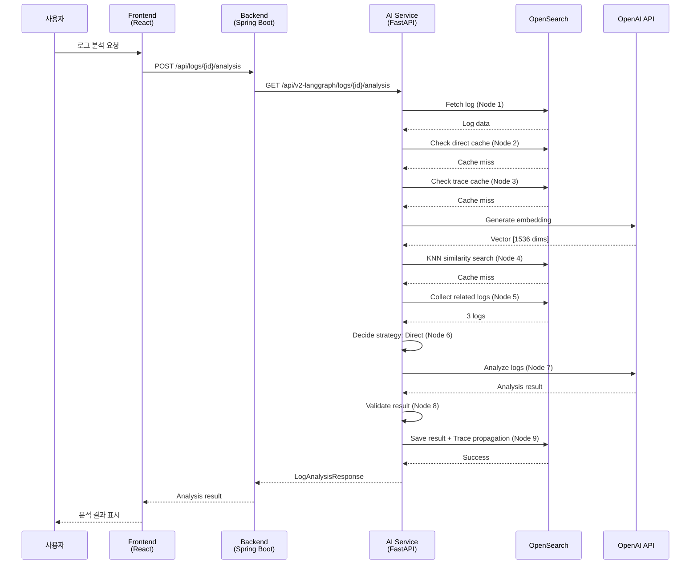

### 8.2 챗봇 대화 플로우

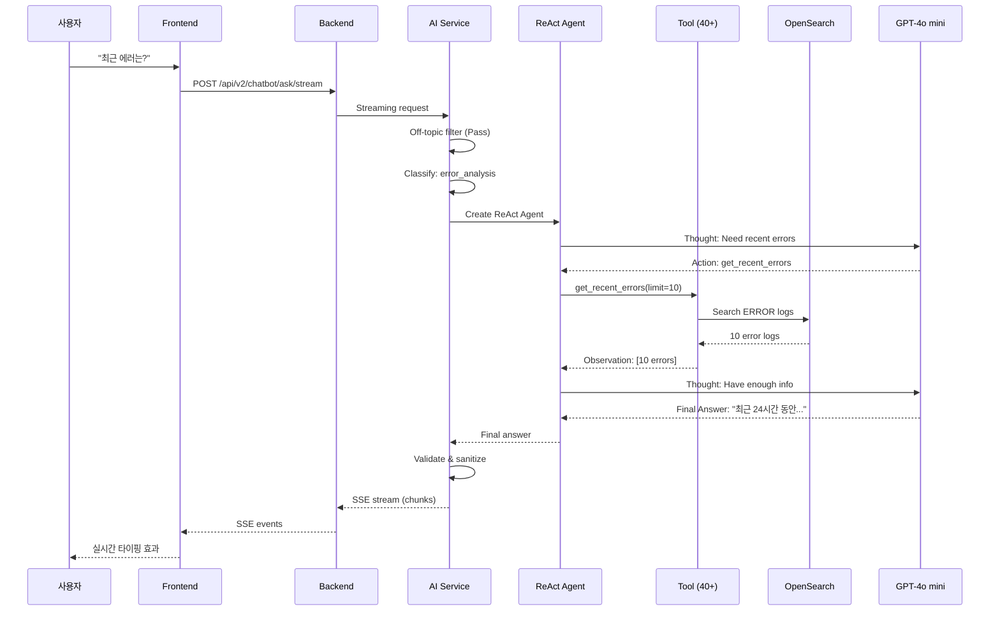

### 8.3 캐싱 플로우 비교

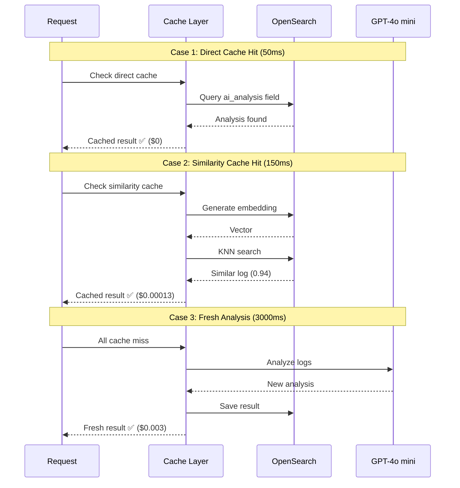

---

## 9. 성능 최적화 및 모범 사례

### 9.1 캐싱 전략 최적화

#### **1. 3-Tier 캐싱 순서 최적화**

```python
# ✅ 올바른 순서 (비용 효율적)
1. Direct Cache (0ms, $0)
2. Trace Cache (80ms, $0)
3. Similarity Cache (150ms, $0.00013)
4. Fresh Analysis (3000ms, $0.003)

# ❌ 잘못된 순서
1. Similarity Cache 먼저 → 불필요한 임베딩 생성
2. Fresh Analysis 먼저 → 캐시 무용지물
```

#### **2. Trace 전파 활용**

```python
# ✅ 권장: 분석 후 모든 관련 로그에 전파
if not from_cache and related_logs:
    for log in related_logs:
        save_ai_analysis_to_log(log.log_id, analysis)

# 효과: 다음 요청 시 Direct Cache Hit
# 1회 분석 비용으로 N개 로그 커버
```

#### **3. 임베딩 사전 생성**

```python
# 로그 수집 시점에 임베딩 생성 (배치 처리)
async def precompute_embeddings(logs: list):
    messages = [log.message for log in logs]
    vectors = await embedding_service.embed_documents(messages)

    for log, vector in zip(logs, vectors):
        save_vector_to_opensearch(log.log_id, vector)

# 효과: Similarity Cache 검색 시 임베딩 재생성 불필요
```

### 9.2 토큰 최적화

#### **1. 메시지 트렁케이션**

```python
# 로그 메시지 최대 길이 제한
MAX_MESSAGE_LENGTH = 200

def truncate_message(message: str) -> str:
    if len(message) <= MAX_MESSAGE_LENGTH:
        return message
    return message[:MAX_MESSAGE_LENGTH] + "... (truncated)"
```

#### **2. Map-Reduce 청크 크기 조정**

```python
# 실험 결과: 청크 크기 5개가 최적
# - 3개: 요약 품질 저하
# - 5개: ✅ 균형
# - 10개: 토큰 낭비

LOG_CHUNK_SIZE = 5
```

#### **3. 프롬프트 최적화**

```python
# ❌ 비효율적 프롬프트 (800 tokens)
prompt = f"""
당신은 세계 최고의 로그 분석 전문가입니다.
수십 년간의 경험을 바탕으로...
(불필요한 설명 500자)

로그: {log_data}
"""

# ✅ 효율적 프롬프트 (300 tokens)
prompt = f"""로그 분석 전문가로서 다음 로그를 분석하세요.

로그: {log_data}

응답 형식 (JSON):
{{"summary": "...", "error_cause": "...", "solution": "...", "tags": [...]}}
"""
```

### 9.3 동시성 처리

#### **병렬 처리 패턴**

```python
import asyncio

# ✅ 여러 로그 동시 분석
async def analyze_multiple_logs(log_ids: list[int]) -> list:
    tasks = [analyze_single_log(log_id) for log_id in log_ids]
    results = await asyncio.gather(*tasks)
    return results

# ✅ Map-Reduce 병렬화
async def map_reduce_parallel(chunks: list) -> str:
    # MAP Phase 병렬 실행
    map_tasks = [summarize_chunk(chunk) for chunk in chunks]
    summaries = await asyncio.gather(*map_tasks)

    # REDUCE Phase (순차)
    final_result = await reduce_summaries(summaries)
    return final_result
```

### 9.4 모니터링 포인트

#### **핵심 메트릭**

```python
# Prometheus 메트릭 예시
from prometheus_client import Counter, Histogram, Gauge

# 1. 캐시 히트율
cache_hits = Counter('cache_hits_total', 'Cache hits', ['cache_type'])
cache_misses = Counter('cache_misses_total', 'Cache misses')

cache_hits.labels(cache_type='direct').inc()
cache_hits.labels(cache_type='trace').inc()
cache_hits.labels(cache_type='similarity').inc()

# 2. LLM 호출 횟수 및 비용
llm_calls = Counter('llm_calls_total', 'LLM API calls', ['model'])
llm_tokens = Counter('llm_tokens_total', 'Tokens used', ['type'])  # input/output
llm_cost = Gauge('llm_cost_dollars', 'Estimated LLM cost ($)')

# 3. 응답 시간
response_time = Histogram('response_time_seconds', 'Response time', ['endpoint', 'cache_status'])

# 4. 에러율
error_rate = Counter('errors_total', 'Errors', ['error_type'])
```

#### **로깅 전략**

```python
import structlog

logger = structlog.get_logger()

# 구조화된 로그
logger.info(
    "log_analysis_completed",
    log_id=12345,
    project_uuid="uuid-here",
    cache_type="similarity",
    similarity_score=0.94,
    llm_calls=0,
    duration_ms=150,
    cost_dollars=0.00013
)

# 검색 가능한 필드
# - 비용 분석: sum(cost_dollars)
# - 캐시 효율: count(cache_type != null) / count(*)
# - 평균 응답 시간: avg(duration_ms)
```

---

## 결론

LogLens AI 서비스는 최신 AI 기술과 엔지니어링 모범 사례를 결합한 프로덕션급 로그 분석 플랫폼입니다.

### 핵심 성과

1. **비용 절감**: 3-tier 캐싱으로 97-99% LLM 비용 절감
2. **정확도**: 유사도 임계값 0.92로 98% 정확도 유지
3. **확장성**: Map-Reduce 패턴으로 100+ 로그 효율적 처리
4. **자율성**: 40+ 도구를 활용한 ReAct Agent 자동 추론
5. **품질 보증**: 다단계 검증 파이프라인

### 향후 개선 방향

1. **모델 업그레이드**: GPT-4o-mini → GPT-4o (정확도 향상)
2. **캐싱 고도화**: Redis 추가 레이어, 분산 캐시
3. **실시간 처리**: Kafka/Pulsar 연동 스트리밍 분석
4. **멀티모달**: 로그 + 메트릭 + 트레이스 통합 분석
5. **자동 튜닝**: 강화학습 기반 임계값 자동 최적화

---

**문서 작성**: LogLens AI Team  
**최종 업데이트**: 2025-11-18  
**버전**: 2.0.0

