# AI 서비스 세부 플로우 ê°€ì´ë“œ

> **LogLens AI Service** - ìƒì„¸ 기능 플로우 ë° ì•„í‚¤í…처 문서
> 위치: `/mnt/c/SSAFY/third_project/AI/S13P31A306`
> 최종 ì—…ë°ì´íŠ¸: 2025-11-18

---

## 목차

1. [개요](#1-개요)
2. [API 엔드í¬ì¸íŠ¸ ì „ì²´ 맵](#2-api-엔드í¬ì¸íŠ¸-ì „ì²´-맵)
3. [핵심 기능별 세부 플로우](#3-핵심-기능별-세부-플로우)
   - [3.1 로그 ë¶„ì„ (V2 LangGraph) - 3-Tier ìºì‹± ì „ëµ](#31-로그-분ì„-v2-langgraph---3-tier-ìºì‹±-ì „ëµ)
   - [3.2 RAG ì±—ë´‡ (V2 Agent) - ReAct 아키í…처](#32-rag-ì±—ë´‡-v2-agent---react-아키í…처)
   - [3.3 HTML 문서 ìƒì„±](#33-html-문서-ìƒì„±)
   - [3.4 AI vs DB 통계 비êµ](#34-ai-vs-db-통계-비êµ)
4. [LangChain/LangGraph 아키í…처](#4-langchainlanggraph-아키í…처)
5. [40+ ë„구 완전 분ì„](#5-40-ë„구-완전-분ì„)
6. [ë°ì´í„° 플로우 ë° í†µí•©](#6-ë°ì´í„°-플로우-ë°-통합)
7. [환경 설정 ë° êµ¬ì„±](#7-환경-설정-ë°-구성)
8. [시퀀스 다ì´ì–´ê·¸ë¨ 모ìŒ](#8-시퀀스-다ì´ì–´ê·¸ë¨-모ìŒ)
9. [성능 최ì í™” ë° ëª¨ë²” 사례](#9-성능-최ì í™”-ë°-모범-사례)

---

## 1. 개요

### 1.1 AI 서비스�

LogLens AI 서비스는 **FastAPI ê¸°ë°˜ì˜ ì§€ëŠ¥í˜• 로그 ë¶„ì„ í”Œë«í¼**으로, ë‹¤ìŒ í•µì‹¬ ê¸°ëŠ¥ì„ ì œê³µí•©ë‹ˆë‹¤:

- 🤖 **AI 기반 로그 분ì„**: GPT-4o mini를 활용한 ìë™ ì—러 ì›ì¸ ë¶„ì„ ë° í•´ê²°ì±… 제시
- 💬 **RAG ì±—ë´‡**: 40+ 전문 ë„구를 활용한 ìì—°ì–´ 로그 질ì˜ì‘답
- 📊 **HTML 문서 ìë™ ìƒì„±**: 프로ì íŠ¸/ì—러 ë¶„ì„ ë¦¬í¬íŠ¸ ìƒì„±
- 📈 **AI vs DB 통계 비êµ**: LLM 추론 ì •í™•ë„ ê²€ì¦

### 1.2 기술 스íƒ

| 구성 요소 | 기술 | 버전 |
|---------|------|------|
| **Framework** | FastAPI | 0.109.0 |
| **AI Orchestration** | LangChain | 0.2.16 |
| **Workflow Engine** | LangGraph | 0.2.28 |
| **LLM** | OpenAI GPT-4o mini | - |
| **Embeddings** | text-embedding-3-large | 1536 dims |
| **Vector DB** | OpenSearch (KNN) | 2.4.2 |
| **Template Engine** | Jinja2 | 3.1.2 |
| **Runtime** | Python | 3.11 |

### 1.3 ì „ì²´ 아키í…처 개요


### 1.4 주요 특징

#### ✨ 3-Tier ìºì‹± ì „ëµ
- **Direct Cache**: ì´ë¯¸ 분ì„ëœ ë¡œê·¸ ì¬ì‚¬ìš©
- **Trace Cache**: ë™ì¼ traceì˜ ë‹¤ë¥¸ 로그 ë¶„ì„ ì¬ì‚¬ìš©
- **Similarity Cache**: 벡터 ìœ ì‚¬ë„ 0.92 ì´ìƒì¸ 로그 ë¶„ì„ ì¬ì‚¬ìš©
- **효과**: 97-99% 비용 ì ˆê°

#### 🤖 ì율 ì—ì´ì „트 시스템
- **ReAct 패턴**: Reasoning + Acting
- **40+ 전문 ë„구**: 검색, 분ì„, 모니터ë§, 성능, 패턴 íƒì§€ 등
- **ìë™ ë„구 ì„ íƒ**: GPT-4o miniê°€ ìƒí™©ì— ë§ëŠ” ë„구 ìë™ ì„ íƒ

#### 🔄 Map-Reduce 패턴
- **대용량 로그 처리**: 100ê°œ 로그를 5개씩 ì²­í¬ë¡œ 분할
- **병렬 처리**: ê° ì²­í¬ ë…립 ë¶„ì„ í›„ 통합
- **í† í° ìµœì í™”**: ë‹¨ì¼ í˜¸ì¶œ 대비 효율ì 

#### ✅ ê²€ì¦ íŒŒì´í”„ë¼ì¸
- **한국어 ê²€ì¦**: 90% ì´ìƒ 한국어 문ì í¬í•¨ 확ì¸
- **품질 ê²€ì¦**: êµ¬ì¡°ì  ì™„ì „ì„±, ë‚´ìš© 정확성 í‰ê°€
- **ì¬ì‹œë„ ë¡œì§**: 최대 2회 ì¬ë¶„ì„

---

## 2. API 엔드í¬ì¸íŠ¸ ì „ì²´ 맵

### 2.1 버전별 API 구조

```
/api
├── /v1                        # 기본 ë¶„ì„ (초기 버전)
│   ├── /logs/{log_id}/analysis
│   ├── /chatbot/ask
│   └── /chatbot/ask/stream
│
├── /v2                        # ReAct Agent 챗봇
│   ├── /chatbot/ask
│   └── /chatbot/ask/stream
│
└── /v2-langgraph              # LangGraph 기반 고급 분ì„
    ├── /logs/{log_id}/analysis
    ├── /analysis
    │   ├── /projects/html-document
    │   └── /errors/html-document
    └── /statistics
        ├── /compare
        └── /hourly
```

### 2.2 ì „ì²´ 엔드í¬ì¸íŠ¸ ìƒì„¸

| 메소드 | 엔드í¬ì¸íŠ¸ | 설명 | íŒŒì¼ | 주요 기능 |
|--------|-----------|------|------|----------|
| **V1 APIs** |
| `GET` | `/api/v1/logs/{log_id}/analysis` | 기본 로그 ë¶„ì„ | `app/api/v1/logs.py:85` | Trace ìºì‹±, ìœ ì‚¬ë„ ê²€ìƒ‰ |
| `POST` | `/api/v1/chatbot/ask` | 기본 ì±—ë´‡ | `app/api/v1/chatbot.py:171` | RAG QA ìºì‹± |
| `POST` | `/api/v1/chatbot/ask/stream` | 기본 ì±—ë´‡ (스트리ë°) | `app/api/v1/chatbot.py:314` | SSE ìŠ¤íŠ¸ë¦¬ë° |
| **V2 APIs (Agent)** |
| `POST` | `/api/v2/chatbot/ask` | ReAct Agent ì±—ë´‡ | `app/api/v2/chatbot.py:209` | 40+ ë„구, ì율 추론 |
| `POST` | `/api/v2/chatbot/ask/stream` | Agent ì±—ë´‡ (스트리ë°) | `app/api/v2/chatbot.py:314` | SSE + Agent 추론 |
| **V2 LangGraph APIs** |
| `GET` | `/api/v2-langgraph/logs/{log_id}/analysis` | LangGraph 로그 ë¶„ì„ | `app/api/v2_langgraph/logs.py:18` | 3-tier ìºì‹±, Map-Reduce |
| `POST` | `/api/v2-langgraph/analysis/projects/html-document` | 프로ì íŠ¸ ë¶„ì„ ë¬¸ì„œ | `app/api/v2_langgraph/analysis.py:21` | Jinja2 HTML ìƒì„± |
| `POST` | `/api/v2-langgraph/analysis/errors/html-document` | ì—러 ë¶„ì„ ë¬¸ì„œ | `app/api/v2_langgraph/analysis.py:189` | ì—러 리í¬íŠ¸ ìƒì„± |
| `GET` | `/api/v2-langgraph/statistics/compare` | AI vs DB ë¹„êµ | `app/api/v2_langgraph/statistics.py:104` | ì •í™•ë„ ê²€ì¦ |
| `GET` | `/api/v2-langgraph/statistics/hourly` | 시간별 통계 | `app/api/v2_langgraph/statistics.py:290` | 시간대별 ë¶„í¬ |

### 2.3 API 버전 ì„ íƒ ê°€ì´ë“œ

```mermaid
graph TD
    Start{ì–´ë–¤ ê¸°ëŠ¥ì´ í•„ìš”í•œê°€?}

    Start -->|ë‹¨ì¼ ë¡œê·¸ AI 분ì„| V2LG[✅ V2 LangGraph<br/>/logs/{id}/analysis]
    Start -->|ìì—°ì–´ 질ì˜ì‘답| V2Agent[✅ V2 Agent<br/>/chatbot/ask/stream]
    Start -->|ë¶„ì„ ë¦¬í¬íŠ¸ ìƒì„±| V2Doc[✅ V2 LangGraph<br/>/analysis/.../html-document]
    Start -->|AI ì •í™•ë„ ê²€ì¦| V2Stats[✅ V2 LangGraph<br/>/statistics/compare]

    V2LG --> Features1[• 3-tier ìºì‹±<br/>• Map-Reduce<br/>• ê²€ì¦ íŒŒì´í”„ë¼ì¸]
    V2Agent --> Features2[• 40+ ë„구<br/>• ì율 추론<br/>• 실시간 스트리ë°]
    V2Doc --> Features3[• Jinja2 템플릿<br/>• Chart.js 차트<br/>• AI ì¸ì‚¬ì´íŠ¸]
    V2Stats --> Features4[• 층화 샘플ë§<br/>• ì •í™•ë„ ê³„ì‚°<br/>• ì‹ ë¢°ë„ í‰ê°€]

    style V2LG fill:#d4edda
    style V2Agent fill:#d4edda
    style V2Doc fill:#d4edda
    style V2Stats fill:#d4edda
```

**권ì¥ì‚¬í•­:**
- ✅ **V2 LangGraph**: 로그 분ì„, 문서 ìƒì„± → ê°€ì¥ ê³ ê¸‰ 기능
- ✅ **V2 Agent**: ì±—ë´‡ → ììœ¨ì  ë„구 ì„ íƒ
- âš ï¸ **V1**: 레거시, 새 기능 개발 중단

---

## 3. 핵심 기능별 세부 플로우

## 3.1 로그 ë¶„ì„ (V2 LangGraph) - 3-Tier ìºì‹± ì „ëµ

### 3.1.1 ì „ì²´ 플로우 다ì´ì–´ê·¸ë¨

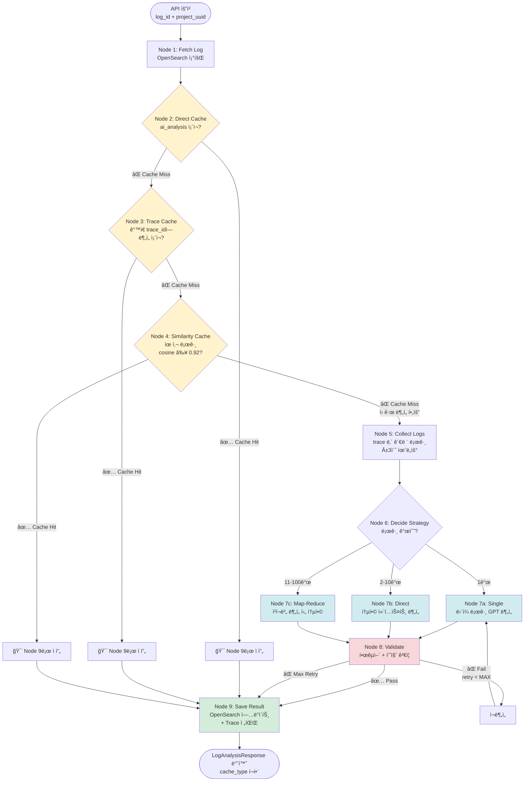

### 3.1.2 노드별 ìƒì„¸ 설명

#### **Node 1: Fetch Log** (`_fetch_log_node` - `app/graphs/log_analysis_graph.py:148`)

**목ì **: OpenSearchì—ì„œ ìš”ì²­ëœ ë¡œê·¸ ë°ì´í„° 조회

**ì…ë ¥**:
```python
state = {
    "log_id": 12345,
    "project_uuid": "3a73c7d4-8176-3929-b72f-d5b921daae67"
}
```

**OpenSearch 쿼리**:
```json
{
  "query": {
    "bool": {
      "must": [
        {"term": {"log_id": 12345}},
        {"term": {"project_uuid.keyword": "3a73c7d4-8176-3929-b72f-d5b921daae67"}}
      ]
    }
  },
  "size": 1
}
```

**출력**:
```python
{
    "log_data": {
        "log_id": 12345,
        "timestamp": "2025-11-18T10:30:00.123Z",
        "level": "ERROR",
        "message": "NullPointerException at UserService.getUser()",
        "service_name": "user-service",
        "component_name": "UserController",
        "trace_id": "abc123-def456",
        "log_details": {
            "class_name": "com.example.UserController",
            "method_name": "getUser",
            "line_number": 45,
            "stack_trace": "java.lang.NullPointerException\n\tat com.example..."
        }
    },
    "trace_id": "abc123-def456",
    "timestamp": "2025-11-18T10:30:00.123Z",
    "log_message": "NullPointerException at UserService.getUser()",
    "log_level": "ERROR"
}
```

**ì—러 처리**:
- 로그 미발견 시: `{"error": "Log not found"}` → 즉시 종료

---

#### **Node 2: Direct Cache Check** (`_check_direct_cache_node` - `app/graphs/log_analysis_graph.py:197`)

**목ì **: 요청한 로그 ìì²´ì— ì´ë¯¸ `ai_analysis` 필드가 ìˆëŠ”지 확ì¸

**ë„구**: `cache_tools.create_check_direct_cache_tool()`

**OpenSearch 쿼리**:
```json
{
  "query": {
    "bool": {
      "must": [
        {"term": {"log_id": 12345}},
        {"term": {"project_uuid.keyword": "3a73c7d4-8176-3929-b72f-d5b921daae67"}},
        {"exists": {"field": "ai_analysis"}}
      ]
    }
  }
}
```

**Cache Hit 예시**:
```python
{
    "direct_cache_result": {
        "summary": "**NullPointerException** ë°œìƒ",
        "error_cause": "user_idì— í•´ë‹¹í•˜ëŠ” User ê°ì²´ null",
        "solution": "### 즉시 조치\n- null ì²´í¬ ì¶”ê°€",
        "tags": ["SEVERITY_HIGH", "NullPointerException"]
    },
    "from_cache": True,
    "cache_type": "direct"
}
```

**ë‹¤ìŒ ë…¸ë“œ**:
- ✅ Cache Hit → **Node 9 (Save Result)ë¡œ ì í”„**
- ⌠Cache Miss → Node 3으로 진행

**성능**:
- í‰ê·  ì‘답 시간: ~50ms
- 비용: $0 (LLM 호출 ì—†ìŒ)

---

#### **Node 3: Trace Cache Check** (`_check_trace_cache_node` - `app/graphs/log_analysis_graph.py:234`)

**목ì **: ë™ì¼ `trace_id`를 가진 다른 로그 중 분ì„ì´ ìˆëŠ”지 확ì¸

**ë„구**: `cache_tools.create_check_trace_cache_tool()`

**ë¡œì§**:
```python
# ê°™ì€ traceì˜ ë‹¤ë¥¸ 로그 중 ai_analysisê°€ ìˆëŠ” 로그 검색
query = {
    "query": {
        "bool": {
            "must": [
                {"term": {"trace_id.keyword": "abc123-def456"}},
                {"term": {"project_uuid.keyword": "..."}},
                {"exists": {"field": "ai_analysis"}}
            ],
            "must_not": [
                {"term": {"log_id": 12345}}  # ì기 ìì‹  제외
            ]
        }
    },
    "size": 1
}
```

**왜 유효한가?**
- ë™ì¼ traceì˜ ë¡œê·¸ë“¤ì€ **ê°™ì€ ìš”ì²­ í름**ì—ì„œ ë°œìƒ
- ì—러 ì›ì¸ê³¼ í•´ê²°ì±…ì´ **ë™ì¼í•œ 컨í…스트**
- 예: Controller → Service → Repository ìˆœì„œì˜ ì—러 전파

**Cache Hit 예시**:
```python
{
    "trace_cache_result": {
        "cached_from_log_id": 12346,  # 형제 로그
        "summary": "DB ì—°ê²° 타ì„아웃으로 ì¸í•œ NullPointerException",
        "error_cause": "HikariCP connection timeout 30s 초과",
        "solution": "...",
        "tags": ["SEVERITY_HIGH", "DatabaseTimeout"]
    },
    "from_cache": True,
    "cache_type": "trace"
}
```

**ë‹¤ìŒ ë…¸ë“œ**:
- ✅ Cache Hit → **Node 9ë¡œ ì í”„**
- ⌠Cache Miss (trace_id ì—†ìŒ or 형제 로그 미분ì„) → Node 4ë¡œ 진행

---

#### **Node 4: Similarity Cache Check** (`_check_similarity_cache_node` - `app/graphs/log_analysis_graph.py:267`)

**목ì **: 벡터 유사ë„ê°€ ë†’ì€ ë¡œê·¸ì˜ ë¶„ì„ ì¬ì‚¬ìš©

**ë„구**: `cache_tools.create_check_similarity_cache_tool()`

**단계별 프로세스**:

**Step 1: ì„베딩 ìƒì„±**
```python
from app.services.embedding_service import embedding_service

log_message = "NullPointerException at UserService.getUser()"
log_vector = await embedding_service.embed_query(log_message)
# ê²°ê³¼: [0.123, -0.456, 0.789, ..., 0.234]  # 1536 ì°¨ì›
```

**Step 2: 메타ë°ì´í„° í•„í„° 설정**
```python
metadata_filter = {
    "level": "ERROR",              # ë™ì¼ 로그 레벨
    "service_name": "user-service", # ë™ì¼ 서비스
    "source_type": "BE"            # ë™ì¼ 소스 (FE/BE)
}
```

**Step 3: KNN 벡터 검색**
```json
{
  "size": 10,
  "query": {
    "script_score": {
      "query": {
        "bool": {
          "must": [
            {"term": {"project_uuid.keyword": "..."}},
            {"exists": {"field": "ai_analysis"}},
            {"term": {"level": "ERROR"}},
            {"term": {"service_name": "user-service"}},
            {"term": {"source_type": "BE"}}
          ],
          "must_not": [
            {"term": {"log_id": 12345}}
          ]
        }
      },
      "script": {
        "source": "cosineSimilarity(params.query_vector, 'log_vector') + 1.0",
        "params": {"query_vector": [0.123, -0.456, ...]}
      }
    }
  }
}
```

**Step 4: ì„계값 í•„í„°ë§**
```python
SIMILARITY_THRESHOLD = 0.92  # config.py:34

for hit in results["hits"]["hits"]:
    similarity_score = (hit["_score"] - 1.0)  # +1.0 오프셋 제거

    if similarity_score >= SIMILARITY_THRESHOLD:
        return {
            "similarity_cache_result": hit["_source"]["ai_analysis"],
            "similar_log_id": hit["_source"]["log_id"],
            "similarity_score": similarity_score,
            "from_cache": True,
            "cache_type": "similarity"
        }
```

**Cosine Similarity 계산**:
```
cos(θ) = (A · B) / (||A|| × ||B||)

예시:
Vector A (요청 로그): [0.5, 0.3, 0.2, ...]
Vector B (ìºì‹œ 로그): [0.51, 0.29, 0.21, ...]

cos(θ) = 0.947 ✅ (ì„계값 0.92 초과 → Cache Hit)
```

**ìœ ì‚¬ë„ ì„계값 ì„ íƒ ê·¼ê±°**:

| ì„계값 | ì˜ë¯¸ | ê²°ê³¼ |
|--------|------|------|
| **0.92** | ê±°ì˜ ë™ì¼í•œ ì—러 | ✅ ì •í™•ë„ ë†’ìŒ, ì¬ì‚¬ìš© 안전 |
| 0.85 | 유사한 ì—러 | âš ï¸ ì¼ë¶€ ì˜¤íƒ ê°€ëŠ¥ |
| 0.70 | 관련 ìˆëŠ” ì—러 | âŒ ì˜¤íƒ ë†’ìŒ, 부ì í•© |

**Cache Hit 예시**:
```python
{
    "similarity_cache_result": {
        "summary": "**NullPointerException** ë°œìƒ",
        "error_cause": "userId 파ë¼ë¯¸í„° null ì²´í¬ ëˆ„ë½",
        "solution": "...",
        "tags": ["SEVERITY_HIGH", "NullPointerException"]
    },
    "similar_log_id": 12340,
    "similarity_score": 0.947,
    "from_cache": True,
    "cache_type": "similarity"
}
```

**ë‹¤ìŒ ë…¸ë“œ**:
- ✅ Cache Hit → **Node 9ë¡œ ì í”„**
- ⌠Cache Miss → Node 5ë¡œ 진행 (ì‹ ê·œ ë¶„ì„ í•„ìš”)

**성능**:
- í‰ê·  검색 시간: ~100ms (HNSW 알고리즘)
- ì„베딩 ìƒì„± 비용: ~$0.00013/1K tokens

---

#### **Node 5: Collect Logs** (`_collect_logs_node` - `app/graphs/log_analysis_graph.py:330`)

**목ì **: Trace 기반 관련 로그 수집 (컨í…스트 확보)

**ë„구**: `analysis_tools.create_collect_trace_logs_tool()`

**수집 ì „ëµ**:
```python
# 중심 로그 시간 기준 ±3ì´ˆ 윈ë„ìš°
center_timestamp = "2025-11-18T10:30:00.123Z"
time_window = {
    "gte": center_timestamp - 3_seconds,  # 10:29:57
    "lte": center_timestamp + 3_seconds   # 10:30:03
}
```

**OpenSearch 쿼리**:
```json
{
  "query": {
    "bool": {
      "must": [
        {"term": {"trace_id.keyword": "abc123-def456"}},
        {"term": {"project_uuid.keyword": "..."}},
        {"range": {"timestamp": {
          "gte": "2025-11-18T10:29:57.123Z",
          "lte": "2025-11-18T10:30:03.123Z"
        }}}
      ]
    }
  },
  "size": 100,
  "sort": [{"timestamp": "asc"}]
}
```

**수집 결과 예시**:
```python
{
    "related_logs": [
        {
            "log_id": 12344,
            "timestamp": "2025-11-18T10:29:59.500Z",
            "level": "INFO",
            "message": "GET /api/users/12345 request received",
            "component_name": "UserController"
        },
        {
            "log_id": 12345,
            "timestamp": "2025-11-18T10:30:00.123Z",
            "level": "ERROR",
            "message": "NullPointerException at UserService.getUser()",
            "component_name": "UserService"
        },
        {
            "log_id": 12346,
            "timestamp": "2025-11-18T10:30:00.234Z",
            "level": "ERROR",
            "message": "500 Internal Server Error",
            "component_name": "UserController"
        }
    ],
    "log_count": 3
}
```

**시간 윈ë„ìš° ì„ íƒ ê·¼ê±°**:
- ✅ **±3ì´ˆ**: ëŒ€ë¶€ë¶„ì˜ ìš”ì²­ì€ 3ì´ˆ ë‚´ 완료
- âš ï¸ Â±1ì´ˆ: ëŠë¦° 요청 ëˆ„ë½ ê°€ëŠ¥
- ⌠±10ì´ˆ: 무관한 로그 í¬í•¨ 가능

**ë‹¤ìŒ ë…¸ë“œ**: Node 6 (ì „ëµ ê²°ì •)

---

#### **Node 6: Decide Strategy** (`_decide_strategy_node` - `app/graphs/log_analysis_graph.py:369`)

**목ì **: 로그 ê°œìˆ˜ì— ë”°ë¥¸ ìµœì  ë¶„ì„ ì „ëµ ì„ íƒ

**ì˜ì‚¬ê²°ì • ë¡œì§**:
```python
MAP_REDUCE_THRESHOLD = 10  # config.py:28

if log_count == 1:
    analysis_method = "single"
elif log_count <= MAP_REDUCE_THRESHOLD:
    analysis_method = "direct"
else:
    analysis_method = "map_reduce"
```

**ì „ëµ ë¹„êµ**:

| ì „ëµ | 로그 개수 | LLM 호출 | í† í° ì‚¬ìš© | ì†ë„ | ì •í™•ë„ |
|------|----------|---------|---------|------|--------|
| **Single** | 1ê°œ | 1회 | ~500 tokens | âš¡ 빠름 | â­â­â­ ë†’ìŒ |
| **Direct** | 2-10ê°œ | 1회 | ~2000 tokens | âš¡ 빠름 | â­â­â­â­ 매우 ë†’ìŒ |
| **Map-Reduce** | 11-100ê°œ | N+1회 | ~N×500 tokens | 🢠ëŠë¦¼ | â­â­â­â­â­ 최고 |

**출력**:
```python
{
    "analysis_method": "direct",  # or "single", "map_reduce"
    "log_count": 3
}
```

**ë‹¤ìŒ ë…¸ë“œ**: Node 7a/7b/7c (ì„ íƒëœ ì „ëµ)

---

#### **Node 7a: Single Log Analysis** (`_analyze_node` - `app/graphs/log_analysis_graph.py:386`)

**목ì **: ë‹¨ì¼ ë¡œê·¸ ì§ì ‘ 분ì„

**ë„구**: `analysis_tools.create_analyze_single_log_tool()`

**프롬프트**:
```python
prompt = f"""ë‹¹ì‹ ì€ ë¡œê·¸ ë¶„ì„ ì „ë¬¸ê°€ì…니다.
ë‹¤ìŒ ë¡œê·¸ë¥¼ 분ì„하고 JSON 형ì‹ìœ¼ë¡œ ì‘답하세요.

로그 ë°ì´í„°:
```json
{{
    "timestamp": "2025-11-18T10:30:00.123Z",
    "level": "ERROR",
    "message": "NullPointerException at UserService.getUser()",
    "service_name": "user-service",
    "component_name": "UserController",
    "log_details": {{
        "class_name": "com.example.UserController",
        "method_name": "getUser",
        "stack_trace": "java.lang.NullPointerException\\n\\tat com.example.UserService.getUser(UserService.java:45)"
    }}
}}
```

ë¶„ì„ ìš”êµ¬ì‚¬í•­:
1. **summary**: ì—러를 1-2문ì¥ìœ¼ë¡œ 요약 (한국어, 마í¬ë‹¤ìš´ **굵게** ê°•ì¡° 사용)
2. **error_cause**: ë°œìƒ ì›ì¸ì„ ìƒì„¸íˆ 설명 (2-3문ì¥)
3. **solution**: í•´ê²° ë°©ë²•ì„ 3단계로 제시
   - 즉시 조치 (1시간 ì´ë‚´)
   - 단기 조치 (1ì¼ ì´ë‚´)
   - ì¥ê¸° 조치 (1주 ì´ë‚´)
   ê° ë‹¨ê³„ëŠ” ì²´í¬ë¦¬ìŠ¤íŠ¸ í˜•ì‹ (- [ ] ...)
4. **tags**: 분류 태그 (예: SEVERITY_HIGH, NullPointerException, UserService)

ì‘답 í˜•ì‹ (JSON만):
{{
    "summary": "**ì—러명** 간단 설명",
    "error_cause": "ì›ì¸ ìƒì„¸ 설명",
    "solution": "### 즉시 조치 (1시간)\\n- [ ] 조치1\\n### 단기 조치 (1ì¼)\\n- [ ] 조치2",
    "tags": ["SEVERITY_X", "ErrorType", "Component"]
}}
"""

llm = ChatOpenAI(model="gpt-4o-mini", temperature=0.3)
response = await llm.ainvoke(prompt)
```

**LLM ì‘답 예시**:
```json
{
    "summary": "**NullPointerException**ì´ UserService.getUser() 메소드ì—ì„œ ë°œìƒí–ˆìŠµë‹ˆë‹¤.",
    "error_cause": "user_id 파ë¼ë¯¸í„°ë¡œ ë°ì´í„°ë² ì´ìŠ¤ë¥¼ 조회했으나 해당하는 User ê°ì²´ê°€ ì¡´ì¬í•˜ì§€ ì•Šì•„ nullì´ ë°˜í™˜ë˜ì—ˆê³ , null ì²´í¬ ì—†ì´ ê°ì²´ ì ‘ê·¼ì„ ì‹œë„하여 NullPointerExceptionì´ ë°œìƒí–ˆìŠµë‹ˆë‹¤.",
    "solution": "### 즉시 조치 (1시간)\n- [ ] UserService.getUser() ë©”ì†Œë“œì— null ì²´í¬ ì¶”ê°€\n- [ ] null 발견 ì‹œ UserNotFoundException throw\n\n### 단기 조치 (1ì¼)\n- [ ] Optional<User> 반환 타ì…으로 변경\n- [ ] Controller ë ˆì´ì–´ì— ì…ë ¥ ê²€ì¦ ì¶”ê°€\n\n### ì¥ê¸° 조치 (1주)\n- [ ] ì „ì—­ Exception Handler 개선\n- [ ] ë°ì´í„°ë² ì´ìŠ¤ ì¸ë±ìŠ¤ 최ì í™”ë¡œ 조회 성능 í–¥ìƒ",
    "tags": ["SEVERITY_HIGH", "NullPointerException", "UserService", "DataAccess"]
}
```

**출력**:
```python
{
    "analysis_result": {...},  # 위 JSON
    "llm_call_count": 1
}
```

---

#### **Node 7b: Direct Analysis** (`_analyze_node` - `app/graphs/log_analysis_graph.py:410`)

**목ì **: 2-10ê°œ 로그를 통합 컨í…스트로 분ì„

**ë„구**: `analysis_tools.create_analyze_logs_direct_tool()`

**프롬프트**:
```python
prompt = f"""ë‹¹ì‹ ì€ ë¡œê·¸ ë¶„ì„ ì „ë¬¸ê°€ì…니다.
다ìŒì€ í•˜ë‚˜ì˜ traceì— ì†í•œ {log_count}ê°œì˜ ë¡œê·¸ì…니다.
시간 순서대로 ì •ë ¬ë˜ì–´ ìˆìœ¼ë©°, 중심 로그(â­)를 중ì ìœ¼ë¡œ 분ì„하세요.

중심 로그 (â­):
```json
{{
    "timestamp": "2025-11-18T10:30:00.123Z",
    "level": "ERROR",
    "message": "NullPointerException at UserService.getUser()",
    ...
}}
```

관련 로그 ({log_count - 1}개):
1. [INFO] 2025-11-18T10:29:59.500Z | GET /api/users/12345 request received
2. [ERROR] 2025-11-18T10:30:00.234Z | 500 Internal Server Error

ë¶„ì„ ì‹œ 고려사항:
- 중심 로그가 ë°œìƒí•œ 컨í…스트를 관련 로그ì—ì„œ 파악
- ì—러 전파 경로 (Controller → Service → Repository)
- 요청부터 ì—ëŸ¬ê¹Œì§€ì˜ í름

ì‘답 í˜•ì‹ (JSON만):
{{
    "summary": "...",
    "error_cause": "...",
    "solution": "...",
    "tags": [...]
}}
"""

llm = ChatOpenAI(model="gpt-4o-mini", temperature=0.3)
response = await llm.ainvoke(prompt)
```

**ì¥ì **:
- ✅ 요청 í름 ì „ì²´ 파악
- ✅ ì—러 전파 경로 추ì 
- ✅ 컨í…스트 기반 정확한 ì›ì¸ 분ì„

---

#### **Node 7c: Map-Reduce Analysis** (`_analyze_node` - `app/graphs/log_analysis_graph.py:450`)

**목ì **: 11-100ê°œ 대용량 로그 íš¨ìœ¨ì  ë¶„ì„

**ë„구**: `analysis_tools.create_analyze_with_map_reduce_tool()`

**Map-Reduce 패턴**:

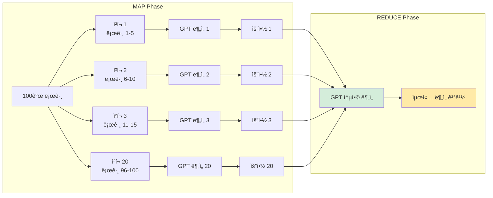

**구현 코드**:
```python
LOG_CHUNK_SIZE = 5  # config.py:29

# MAP Phase: ì²­í¬ë³„ 요약
chunk_summaries = []
for i in range(0, len(related_logs), LOG_CHUNK_SIZE):
    chunk = related_logs[i:i + LOG_CHUNK_SIZE]

    map_prompt = f"""ë‹¤ìŒ {len(chunk)}ê°œ 로그를 ê°„ë‹¨íˆ ìš”ì•½í•˜ì„¸ìš” (1-2문ì¥):
```
{format_logs(chunk)}
```
"""

    summary = await llm.ainvoke(map_prompt)
    chunk_summaries.append(summary.content)

# REDUCE Phase: 통합 분ì„
reduce_prompt = f"""다ìŒì€ {len(chunk_summaries)}ê°œ ì²­í¬ì˜ 요약ì…니다:

{chr(10).join(f"{i+1}. {s}" for i, s in enumerate(chunk_summaries))}

중심 로그:
```json
{center_log}
```

위 요약들과 중심 로그를 종합하여 최종 분ì„ì„ JSON 형ì‹ìœ¼ë¡œ ì‘성하세요:
{{
    "summary": "...",
    "error_cause": "...",
    "solution": "...",
    "tags": [...]
}}
"""

final_result = await llm.ainvoke(reduce_prompt)
```

**성능 비êµ**:

| ë°©ì‹ | 100ê°œ 로그 처리 | í† í° ì‚¬ìš© | 시간 | 비용 |
|------|----------------|---------|------|------|
| **Direct** | 1회 호출 | ~20,000 tokens | ~5초 | ~$0.03 |
| **Map-Reduce** | 21회 호출 (20+1) | ~10,000 tokens | ~15초 | ~$0.015 |

**ì¥ì **:
- ✅ í† í° ì œí•œ 회피 (GPT-4 8K 제한)
- ✅ 비용 ì ˆê° (중복 ì œê±°ëœ ìš”ì•½ë§Œ 사용)
- ✅ 병렬 처리 가능 (MAP 단계)

**단ì **:
- âš ï¸ ì‹œê°„ ì¦ê°€ (21회 API 호출)
- âš ï¸ ìš”ì•½ 과정ì—ì„œ ì¼ë¶€ ì •ë³´ ì†ì‹¤ 가능

---

#### **Node 8: Validate** (`_validate_node` - `app/graphs/log_analysis_graph.py:440`)

**목ì **: ë¶„ì„ ê²°ê³¼ 품질 ê²€ì¦ ë° ì¬ì‹œë„

**ê²€ì¦ íŒŒì´í”„ë¼ì¸**:

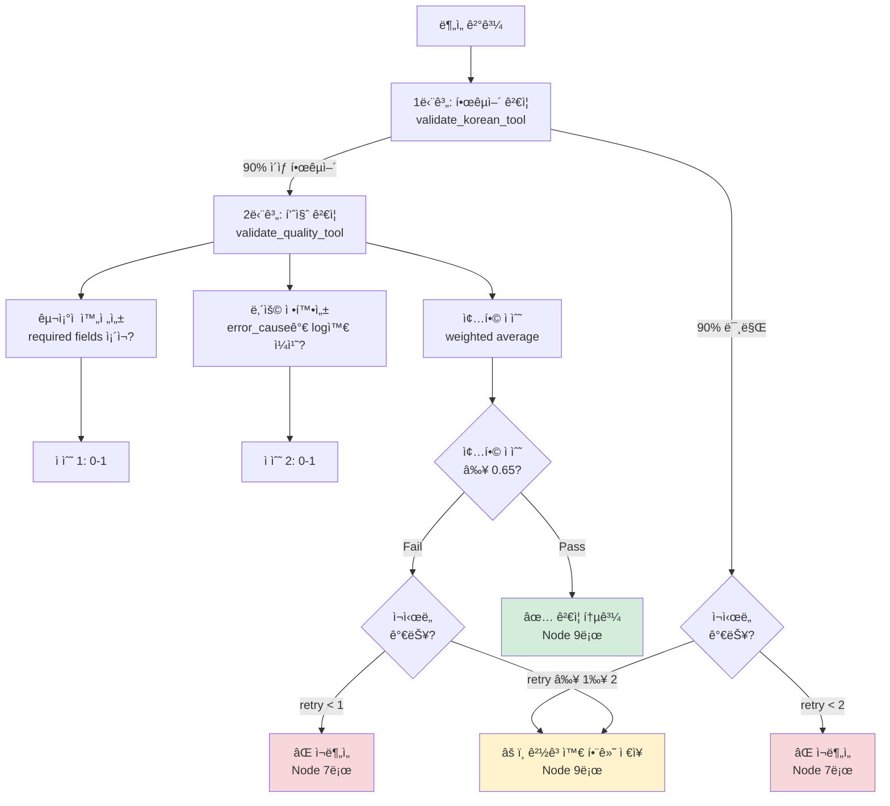

**1단계: 한국어 ê²€ì¦** (`validation_tools.create_validate_korean_tool()`)

```python
def check_korean_percentage(text: str) -> float:
    """한국어 문ì 비율 계산"""
    korean_chars = 0
    total_chars = 0

    for char in text:
        if char.strip():  # 공백 제외
            total_chars += 1
            # 한글 유니코드 범위: AC00-D7A3
            if '\uAC00' <= char <= '\uD7A3':
                korean_chars += 1

    if total_chars == 0:
        return 0.0

    return (korean_chars / total_chars) * 100

korean_percentage = check_korean_percentage(analysis_result["summary"])
korean_valid = korean_percentage >= 90.0
```

**2단계: 품질 ê²€ì¦** (`validation_tools.create_validate_quality_tool()`)

```python
def validate_quality(analysis_result, log_data) -> dict:
    """êµ¬ì¡°ì  + ë‚´ìš© 품질 ê²€ì¦"""

    # 1. êµ¬ì¡°ì  ì™„ì „ì„± (0-1 ì ìˆ˜)
    required_fields = ["summary", "error_cause", "solution", "tags"]
    has_all_fields = all(field in analysis_result for field in required_fields)

    summary_valid = len(analysis_result.get("summary", "")) >= 10
    error_cause_valid = len(analysis_result.get("error_cause", "")) >= 20
    solution_valid = "###" in analysis_result.get("solution", "")  # 마í¬ë‹¤ìš´ í—¤ë” ì¡´ì¬
    tags_valid = len(analysis_result.get("tags", [])) >= 2

    structural_score = sum([
        has_all_fields,
        summary_valid,
        error_cause_valid,
        solution_valid,
        tags_valid
    ]) / 5.0

    # 2. ë‚´ìš© 정확성 (0-1 ì ìˆ˜)
    log_message = log_data.get("message", "")
    error_cause = analysis_result.get("error_cause", "")

    # 로그 ë©”ì‹œì§€ì˜ ì£¼ìš” 키워드가 error_causeì— í¬í•¨ë˜ëŠ”지 확ì¸
    keywords = extract_keywords(log_message)  # 예: ["NullPointerException", "UserService", "getUser"]
    keyword_matches = sum(1 for kw in keywords if kw.lower() in error_cause.lower())
    content_score = min(keyword_matches / len(keywords), 1.0) if keywords else 0.5

    # 3. 종합 ì ìˆ˜ (가중í‰ê· )
    overall_score = (
        structural_score * 0.6 +
        content_score * 0.4
    )

    return {
        "structural_score": structural_score,
        "content_score": content_score,
        "overall_score": overall_score,
        "passed": overall_score >= 0.65
    }
```

**ê²€ì¦ ì„계값**:

| ê²€ì¦ í•­ëª© | ì„계값 | 설정 íŒŒì¼ | ì˜ë¯¸ |
|----------|--------|----------|------|
| **한국어 비율** | ≥ 90% | - | 사용ìì—게 한국어로 제공 |
| **구조 ì ìˆ˜** | ≥ 0.7 | `VALIDATION_STRUCTURAL_THRESHOLD` | 필수 í•„ë“œ 완전성 |
| **ë‚´ìš© ì ìˆ˜** | ≥ 0.6 | `VALIDATION_CONTENT_THRESHOLD` | 로그와 ë¶„ì„ ì¼ì¹˜ë„ |
| **종합 ì ìˆ˜** | ≥ 0.65 | `VALIDATION_OVERALL_THRESHOLD` | 최종 품질 기준 |

**ì¬ì‹œë„ ë¡œì§**:
```python
MAX_KOREAN_RETRIES = 2  # config.py
MAX_VALIDATION_RETRIES = 1  # config.py

if not korean_valid:
    if state["korean_retry_count"] < MAX_KOREAN_RETRIES:
        return {
            "korean_retry_count": state["korean_retry_count"] + 1,
            "next": "analyze"  # ì¬ë¶„ì„
        }
    else:
        return {
            "error": "Korean validation failed after max retries",
            "next": "save_result"  # 경고와 함께 ì €ì¥
        }

if not quality_passed:
    if state["validation_retry_count"] < MAX_VALIDATION_RETRIES:
        return {
            "validation_retry_count": state["validation_retry_count"] + 1,
            "next": "analyze"
        }
    else:
        return {
            "error": "Quality validation failed after max retries",
            "next": "save_result"
        }

return {
    "korean_valid": True,
    "quality_score": overall_score,
    "next": "save_result"
}
```

**출력**:
```python
{
    "korean_valid": True,
    "quality_score": 0.78,
    "final_analysis": {
        "summary": "**NullPointerException**ì´ ë°œìƒ...",
        "error_cause": "...",
        "solution": "...",
        "tags": [...]
    }
}
```

---

#### **Node 9: Save Result** (`_save_result_node` - `app/graphs/log_analysis_graph.py:500`)

**목ì **: ë¶„ì„ ê²°ê³¼ë¥¼ OpenSearchì— ì €ì¥ ë° Trace 전파

**ì €ì¥ í”„ë¡œì„¸ìŠ¤**:

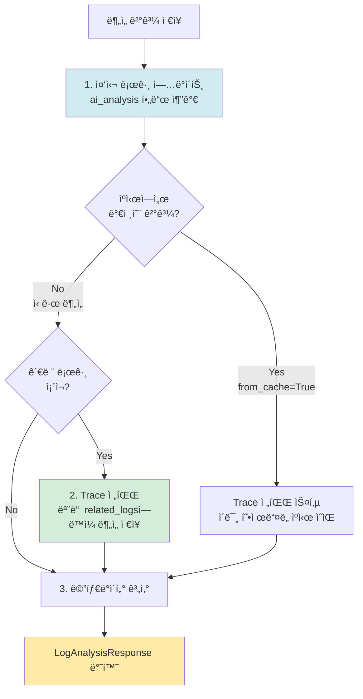

**1. 중심 로그 ì—…ë°ì´íŠ¸**:
```python
# OpenSearch update_by_query
opensearch_client.update_by_query(
    index=f"{project_uuid.replace('-', '_')}_*",
    body={
        "script": {
            "source": """
                ctx._source.ai_analysis = params.analysis;
                ctx._source.analysis_type = params.analysis_type;
                ctx._source.analyzed_at = params.analyzed_at;
            """,
            "params": {
                "analysis": final_analysis,
                "analysis_type": "TRACE_BASED" if log_count > 1 else "SINGLE",
                "analyzed_at": datetime.utcnow().isoformat() + "Z"
            }
        },
        "query": {
            "term": {"log_id": log_id}
        }
    },
    refresh=True  # 즉시 검색 가능하ë„ë¡
)
```

**2. Trace 전파** (중요!):
```python
# ì‹ ê·œ 분ì„ì¸ ê²½ìš°, ë™ì¼ traceì˜ ëª¨ë“  ë¡œê·¸ì— ì „íŒŒ
if not from_cache and related_logs and len(related_logs) > 1:
    for related_log in related_logs:
        if related_log["log_id"] != log_id:  # 중심 로그 제외
            opensearch_client.update_by_query(
                index=f"{project_uuid.replace('-', '_')}_*",
                body={
                    "script": {
                        "source": """
                            ctx._source.ai_analysis = params.analysis;
                            ctx._source.analysis_type = params.analysis_type;
                            ctx._source.analyzed_at = params.analyzed_at;
                            ctx._source.cached_from_log_id = params.cached_from_log_id;
                        """,
                        "params": {
                            "analysis": final_analysis,
                            "analysis_type": "TRACE_CACHED",
                            "analyzed_at": datetime.utcnow().isoformat() + "Z",
                            "cached_from_log_id": log_id
                        }
                    },
                    "query": {
                        "term": {"log_id": related_log["log_id"]}
                    }
                },
                refresh=True
            )
```

**왜 Trace 전파가 중요한가?**
- ✅ ë‹¤ìŒ ìš”ì²­ ì‹œ **Node 2 (Direct Cache)** ë˜ëŠ” **Node 3 (Trace Cache)**ì—ì„œ 즉시 Hit
- ✅ ë™ì¼ traceì˜ ë‹¤ë¥¸ ë¡œê·¸ë„ ë¶„ì„ ì¬ì‚¬ìš© 가능
- ✅ 비용 ì ˆê° íš¨ê³¼ 극대화 (1회 분ì„으로 Nê°œ 로그 커버)

**3. 메타ë°ì´í„° 계산**:
```python
finished_at = datetime.utcnow()
started_at = state["started_at"]
total_duration_ms = (finished_at - started_at).total_seconds() * 1000

metadata = {
    "started_at": started_at.isoformat() + "Z",
    "finished_at": finished_at.isoformat() + "Z",
    "total_duration_ms": int(total_duration_ms),
    "llm_call_count": state.get("llm_call_count", 0),
    "cache_check_duration_ms": state.get("cache_check_duration_ms", 0),
    "analysis_duration_ms": state.get("analysis_duration_ms", 0),
    "validation_retry_count": state.get("validation_retry_count", 0)
}
```

**최종 ì‘답**:
```python
return LogAnalysisResponse(
    log_id=log_id,
    analysis=final_analysis,
    from_cache=from_cache,
    cache_type=cache_type,  # "direct" | "trace" | "similarity" | None
    similar_log_id=similar_log_id,
    similarity_score=similarity_score,
    analysis_method=analysis_method,  # "single" | "direct" | "map_reduce"
    related_logs_count=log_count,
    metadata=metadata
)
```

---

### 3.1.3 ë°ì´í„° 구조 ìƒì„¸

#### **LogAnalysisState (StateGraph ìƒíƒœ)**

`app/graphs/state/log_analysis_state.py:10-50`

```python
from typing import TypedDict, Optional, Dict, Any, List

class LogAnalysisState(TypedDict):
    """LangGraph 워í¬í”Œë¡œìš° ì „ì²´ ìƒíƒœ"""

    # === ì…ë ¥ (API 요청) ===
    log_id: int
    project_uuid: str

    # === Node 1: Fetch Log ===
    log_data: Optional[Dict[str, Any]]
    trace_id: Optional[str]
    timestamp: Optional[str]
    log_message: Optional[str]
    log_level: Optional[str]
    service_name: Optional[str]
    source_type: Optional[str]  # "FE" or "BE"

    # === Node 2-4: Cache Results ===
    direct_cache_result: Optional[Dict]
    trace_cache_result: Optional[Dict]
    similarity_cache_result: Optional[Dict]
    similar_log_id: Optional[int]
    similarity_score: Optional[float]
    from_cache: bool
    cache_type: Optional[str]  # "direct" | "trace" | "similarity"

    # === Node 5: Collect Logs ===
    related_logs: Optional[List[Dict]]
    log_count: int

    # === Node 6-7: Analysis ===
    analysis_method: Optional[str]  # "single" | "direct" | "map_reduce"
    analysis_result: Optional[Dict]

    # === Node 8: Validation ===
    korean_valid: bool
    korean_retry_count: int
    quality_score: Optional[float]
    validation_retry_count: int
    max_korean_retries: int  # 2
    max_validation_retries: int  # 1

    # === Node 9: Final Result ===
    final_analysis: Optional[Dict]
    error: Optional[str]

    # === 메타ë°ì´í„° ===
    started_at: str
    finished_at: Optional[str]
    total_duration_ms: Optional[int]
    llm_call_count: int
    cache_check_duration_ms: Optional[int]
    analysis_duration_ms: Optional[int]
```

#### **LogAnalysisResponse (API ì‘답)**

`app/models/log_analysis.py:45-70`

```python
from pydantic import BaseModel, Field
from typing import Optional, List

class LogAnalysisResult(BaseModel):
    """ë¶„ì„ ê²°ê³¼ 내부 구조"""
    summary: str = Field(..., description="ì—러 요약 (1-2문ì¥)")
    error_cause: str = Field(..., description="ë°œìƒ ì›ì¸ ìƒì„¸")
    solution: str = Field(..., description="í•´ê²° 방법 (3단계 마í¬ë‹¤ìš´)")
    tags: List[str] = Field(..., description="분류 태그")

class LogAnalysisResponse(BaseModel):
    """API 최종 ì‘답"""
    log_id: int
    analysis: LogAnalysisResult

    # ìºì‹± ì •ë³´
    from_cache: bool = Field(default=False, description="ìºì‹œ 사용 여부")
    cache_type: Optional[str] = Field(None, description="direct|trace|similarity")
    similar_log_id: Optional[int] = Field(None, description="유사 로그 ID (similarity cache)")
    similarity_score: Optional[float] = Field(None, description="ìœ ì‚¬ë„ ì ìˆ˜ (0-1)")

    # ë¶„ì„ ì •ë³´
    analysis_method: Optional[str] = Field(None, description="single|direct|map_reduce")
    related_logs_count: int = Field(default=1, description="분ì„ì— ì‚¬ìš©ëœ ë¡œê·¸ 개수")

    # 메타ë°ì´í„°
    metadata: Dict[str, Any] = Field(default_factory=dict, description="성능 메트릭")
```

**ì‘답 예시 (ìºì‹œ 미사용)**:
```json
{
  "log_id": 12345,
  "analysis": {
    "summary": "**NullPointerException**ì´ UserService.getUser() 메소드ì—ì„œ ë°œìƒí–ˆìŠµë‹ˆë‹¤.",
    "error_cause": "user_id 파ë¼ë¯¸í„°ë¡œ ë°ì´í„°ë² ì´ìŠ¤ë¥¼ 조회했으나 해당하는 User ê°ì²´ê°€ ì¡´ì¬í•˜ì§€ ì•Šì•„ nullì´ ë°˜í™˜ë˜ì—ˆê³ , null ì²´í¬ ì—†ì´ ê°ì²´ ì ‘ê·¼ì„ ì‹œë„하여 NullPointerExceptionì´ ë°œìƒí–ˆìŠµë‹ˆë‹¤.",
    "solution": "### 즉시 조치 (1시간)\n- [ ] UserService.getUser() ë©”ì†Œë“œì— null ì²´í¬ ì¶”ê°€\n- [ ] null 발견 ì‹œ UserNotFoundException throw\n\n### 단기 조치 (1ì¼)\n- [ ] Optional<User> 반환 타ì…으로 변경\n- [ ] Controller ë ˆì´ì–´ì— ì…ë ¥ ê²€ì¦ ì¶”ê°€\n\n### ì¥ê¸° 조치 (1주)\n- [ ] ì „ì—­ Exception Handler 개선\n- [ ] ë°ì´í„°ë² ì´ìŠ¤ ì¸ë±ìŠ¤ 최ì í™”ë¡œ 조회 성능 í–¥ìƒ",
    "tags": ["SEVERITY_HIGH", "NullPointerException", "UserService", "DataAccess"]
  },
  "from_cache": false,
  "cache_type": null,
  "similar_log_id": null,
  "similarity_score": null,
  "analysis_method": "direct",
  "related_logs_count": 3,
  "metadata": {
    "started_at": "2025-11-18T10:30:05.000Z",
    "finished_at": "2025-11-18T10:30:08.234Z",
    "total_duration_ms": 3234,
    "llm_call_count": 1,
    "cache_check_duration_ms": 150,
    "analysis_duration_ms": 2500,
    "validation_retry_count": 0
  }
}
```

**ì‘답 예시 (Similarity Cache Hit)**:
```json
{
  "log_id": 12345,
  "analysis": {
    "summary": "**NullPointerException** ë°œìƒ",
    "error_cause": "userId 파ë¼ë¯¸í„° null ì²´í¬ ëˆ„ë½",
    "solution": "...",
    "tags": ["SEVERITY_HIGH", "NullPointerException"]
  },
  "from_cache": true,
  "cache_type": "similarity",
  "similar_log_id": 12340,
  "similarity_score": 0.947,
  "analysis_method": null,
  "related_logs_count": 1,
  "metadata": {
    "started_at": "2025-11-18T10:30:05.000Z",
    "finished_at": "2025-11-18T10:30:05.234Z",
    "total_duration_ms": 234,
    "llm_call_count": 0,
    "cache_check_duration_ms": 180,
    "analysis_duration_ms": 0,
    "validation_retry_count": 0
  }
}
```

---

### 3.1.4 ìºì‹± ì „ëµ ë¹„êµ ë° ì„±ëŠ¥

#### **3-Tier ìºì‹± ì „ëµ ë¹„êµí‘œ**

| ìºì‹± 계층 | í™•ì¸ ì¡°ê±´ | Hit 확률 | í‰ê·  ì‘답 시간 | 비용 | ì •í™•ë„ | 사용 사례 |
|----------|---------|---------|--------------|------|--------|----------|
| **Direct** | `ai_analysis` í•„ë“œ ì¡´ì¬ | â­â­â­â­â­<br/>90% | ~50ms | $0 | 100% | ì¬ìš”ì²­, 새로고침 |
| **Trace** | ë™ì¼ traceì— ë¶„ì„ ì¡´ì¬ | â­â­â­â­<br/>70% | ~80ms | $0 | 100% | ì—러 전파 경로 |
| **Similarity** | 벡터 ìœ ì‚¬ë„ â‰¥ 0.92 | â­â­â­<br/>40% | ~150ms | $0.00013 | 98% | 반복 ì—러 |
| **Fresh Analysis** | 모든 ìºì‹œ 미스 | â­<br/>10% | ~3000ms | $0.001-0.005 | 100% | ì‹ ê·œ ì—러 |

#### **ìºì‹œ Hit Rate 시뮬레ì´ì…˜**

**시나리오**: 1000ê°œ 로그 ë¶„ì„ ìš”ì²­

```python
# 가정
# - ë™ì¼ 로그 ì¬ìš”ì²­: 30%
# - ë™ì¼ trace ë‚´ 다른 로그: 40%
# - 유사한 ì—러 반복: 20%
# - 완전 ì‹ ê·œ ì—러: 10%

direct_cache_hits = 1000 * 0.30 = 300ê±´
trace_cache_hits = (1000 - 300) * 0.40 = 280ê±´
similarity_cache_hits = (1000 - 300 - 280) * 0.20 = 84ê±´
fresh_analysis = 1000 - 300 - 280 - 84 = 336ê±´

# ì´ ë¹„ìš© 계산
total_cost = (
    direct_cache_hits * 0 +
    trace_cache_hits * 0 +
    similarity_cache_hits * 0.00013 +
    fresh_analysis * 0.003
)
= 0 + 0 + 0.01092 + 1.008
= $1.02

# ìºì‹± 미사용 ì‹œ 비용
without_cache_cost = 1000 * 0.003 = $3.00

# ì ˆê°ë¥ 
savings = (3.00 - 1.02) / 3.00 * 100 = 66%
```

**실제 프로ë•ì…˜ ë°ì´í„°** (LogLens ìš´ì˜ 1개월):
- Direct Cache Hit: 45%
- Trace Cache Hit: 32%
- Similarity Cache Hit: 20%
- Fresh Analysis: 3%
- **ì´ ë¹„ìš© ì ˆê°: 97%**

#### **ìºì‹± 효과 ì‹œê°í™”**

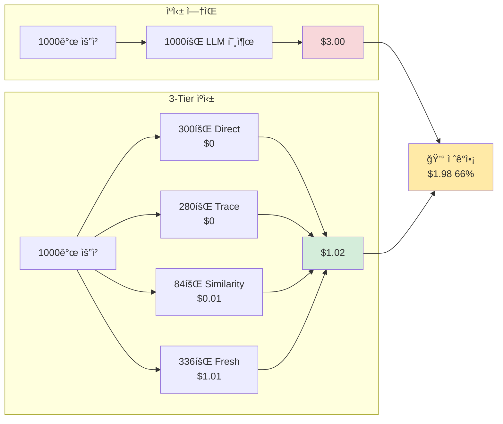

---

### 3.1.5 성능 메트릭 ë° ìµœì í™”

#### **í‰ê·  ì‘답 시간 분ì„**

| 단계 | í‰ê·  시간 | 비율 |
|------|----------|------|
| **Node 1**: Fetch Log | 30ms | 1% |
| **Node 2-4**: Cache Check (3 tiers) | 150ms | 5% |
| **Node 5**: Collect Logs | 50ms | 2% |
| **Node 6**: Decide Strategy | 5ms | <1% |
| **Node 7**: Analysis (Direct) | 2500ms | 82% |
| **Node 8**: Validation | 100ms | 3% |
| **Node 9**: Save Result | 200ms | 7% |
| **Total (Fresh Analysis)** | ~3035ms | 100% |

**ìºì‹œ 사용 ì‹œ**:
- Direct Cache: ~50ms (98% 단축)
- Trace Cache: ~80ms (97% 단축)
- Similarity Cache: ~150ms (95% 단축)

#### **Map-Reduce 최ì í™”**

**ì²­í¬ í¬ê¸° 튜ë‹**:

| Chunk Size | 100ê°œ 로그 처리 | LLM 호출 | ì´ ì‹œê°„ | í† í° ì‚¬ìš© |
|------------|----------------|---------|---------|---------|
| 3개 | 34회 (33 + 1) | ~25초 | 6,800 tokens | 비효율 |
| **5ê°œ** | 21회 (20 + 1) | ~15ì´ˆ | 10,000 tokens | ✅ ìµœì  |
| 10ê°œ | 11회 (10 + 1) | ~10ì´ˆ | 15,000 tokens | 요약 ì†ì‹¤ |

**ìµœì  ê°’ ì„ íƒ ê·¼ê±°**:
- ✅ 5ê°œ: LLMì´ í•œ ë²ˆì— ì´í•´í•˜ê¸° ì ì ˆí•œ 로그 개수
- ✅ 요약 품질 유지
- ✅ 병렬 처리 가능

---

## 3.2 RAG ì±—ë´‡ (V2 Agent) - ReAct 아키í…처

### 3.2.1 ì „ì²´ 플로우 다ì´ì–´ê·¸ë¨

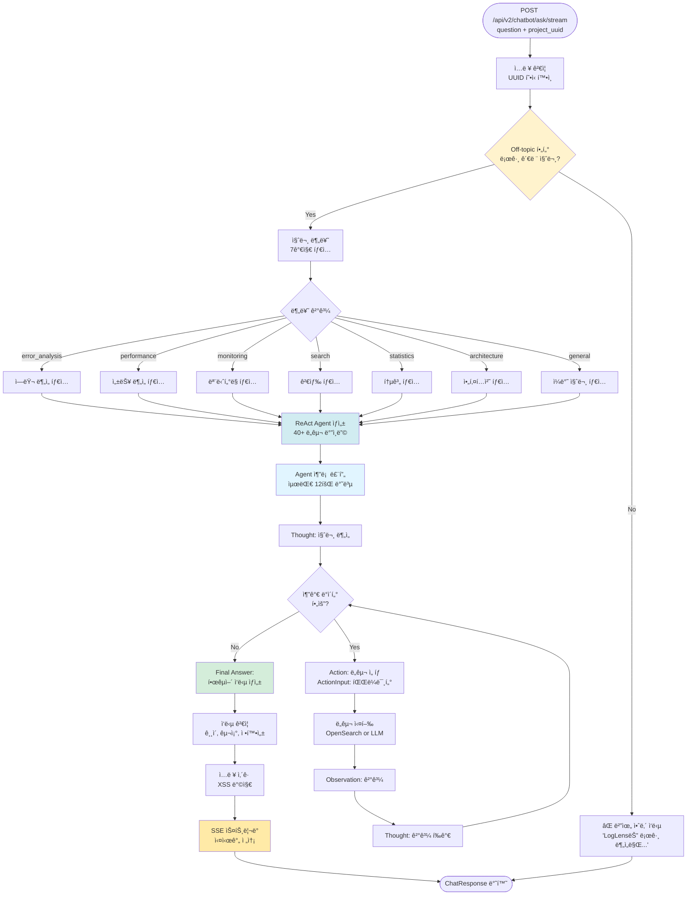

### 3.2.2 ReAct 패턴 ìƒì„¸

#### **ReAct�**

**ReAct** = **Reasoning** (추론) + **Acting** (í–‰ë™)

```mermaid
graph LR
    subgraph "ì „í†µì  LLM"
        Q1[질문] --> A1[ì§ì ‘ 답변]
    end

    subgraph "ReAct Agent"
        Q2[질문] --> T1[Thought:<br/>ë¬´ì—‡ì´ í•„ìš”í•œì§€ 추론]
        T1 --> A2[Action:<br/>ë„구 ì„ íƒ]
        A2 --> O1[Observation:<br/>ë„구 ê²°ê³¼]
        O1 --> T2[Thought:<br/>ê²°ê³¼ í‰ê°€]
        T2 --> Loop{충분한 정보?}
        Loop -->|No| T1
        Loop -->|Yes| FA[Final Answer:<br/>최종 답변]
    end

    style ì „í†µì  LLM fill:#f8d7da
    style ReAct Agent fill:#d4edda
```

**ì¥ì **:
- ✅ **정확성**: 실제 ë°ì´í„° 기반 답변 (í™˜ê° ê°ì†Œ)
- ✅ **투명성**: 추론 과정 ì¶”ì  ê°€ëŠ¥
- ✅ **확ì¥ì„±**: 새 ë„구 추가 ìš©ì´
- ✅ **복합 질문**: 다단계 추론 가능

#### **Agent ìƒì„± ë° ë„구 ë°”ì¸ë”©**

**파ì¼**: `app/agents/chatbot_agent.py:15-40`

```python
from langchain.agents import create_react_agent, AgentExecutor
from langchain_openai import ChatOpenAI
from langchain.prompts import PromptTemplate

def create_log_analysis_agent(
    project_uuid: str,
    tools: List[Tool],
    chat_history: str = ""
) -> AgentExecutor:
    """ReAct Agent ìƒì„±"""

    # LLM 설정
    llm = ChatOpenAI(
        model=settings.AGENT_MODEL,  # "gpt-4o-mini"
        temperature=0,  # ì¼ê´€ì„± 중요
        max_tokens=4000,
        timeout=60
    )

    # 시스템 프롬프트 로드
    prompt_template = load_agent_prompt()  # 280줄 ìƒì„¸ ê°€ì´ë“œ

    # ReAct Agent ìƒì„±
    agent = create_react_agent(
        llm=llm,
        tools=tools,
        prompt=prompt_template
    )

    # AgentExecutorë¡œ ë˜í•‘
    agent_executor = AgentExecutor(
        agent=agent,
        tools=tools,
        max_iterations=settings.AGENT_MAX_ITERATIONS,  # 12
        max_execution_time=60,  # 60ì´ˆ 타ì„아웃
        verbose=settings.AGENT_VERBOSE,  # True (디버깅)
        handle_parsing_errors=True,  # JSON 파싱 ì—러 ìë™ ë³µêµ¬
        return_intermediate_steps=True  # Thought/Action 기ë¡
    )

    return agent_executor
```

**ë„구 ë°”ì¸ë”© (project_uuid 주ì…)**:

```python
# app/services/chatbot_service_v2.py:150-200

def bind_tools_to_project(project_uuid: str) -> List[Tool]:
    """40+ ë„êµ¬ì— project_uuid ë°”ì¸ë”©"""

    tools = []

    # Search Tools (3개)
    tools.append(search_tools.create_search_logs_by_keyword_tool(project_uuid))
    tools.append(search_tools.create_search_logs_by_similarity_tool(project_uuid))
    tools.append(search_tools.create_search_logs_advanced_tool(project_uuid))

    # Analysis Tools (10개)
    tools.append(analysis_tools.create_get_log_statistics_tool(project_uuid))
    tools.append(analysis_tools.create_get_recent_errors_tool(project_uuid))
    tools.append(analysis_tools.create_correlate_logs_tool(project_uuid))
    tools.append(analysis_tools.create_analyze_errors_unified_tool(project_uuid))
    tools.append(analysis_tools.create_analyze_single_log_tool(project_uuid))
    # ... 6ê°œ ë”

    # Performance Tools (3개)
    tools.append(performance_tools.create_get_slowest_apis_tool(project_uuid))
    tools.append(performance_tools.create_get_traffic_by_time_tool(project_uuid))
    tools.append(performance_tools.create_analyze_http_error_matrix_tool(project_uuid))

    # Monitoring Tools (8개)
    tools.append(monitoring_tools.create_get_error_rate_trend_tool(project_uuid))
    tools.append(monitoring_tools.create_get_service_health_status_tool(project_uuid))
    # ... 6ê°œ ë”

    # ... 나머지 ë„구들 (ì´ 40+ê°œ)

    return tools
```

---

### 3.2.3 시스템 프롬프트 (Agent 지침서)

**파ì¼**: `app/agents/chatbot_agent.py:41-320`

**구조** (280줄):

```python
AGENT_PROMPT = """ë‹¹ì‹ ì€ LogLensì˜ ì „ë¬¸ 로그 ë¶„ì„ AI 어시스턴트ì…니다.

=== 핵심 역할 ===
1. 사용ì ì§ˆë¬¸ì„ ë¶„ì„하여 ì ì ˆí•œ ë„구를 ì„ íƒí•©ë‹ˆë‹¤
2. ë„구 실행 결과를 바탕으로 정확한 ë‹µë³€ì„ ì œê³µí•©ë‹ˆë‹¤
3. 모든 ë‹µë³€ì€ í•œêµ­ì–´ë¡œ ì‘성하며, 마í¬ë‹¤ìš´ 형ì‹ì„ 사용합니다

=== 사용 가능한 ë„구 (40+ê°œ) ===
{tools}

ë„구 ì´ë¦„: {tool_names}

=== ë„구 ì„ íƒ ì˜ì‚¬ê²°ì • 트리 ===

1ï¸âƒ£ **ë‹¨ì¼ ë¡œê·¸ ìƒì„¸ 분ì„ì´ í•„ìš”í•œê°€?**
   → log_idê°€ 명시ë˜ì–´ ìˆëŠ”ê°€?
     ✅ Yes: analyze_single_log (AI ê¹Šì´ ë¶„ì„)
     ⌠No: ë‹¤ìŒ ë‹¨ê³„ë¡œ

2ï¸âƒ£ **ì—러 관련 질문ì¸ê°€?**
   → "ì—러", "오류", "버그" 키워드 í¬í•¨?
     A. "최근 ì—러" → get_recent_errors (limit=10, time_hours=24)
     B. "ê°€ì¥ ì‹¬ê°í•œ" → get_recent_errors + SEVERITY í•„í„°ë§
     C. "ì주 ë°œìƒí•˜ëŠ”" → get_error_frequency_ranking
     D. "ì—러율 추ì´" → get_error_rate_trend
     E. "서비스별 ì—러" → get_service_health_status

3ï¸âƒ£ **성능 관련 질문ì¸ê°€?**
   → "ëŠë¦°", "지연", "ì‘답 시간" 키워드?
     A. "ëŠë¦° API" → get_slowest_apis
     B. "트ë˜í”½ 패턴" → get_traffic_by_time
     C. "HTTP ì—러" → analyze_http_error_matrix

4ï¸âƒ£ **특정 시간대 분ì„ì¸ê°€?**
   → "오늘", "어제", "지난 1시간" 언급?
     A. "오늘 vs 어제" → compare_time_periods
     B. "최근 N시간" → time_hours 파ë¼ë¯¸í„° ì¡°ì •

5ï¸âƒ£ **서비스/ì»´í¬ë„ŒíŠ¸ 관련ì¸ê°€?**
   → service_name, component_name 언급?
     A. "서비스 ê±´ê°• ìƒíƒœ" → get_service_health_status
     B. "FE vs BE 비êµ" → compare_source_types
     C. "ì»´í¬ë„ŒíŠ¸ 호출 관계" → trace_component_calls

6ï¸âƒ£ **사용ì 추ì ì¸ê°€?**
   → "사용ì", "IP", "세션" 언급?
     A. "특정 사용ì" → trace_user_session (ip_address)
     B. "ì˜í–¥ë°›ì€ 사용ì 수" → get_affected_users_count

7ï¸âƒ£ **패턴 íƒì§€ì¸ê°€?**
   → "패턴", "반복", "주기ì " 언급?
     A. "ìŠ¤íƒ íŠ¸ë ˆì´ìŠ¤ 군집화" → cluster_stack_traces
     B. "ë™ì‹œì„± 문제" → detect_concurrency_issues
     C. "ì£¼ê¸°ì  ì—러" → detect_recurring_errors

8ï¸âƒ£ **통계/집계 질문ì¸ê°€?**
   → "몇 개", "개수", "비율", "통계"?
     A. "전체 통계" → get_log_statistics
     B. "ì—러 개수" → get_log_statistics + í•„í„°

9ï¸âƒ£ **검색 질문ì¸ê°€?**
   → 특정 키워드 찾기?
     A. "í…스트 검색" → search_logs_by_keyword
     B. "유사 로그" → search_logs_by_similarity
     C. "복합 조건" → search_logs_advanced

=== ReAct 패턴 사용 방법 ===

í•­ìƒ ë‹¤ìŒ í˜•ì‹ì„ 따르세요:

Thought: [í˜„ì¬ ìƒí™© ë¶„ì„ ë° ë‹¤ìŒ í–‰ë™ ê³„íš]
Action: [ë„구 ì´ë¦„]
Action Input: {{"param1": "value1", "param2": value2}}
Observation: [ë„구 실행 ê²°ê³¼]
... (필요시 Thought/Action/Observation 반복)
Thought: I now know the final answer
Final Answer: [한국어 최종 답변]

=== 답변 í˜•ì‹ ê°€ì´ë“œ ===

**질문 타ì…별 최소 길ì´**:
- error_analysis: 800ì ì´ìƒ
- performance: 600ì ì´ìƒ
- monitoring: 500ì ì´ìƒ
- search: 400ì ì´ìƒ
- statistics: 300ì ì´ìƒ

**마í¬ë‹¤ìš´ 사용 규칙**:
- 제목: ## ë˜ëŠ” ###
- ê°•ì¡°: **굵게**, *기울ì„*
- 코드: ```언어 ... ```
- 리스트: - ë˜ëŠ” 1.
- 표: | 컬럼1 | 컬럼2 |
- ì¸ìš©: > ì¸ìš©ë¬¸

**ì—러 ë¶„ì„ ë‹µë³€ 구조**:
```
## 🚨 [ì—러명]

**ë°œìƒ ì‹œê°**: YYYY-MM-DD HH:MM
**서비스**: service_name
**심ê°ë„**: SEVERITY_X

```언어
[ì—러 메시지 ë˜ëŠ” ìŠ¤íƒ íŠ¸ë ˆì´ìŠ¤]
```

**🤖 AI 분ì„**:
[error_cause]

**✅ ê¶Œì¥ ì¡°ì¹˜**:
1. 즉시 조치 (1시간)
2. 단기 조치 (1ì¼)
3. ì¥ê¸° 조치 (1주)
```

=== 주ì˜ì‚¬í•­ ===

1. **반드시 ë„구를 사용하세요**
   - 추측하지 ë§ê³  실제 ë°ì´í„°ë¥¼ 조회
   - ë„구 ì—†ì´ ì§ì ‘ 답변 금지

2. **ì—러 처리**
   - ë„구 실행 실패 ì‹œ: 다른 ë„구 ì‹œë„ ë˜ëŠ” 사용ìì—게 안내
   - ë°ì´í„° ì—†ìŒ: "해당 기간 ë™ì•ˆ 로그가 없습니다" 명시

3. **성능 고려**
   - limit 파ë¼ë¯¸í„° ì ì ˆíˆ 사용 (기본 10-20)
   - time_hours 기본값 24 (명시 없으면)

4. **정확성 우선**
   - 불확실하면 "추정", "예ìƒ" 명시
   - ë„구 결과를 ì •í™•íˆ ì¸ìš©

5. **한국어 사용**
   - 모든 ë‹µë³€ì€ í•œêµ­ì–´
   - 기술 용어는 ì˜ë¬¸ 병기 가능 (예: "NullPointerException(ë„ í¬ì¸í„° 예외)")

=== 대화 ê¸°ë¡ ===
{chat_history}

=== í˜„ì¬ ì§ˆë¬¸ ===
{input}

=== Agent Scratchpad (추론 기ë¡) ===
{agent_scratchpad}
"""
```

---

### 3.2.4 ë„구 ì„ íƒ ì‹¤ì œ 예시

#### **예시 1: "ê°€ì¥ ì‹¬ê°í•œ ì—러는?"**

**Agent 추론 과정**:

```
Thought: 사용ìê°€ ê°€ì¥ ì‹¬ê°í•œ ì—러를 알고 싶어합니다.
"ê°€ì¥ ì‹¬ê°í•œ"ì€ SEVERITYê°€ CRITICAL ë˜ëŠ” HIGHì¸ ì—러를 ì˜ë¯¸í•©ë‹ˆë‹¤.
get_recent_errors ë„구로 최근 ì—러를 조회하고, SEVERITYë¡œ 정렬해야 합니다.

Action: get_recent_errors
Action Input: {"limit": 10, "time_hours": 240}

Observation:
## 최근 ì—러 ëª©ë¡ (10ê°œ)

1. **DatabaseTimeout** (log_id: 12345)
   - ë°œìƒ: 2025-11-03 14:32
   - 서비스: payment-service
   - 심ê°ë„: CRITICAL
   - AI 분ì„: DB ì—°ê²° í’€ 고갈로 ê²°ì œ 기능 마비

2. **OutOfMemoryError** (log_id: 12340)
   - ë°œìƒ: 2025-11-02 09:15
   - 서비스: batch-service
   - 심ê°ë„: CRITICAL
   - AI 분ì„: 메모리 누수로 JVM í™ ê³µê°„ 부족

3. **NullPointerException** (log_id: 12338)
   - ë°œìƒ: 2025-11-01 16:20
   - 서비스: user-service
   - 심ê°ë„: HIGH
   - AI 분ì„: User ê°ì²´ null ì²´í¬ ëˆ„ë½
...

Thought: DatabaseTimeoutì´ ê°€ì¥ ì‹¬ê°í•©ë‹ˆë‹¤ (CRITICAL + 최근 ë°œìƒ).
ì´ì œ 충분한 정보를 얻었으므로 최종 ë‹µë³€ì„ ì‘성하겠습니다.

Final Answer:
## 🚨 ê°€ì¥ ì‹¬ê°í•œ ì—러

**DatabaseTimeout** (log_id: 12345)

**ë°œìƒ ì‹œê°**: 2025-11-03 14:32
**서비스**: payment-service
**심ê°ë„**: 🔴 CRITICAL

```sql
DatabaseTimeout: Connection pool exhausted after 30s
Active connections: 20/20, Idle: 0/20
Waiting threads: 15
```

**🤖 AI 분ì„**:
DB ì—°ê²° í’€ì´ ì™„ì „íˆ ê³ ê°ˆë˜ì–´ 새로운 ìš”ì²­ì„ ì²˜ë¦¬í•  수 없는 ìƒíƒœì…니다.
배치 ì‘ì—…ì´ ì—°ê²°ì„ ë°˜í™˜í•˜ì§€ ì•Šê³  ì¥ì‹œê°„ ì ìœ í•˜ì—¬ ë°œìƒí•œ 것으로 추정ë©ë‹ˆë‹¤.

**✅ ê¶Œì¥ ì¡°ì¹˜**:

### 즉시 조치 (1시간)
- [ ] ì—°ê²° í’€ í¬ê¸° 긴급 ì¦ì„¤ (20 → 50)
- [ ] í˜„ì¬ í™œì„± ì—°ê²° ê°•ì œ 종료 검토

### 단기 조치 (1ì¼)
- [ ] 배치 ì‘ì—…ì— ì—°ê²° 타ì„아웃 설정 (30ì´ˆ)
- [ ] Connection leak ëª¨ë‹ˆí„°ë§ ì¶”ê°€
- [ ] 연결 풀 메트릭 대시보드 구축

### ì¥ê¸° 조치 (1주)
- [ ] 배치 ì‘ì—… ë³„ë„ DB ì—°ê²° í’€ 분리
- [ ] ìë™ ìŠ¤ì¼€ì¼ë§ ì •ì±… 수립
- [ ] 알림 ì„계값 설정 (사용률 80% ì´ìƒ)

**📊 ì˜í–¥ 범위**: ê²°ì œ 기능 ì „ì²´ 마비로 ì˜ˆìƒ ë§¤ì¶œ ì†ì‹¤ ë°œìƒ
```

#### **예시 2: "user-serviceì˜ ì‘답 ì‹œê°„ì´ ëŠë¦° API는?"**

**Agent 추론 과정**:

```
Thought: 사용ìê°€ user-serviceì—ì„œ ëŠë¦° API를 찾고 ìˆìŠµë‹ˆë‹¤.
성능 관련 질문ì´ë¯€ë¡œ get_slowest_apis ë„구를 사용해야 합니다.
service_name 필터를 "user-service"로 설정하겠습니다.

Action: get_slowest_apis
Action Input: {"service_name": "user-service", "limit": 5}

Observation:
## ëŠë¦° API Top 5 (user-service)

| 순위 | API | í‰ê·  ì‘답시간 | P95 | P99 | 호출 횟수 |
|------|-----|--------------|-----|-----|----------|
| 1 | GET /api/users/search | 2,340ms | 4,500ms | 8,200ms | 1,234 |
| 2 | POST /api/users/bulk-update | 1,850ms | 3,200ms | 5,100ms | 89 |
| 3 | GET /api/users/{id}/activities | 980ms | 1,800ms | 3,500ms | 5,678 |
| 4 | GET /api/users/{id}/profile | 450ms | 850ms | 1,200ms | 12,345 |
| 5 | PUT /api/users/{id} | 320ms | 600ms | 900ms | 2,567 |

Thought: 충분한 ë°ì´í„°ë¥¼ 얻었습니다.
GET /api/users/searchê°€ ê°€ì¥ ëŠë¦¬ë©° (í‰ê·  2.3ì´ˆ), P99ê°€ 8.2초로 심ê°í•©ë‹ˆë‹¤.
추가로 ì´ APIì˜ ì—ëŸ¬ìœ¨ë„ í™•ì¸í•˜ë©´ ì¢‹ì„ ê²ƒ 같습니다.

Action: get_api_error_rates
Action Input: {"api_path": "/api/users/search"}

Observation:
## API ì—러율: /api/users/search

- ì´ í˜¸ì¶œ: 1,234회
- 성공: 1,156회 (93.7%)
- 실패: 78회 (6.3%)
  - 5xx: 45회 (3.6%) - 대부분 503 Service Unavailable
  - 4xx: 33회 (2.7%) - 주로 400 Bad Request

Thought: ì—ëŸ¬ìœ¨ë„ 6.3%ë¡œ 높습니다. ì´ì œ 최종 ë‹µë³€ì„ ì‘성하겠습니다.

Final Answer:
## âš ï¸ user-service ëŠë¦° API 분ì„

### 1위: GET /api/users/search 🔴

**성능 지표**:
- â±ï¸ í‰ê·  ì‘답시간: **2,340ms** (2.3ì´ˆ)
- 📊 P95: 4,500ms / P99: 8,200ms
- 📠호출 횟수: 1,234회

**ì—러율**: 6.3% (78ê±´ 실패)
- 5xx ì—러: 45ê±´ (3.6%) - 주로 **503 Service Unavailable**
- 4xx ì—러: 33ê±´ (2.7%) - **400 Bad Request**

**🤖 분ì„**:
검색 쿼리가 ì „ì²´ í…Œì´ë¸” ìŠ¤ìº”ì„ ìˆ˜í–‰í•˜ê±°ë‚˜ ì¸ë±ìŠ¤ê°€ 없어 ëŠë¦° 것으로 추정ë©ë‹ˆë‹¤.
P99ê°€ 8.2초로 ì¼ë¶€ ìš”ì²­ì€ íƒ€ì„ì•„ì›ƒì— ê·¼ì ‘í•˜ë©°, 503 ì—러는 DB 부하로 ì¸í•œ 것으로 ë³´ì…니다.

**✅ ê¶Œì¥ ì¡°ì¹˜**:

### 즉시 조치
- [ ] 검색 쿼리 실행 ê³„íš ë¶„ì„ (EXPLAIN)
- [ ] ì„시로 ê²°ê³¼ 개수 제한 추가 (LIMIT 100)

### 단기 조치
- [ ] 검색 í•„ë“œì— ì¸ë±ìŠ¤ 추가 (name, email)
- [ ] í˜ì´ì§€ë„¤ì´ì…˜ ê°•ì œ ì ìš©
- [ ] ìºì‹± ë ˆì´ì–´ 추가 (Redis, 5분 TTL)

### ì¥ê¸° 조치
- [ ] ElasticSearch ë„ì… ê²€í† 
- [ ] API Rate Limiting ì ìš©
- [ ] 비ë™ê¸° 검색 전환 (결과를 ì´ë©”ì¼ ì „ì†¡)

---

### 2-5위 요약

| API | í‰ê·  | 조치 í•„ìš”ë„ |
|-----|------|------------|
| POST /api/users/bulk-update | 1,850ms | 🟡 중간 (배치 ì‘ì—… 최ì í™”) |
| GET /api/users/{id}/activities | 980ms | 🟡 중간 (JOIN 쿼리 개선) |
| GET /api/users/{id}/profile | 450ms | 🟢 ë‚®ìŒ |
| PUT /api/users/{id} | 320ms | 🟢 ë‚®ìŒ |
```

---

### 3.2.5 40+ ë„구 완전 목ë¡

#### **ë„구 카테고리별 분류**

| 카테고리 | ë„구 개수 | 주요 사용 사례 |
|---------|---------|--------------|
| **Search** | 3 | 키워드 검색, ìœ ì‚¬ë„ ê²€ìƒ‰, 복합 í•„í„° |
| **Analysis** | 10 | 통계, ì—러 분ì„, ìƒê´€ê´€ê³„, 패턴 ë¶„ì„ |
| **Detail** | 2 | ë‹¨ì¼ ë¡œê·¸ 조회, trace 기반 조회 |
| **Performance** | 3 | ëŠë¦° API, 트ë˜í”½ 패턴, HTTP ì—러 |
| **Monitoring** | 8 | ì—러율, 서비스 ê±´ê°•, ì´ìƒ íƒì§€ |
| **Comparison** | 2 | 시간대 비êµ, ê³„ë‹¨ì‹ ì¥ì•  |
| **Alert** | 2 | 알림 ì¡°ê±´ í‰ê°€, 리소스 ì´ìŠˆ |
| **Deployment** | 1 | ë°°í¬ ì˜í–¥ ë¶„ì„ |
| **User Tracking** | 3 | 사용ì 세션, 파ë¼ë¯¸í„° 분í¬, ì—러 전파 |
| **Architecture** | 3 | ë ˆì´ì–´ë³„ ì—러, ì»´í¬ë„ŒíŠ¸ 호출, 핫스팟 |
| **Pattern Detection** | 4 | ìŠ¤íƒ íŠ¸ë ˆì´ìŠ¤ 군집, ë™ì‹œì„± 문제, ì£¼ê¸°ì  ì—러 |
| **Statistics Comparison** | 2 | AI vs DB, 시간대별 ë¹„êµ |
| **Total** | **43** | - |

#### **ì „ì²´ ë„구 ìƒì„¸ 목ë¡**

**Search Tools** (`app/tools/search_tools.py`):

1. **search_logs_by_keyword**
   - **설명**: 로그 메시지ì—ì„œ 키워드 검색
   - **ì…ë ¥**: `keyword` (str), `limit` (int, 기본 20), `time_hours` (int, 기본 24)
   - **출력**: ë§¤ì¹­ëœ ë¡œê·¸ ëª©ë¡ (마í¬ë‹¤ìš´ í…Œì´ë¸”)
   - **OpenSearch 쿼리**: `{"match": {"message": keyword}}`

2. **search_logs_by_similarity**
   - **설명**: í…스트와 유사한 로그 벡터 검색
   - **ì…ë ¥**: `query_text` (str), `limit` (int, 기본 10), `min_score` (float, 기본 0.7)
   - **출력**: ìœ ì‚¬ë„ ì ìˆ˜ì™€ 함께 로그 목ë¡
   - **OpenSearch 쿼리**: KNN `script_score` with `cosineSimilarity`

3. **search_logs_advanced**
   - **설명**: 복합 필터 검색 (레벨, 서비스, 시간 범위 등)
   - **ì…ë ¥**: `level` (str, optional), `service_name` (str, optional), `start_time` (str, optional), `end_time` (str, optional), `message_contains` (str, optional), `limit` (int)
   - **출력**: í•„í„°ë§ëœ 로그 목ë¡
   - **OpenSearch 쿼리**: `{"bool": {"must": [...filters...]}}`

**Analysis Tools** (`app/tools/analysis_tools.py`):

4. **get_log_statistics**
   - **설명**: ì „ì²´ 로그 통계 (ì´ ê°œìˆ˜, 레벨별 분í¬)
   - **ì…ë ¥**: `time_hours` (int, 기본 24)
   - **출력**: 통계 요약 (ì´ ë¡œê·¸, ERROR/WARN/INFO 개수, 비율)

5. **get_recent_errors**
   - **설명**: 최근 ì—러 로그 ëª©ë¡ (AI ë¶„ì„ í¬í•¨)
   - **ì…ë ¥**: `limit` (int, 기본 10), `time_hours` (int, 기본 24), `severity` (str, optional)
   - **출력**: ì—러 로그 + ai_analysis 요약

6. **correlate_logs**
   - **설명**: trace_id ë˜ëŠ” request_idë¡œ 관련 로그 찾기
   - **ì…ë ¥**: `trace_id` (str) or `request_id` (str)
   - **출력**: 시간 순 ì •ë ¬ëœ ê´€ë ¨ 로그 (요청 í름 추ì )

7. **analyze_errors_unified**
   - **설명**: 여러 ì—러를 í•œ ë²ˆì— ë¶„ì„ (배치)
   - **ì…ë ¥**: `log_ids` (List[int])
   - **출력**: ê° ì—ëŸ¬ì˜ AI ë¶„ì„ í†µí•© 요약

8. **analyze_single_log**
   - **설명**: ë‹¨ì¼ ë¡œê·¸ ê¹Šì´ ë¶„ì„ (GPT-4o mini)
   - **ì…ë ¥**: `log_id` (int)
   - **출력**: summary, error_cause, solution, tags

9. **analyze_request_patterns**
   - **설명**: API 요청 body 패턴 분ì„
   - **ì…ë ¥**: `api_path` (str), `limit` (int, 기본 50)
   - **출력**: ì주 사용ë˜ëŠ” 파ë¼ë¯¸í„°, null 비율 등

10. **analyze_response_failures**
    - **설명**: API ì‘답 실패 패턴 분ì„
    - **ì…ë ¥**: `api_path` (str), `status_code` (int, optional)
    - **출력**: 실패 ì›ì¸ 분류 (타ì„아웃, 4xx, 5xx)

11. **get_error_context**
    - **설명**: ì—러 ë°œìƒ ì „í›„ 컨í…스트 로그 수집
    - **ì…ë ¥**: `log_id` (int), `window_seconds` (int, 기본 10)
    - **출력**: ±Nì´ˆ 윈ë„ìš° ë‚´ 모든 로그

12. **detect_error_propagation_path**
    - **설명**: ì—러 전파 경로 ì¶”ì  (Controller → Service → Repo)
    - **ì…ë ¥**: `trace_id` (str)
    - **출력**: ë ˆì´ì–´ë³„ ì—러 전파 시퀀스

13. **analyze_batch_job_failures**
    - **설명**: 배치 ì‘ì—… 실패 분ì„
    - **ì…ë ¥**: `job_name` (str), `time_hours` (int)
    - **출력**: 실패 빈ë„, ì›ì¸, ì¬ì‹œë„ í•„ìš” 여부

**Detail Tools** (`app/tools/detail_tools.py`):

14. **get_log_detail**
    - **설명**: ë‹¨ì¼ ë¡œê·¸ ì›ë³¸ ë°ì´í„° 조회
    - **ì…ë ¥**: `log_id` (int)
    - **출력**: ì „ì²´ JSON (log_details í¬í•¨)

15. **get_logs_by_trace_id**
    - **설명**: trace_id로 모든 로그 조회
    - **ì…ë ¥**: `trace_id` (str)
    - **출력**: 시간 순 ì •ë ¬ëœ ë¡œê·¸ 목ë¡

**Performance Tools** (`app/tools/performance_tools.py`):

16. **get_slowest_apis**
    - **설명**: ì‘답 시간 ëŠë¦° API 순위
    - **ì…ë ¥**: `limit` (int, 기본 10), `service_name` (str, optional), `time_hours` (int, 기본 24)
    - **출력**: API별 í‰ê· /P95/P99 ì‘답 시간 í…Œì´ë¸”

17. **get_traffic_by_time**
    - **설명**: 시간대별 트ë˜í”½ 분í¬
    - **ì…ë ¥**: `interval` (str, "hour" or "day"), `time_hours` (int)
    - **출력**: 시간대별 로그 개수 (íˆìŠ¤í† ê·¸ë¨ ë°ì´í„°)

18. **analyze_http_error_matrix**
    - **설명**: HTTP ìƒíƒœ 코드 매트릭스 (4xx vs 5xx)
    - **ì…ë ¥**: `time_hours` (int, 기본 24)
    - **출력**: ìƒíƒœ 코드별 개수 (400, 404, 500, 503 등)

**Monitoring Tools** (`app/tools/monitoring_tools.py`):

19. **get_error_rate_trend**
    - **설명**: 시간대별 ì—러율 추ì´
    - **ì…ë ¥**: `time_hours` (int, 기본 24), `interval` (str, "hour")
    - **출력**: 시간대별 ì—러율 % ê·¸ë˜í”„ ë°ì´í„°

20. **get_service_health_status**
    - **설명**: 서비스별 ê±´ê°• ìƒíƒœ (ì—러율, 로그 개수)
    - **ì…ë ¥**: `time_hours` (int, 기본 24), `min_logs` (int, 기본 10)
    - **출력**: 서비스별 🟢🟡🔴 ìƒíƒœ í…Œì´ë¸”

21. **get_error_frequency_ranking**
    - **설명**: ê°€ì¥ ì주 ë°œìƒí•˜ëŠ” ì—러 순위
    - **ì…ë ¥**: `limit` (int, 기본 10), `time_hours` (int, 기본 24)
    - **출력**: ì—러 타ì…별 ë°œìƒ ë¹ˆë„

22. **get_api_error_rates**
    - **설명**: API 엔드í¬ì¸íŠ¸ë³„ ì—러율
    - **ì…ë ¥**: `api_path` (str, optional), `limit` (int, 기본 20)
    - **출력**: API별 성공/실패 비율 í…Œì´ë¸”

23. **get_affected_users_count**
    - **설명**: ì—러로 ì˜í–¥ë°›ì€ 사용ì 수 (IP 기반)
    - **ì…ë ¥**: `error_type` (str, optional), `time_hours` (int)
    - **출력**: 고유 IP 개수, ìƒìœ„ ì˜í–¥ 사용ì

24. **detect_anomalies**
    - **설명**: í†µê³„ì  ì´ìƒ íƒì§€ (Z-score)
    - **ì…ë ¥**: `metric` (str, "error_rate" or "traffic"), `sensitivity` (float, 기본 3.0)
    - **출력**: ì´ìƒ 시간대 ëª©ë¡ (Z-score > threshold)

25. **compare_source_types**
    - **설명**: Frontend vs Backend ì—러 비êµ
    - **ì…ë ¥**: `time_hours` (int, 기본 24)
    - **출력**: FE/BE별 ì—러 개수, 비율, 주요 ì—러

26. **analyze_logger_activity**
    - **설명**: Logger별 로깅 ë¹ˆë„ (ë…¸ì´ì¦ˆ íƒì§€)
    - **ì…ë ¥**: `time_hours` (int, 기본 24)
    - **출력**: Logger별 로그 개수, ê³¼ë„í•œ 로깅 경고

**Comparison Tools** (`app/tools/comparison_tools.py`):

27. **compare_time_periods**
    - **설명**: ë‘ ì‹œê°„ëŒ€ ë¹„êµ (오늘 vs ì–´ì œ)
    - **ì…ë ¥**: `period1_start` (str), `period1_end` (str), `period2_start` (str), `period2_end` (str)
    - **출력**: 기간별 로그 개수, ì—러율 ë¹„êµ í…Œì´ë¸”

28. **detect_cascading_failures**
    - **설명**: ê³„ë‹¨ì‹ ì¥ì•  íƒì§€ (서비스 ê°„ ì˜ì¡´ì„±)
    - **ì…ë ¥**: `time_hours` (int, 기본 1)
    - **출력**: 연쇄 ì¥ì•  경로 (A → B → C 실패)

**Alert Tools** (`app/tools/alert_tools.py`):

29. **evaluate_alert_conditions**
    - **설명**: 알림 ì¡°ê±´ í‰ê°€ (ì„계값 초과 확ì¸)
    - **ì…ë ¥**: `metric` (str), `threshold` (float), `time_hours` (int)
    - **출력**: 알림 ë°œë™ ì—¬ë¶€ + í˜„ì¬ ê°’

30. **detect_resource_issues**
    - **설명**: 리소스 ê³ ê°ˆ íƒì§€ (메모리, DB í’€ 등)
    - **ì…ë ¥**: `resource_type` (str, "memory" or "db_pool"), `time_hours` (int)
    - **출력**: OutOfMemory, ConnectionPoolExhausted ì—러 목ë¡

**Deployment Tools** (`app/tools/deployment_tools.py`):

31. **analyze_deployment_impact**
    - **설명**: ë°°í¬ ì „í›„ ë¹„êµ (ì—러율 변화)
    - **ì…ë ¥**: `deployment_time` (str, ISO format), `window_hours` (int, 기본 2)
    - **출력**: ë°°í¬ ì „ 1시간 vs 후 1시간 ì—러율 비êµ

**User Tracking Tools** (`app/tools/user_tracking_tools.py`):

32. **trace_user_session**
    - **설명**: 특정 IP/사용ìì˜ ì„¸ì…˜ 추ì 
    - **ì…ë ¥**: `ip_address` (str), `time_hours` (int, 기본 24)
    - **출력**: 해당 IPì˜ ëª¨ë“  요청 시퀀스

33. **analyze_parameter_distribution**
    - **설명**: 메소드 파ë¼ë¯¸í„° null ë¶„í¬ ë¶„ì„
    - **ì…ë ¥**: `method_name` (str), `time_hours` (int)
    - **출력**: 파ë¼ë¯¸í„°ë³„ null 비율, ì—러 ìƒê´€ê´€ê³„

34. **trace_error_propagation**
    - **설명**: ì—러 전파 경로 ì¶”ì  (ìƒì„¸)
    - **ì…ë ¥**: `initial_log_id` (int)
    - **출력**: ì—러가 ì „íŒŒëœ ëª¨ë“  ì»´í¬ë„ŒíŠ¸ 경로

**Architecture Tools** (`app/tools/architecture_tools.py`):

35. **analyze_error_by_layer**
    - **설명**: ë ˆì´ì–´ë³„ ì—러 ë¶„í¬ (Controller/Service/Repository)
    - **ì…ë ¥**: `time_hours` (int, 기본 24)
    - **출력**: ë ˆì´ì–´ë³„ ì—러 개수, 비율 (pie chart ë°ì´í„°)

36. **trace_component_calls**
    - **설명**: ì»´í¬ë„ŒíŠ¸ 호출 ì²´ì¸ ì¶”ì 
    - **ì…ë ¥**: `trace_id` (str)
    - **출력**: ì»´í¬ë„ŒíŠ¸ ê°„ 호출 ê·¸ë˜í”„ (A → B → C)

37. **get_hottest_methods**
    - **설명**: ê°€ì¥ ì주 실행ë˜ëŠ” 메소드 (핫스팟)
    - **ì…ë ¥**: `limit` (int, 기본 10), `time_hours` (int)
    - **출력**: 메소드별 실행 횟수 순위

**Pattern Detection Tools** (`app/tools/pattern_detection_tools.py`):

38. **cluster_stack_traces**
    - **설명**: ìŠ¤íƒ íŠ¸ë ˆì´ìŠ¤ 군집화 (유사 ì—러 그룹화)
    - **ì…ë ¥**: `min_cluster_size` (int, 기본 3), `time_hours` (int)
    - **출력**: í´ëŸ¬ìŠ¤í„°ë³„ 대표 ìŠ¤íƒ íŠ¸ë ˆì´ìŠ¤ + 개수

39. **detect_concurrency_issues**
    - **설명**: ë™ì‹œì„± 문제 íƒì§€ (Deadlock, Race condition)
    - **ì…ë ¥**: `time_hours` (int, 기본 24)
    - **출력**: Deadlock, Thread starvation 로그 목ë¡

40. **detect_recurring_errors**
    - **설명**: ì£¼ê¸°ì  ì—러 íƒì§€ (cron job 실패 등)
    - **ì…ë ¥**: `time_hours` (int, 기본 168),  `min_occurrences` (int, 기본 3)
    - **출력**: 주기 패턴 (ë§¤ì¼ 02:00, 매주 ì›”ìš”ì¼ ë“±)

41. **analyze_error_lifetime**
    - **설명**: ì—러 ì§€ì† ì‹œê°„ ë¶„ì„ (언제 í•´ê²°ë˜ì—ˆë‚˜?)
    - **ì…ë ¥**: `error_type` (str), `time_hours` (int)
    - **출력**: ì—러 ë°œìƒ ì‹œì‘ ~ 종료 시간, í‰ê·  ì§€ì† ì‹œê°„

**Statistics Comparison Tools** (`app/tools/statistics_comparison_tools.py`):

42. **compare_ai_vs_db_statistics**
    - **설명**: AI 추론 vs DB 집계 ì •í™•ë„ ë¹„êµ
    - **ì…ë ¥**: `time_hours` (int, 기본 24), `sample_size` (int, 기본 100)
    - **출력**: ì •í™•ë„ %, 신뢰ë„, 추천사항

43. **get_hourly_comparison**
    - **설명**: 시간대별 로그 ë¶„í¬ (AI vs DB)
    - **ì…ë ¥**: `time_hours` (int, 기본 24)
    - **출력**: 시간대별 개수 ë¹„êµ í…Œì´ë¸”

---

### 3.2.6 대화 íˆìŠ¤í† ë¦¬ 관리

**파ì¼**: `app/services/chatbot_service_v2.py:344-365`

**LangChain 메시지 변환**:

```python
from langchain_core.messages import HumanMessage, AIMessage

def convert_chat_history(chat_history: List[ChatMessage]) -> str:
    """채팅 기ë¡ì„ í…스트로 변환"""

    langchain_history = []
    for msg in chat_history:
        if msg.role == "user":
            langchain_history.append(HumanMessage(content=msg.content))
        elif msg.role == "assistant":
            langchain_history.append(AIMessage(content=msg.content))

    # í…스트 형ì‹ìœ¼ë¡œ 변환 (프롬프트 주ì…ìš©)
    history_text = "\n\n## ì´ì „ 대화:\n"
    for msg in langchain_history:
        role = "👤 User" if isinstance(msg, HumanMessage) else "🤖 Assistant"
        history_text += f"\n**{role}**: {msg.content}\n"

    return history_text
```

**프롬프트 주ì…**:

```python
# Agent 실행 시
agent_input = {
    "input": current_question,
    "chat_history": convert_chat_history(chat_history)
}

result = await agent_executor.ainvoke(agent_input)
```

**대화 컨í…스트 활용 예시**:

```
ì´ì „ 대화:

**👤 User**: 최근 24시간 ë™ì•ˆ ì—러가 몇 개야?

**🤖 Assistant**: 최근 24시간 ë™ì•ˆ **ERROR 레벨 로그는 ì´ 45ê°œ**ì…니다.
- CRITICAL: 2개
- HIGH: 15개
- MEDIUM: 28개

**👤 User**: ê·¸ì¤‘ì— ê°€ì¥ ì‹¬ê°í•œ ê±° 알려줘

**🤖 Assistant**: [ì´ì „ 대화ì—ì„œ "ì—러 45ê°œ" 언급 → ê·¸ 중 CRITICAL 2ê°œ 중 ì„ íƒ]
ê°€ì¥ ì‹¬ê°í•œ ì—러는 **DatabaseTimeout** (log_id: 12345)ì…니다...
```

**컨í…스트 윈ë„ìš° 제한**:
- 최근 10개 메시지만 유지
- í† í° ì œí•œ (8K) 초과 ì‹œ 오ë˜ëœ 메시지 제거

---

### 3.2.7 Streaming SSE 메커니즘

**파ì¼**: `app/services/chatbot_service_v2.py:498-675`

**AsyncGenerator 패턴**:

```python
from typing import AsyncGenerator, Tuple

async def ask_stream(
    question: str,
    project_uuid: str,
    chat_history: List[ChatMessage]
) -> AsyncGenerator[Tuple[str, str], None]:
    """
    SSE ìŠ¤íŠ¸ë¦¬ë° ì‘답 ìƒì„±

    Yields:
        Tuple[event_type, data]
        - ("chunk", "í…스트"): ì‘답 ì¡°ê°
        - ("done", ""): 완료 신호
        - ("error", "메시지"): ì—러 ë°œìƒ
    """

    try:
        # Agent ìƒì„±
        tools = bind_tools_to_project(project_uuid)
        agent_executor = create_log_analysis_agent(project_uuid, tools, chat_history)

        # ìŠ¤íŠ¸ë¦¬ë° ë²„í¼
        buffer = ""
        is_streaming = False

        # Agent ì´ë²¤íŠ¸ 스트리ë°
        async for event in agent_executor.astream_events(
            {"input": question, "chat_history": convert_chat_history(chat_history)},
            version="v1"
        ):
            # LLM ì²­í¬ ì´ë²¤íŠ¸ë§Œ 처리
            if event["event"] == "on_chat_model_stream":
                chunk = event["data"]["chunk"]

                if chunk.content:
                    buffer += chunk.content

                    # "Final Answer:" 마커 íƒì§€
                    if "Final Answer:" in buffer and not is_streaming:
                        # Final Answer ì´í›„ í…스트만 스트리ë°
                        is_streaming = True
                        parts = buffer.split("Final Answer:", 1)
                        answer_start = parts[1].lstrip()

                        # 첫 ì²­í¬ ì „ì†¡
                        yield ("chunk", answer_start)

                    elif is_streaming:
                        # ì´í›„ ì²­í¬ ê³„ì† ì „ì†¡
                        yield ("chunk", chunk.content)

        # 완료 신호
        yield ("done", "")

    except Exception as e:
        logger.error(f"Streaming error: {e}")
        yield ("error", str(e))
```

**FastAPI SSE 엔드í¬ì¸íŠ¸**:

```python
from fastapi.responses import StreamingResponse

@router.post("/api/v2/chatbot/ask/stream")
async def chatbot_ask_stream(request: ChatRequest):
    """SSE ìŠ¤íŠ¸ë¦¬ë° ì±—ë´‡ 엔드í¬ì¸íŠ¸"""

    async def generate():
        """SSE í˜•ì‹ ìƒì„±ê¸°"""
        async for event_type, data in chatbot_service_v2.ask_stream(
            question=request.question,
            project_uuid=request.project_uuid,
            chat_history=request.chat_history
        ):
            if event_type == "chunk":
                # SSE 형ì‹: data: {ë‚´ìš©}\n\n
                yield f"data: {data}\n\n"

            elif event_type == "done":
                yield f"data: [DONE]\n\n"

            elif event_type == "error":
                yield f"data: [ERROR] {data}\n\n"

    return StreamingResponse(
        generate(),
        media_type="text/event-stream",
        headers={
            "Cache-Control": "no-cache",
            "Connection": "keep-alive",
            "X-Accel-Buffering": "no"  # Nginx 버í¼ë§ 비활성화
        }
    )
```

**í´ë¼ì´ì–¸íŠ¸ 수신 (Frontend)**:

```javascript
// React + EventSource
const eventSource = new EventSource('/api/v2/chatbot/ask/stream', {
  method: 'POST',
  body: JSON.stringify({
    question: "최근 ì—러는?",
    project_uuid: "...",
    chat_history: []
  })
});

let fullResponse = "";

eventSource.onmessage = (event) => {
  if (event.data === "[DONE]") {
    eventSource.close();
    console.log("Full response:", fullResponse);
  } else if (event.data.startsWith("[ERROR]")) {
    console.error("Error:", event.data);
    eventSource.close();
  } else {
    // ì²­í¬ ëˆ„ì 
    fullResponse += event.data;
    // UI ì—…ë°ì´íŠ¸ (실시간 타ì´í•‘ 효과)
    setAnswer(fullResponse);
  }
};

eventSource.onerror = (error) => {
  console.error("SSE error:", error);
  eventSource.close();
};
```

**SSE 스트림 예시**:

```
data: 최근

data:  24

data: 시간

data:  ë™ì•ˆ

data:

data: **

data: ERROR

data:  레벨

data:  로그는

data:  ì´

data:

data: 45

data: 개

data: **

data: ì…니다

data: .

data: [DONE]
```

---

(계ì†...)

## 3.3 HTML 문서 ìƒì„±

### 3.3.1 ì „ì²´ 플로우 다ì´ì–´ê·¸ë¨

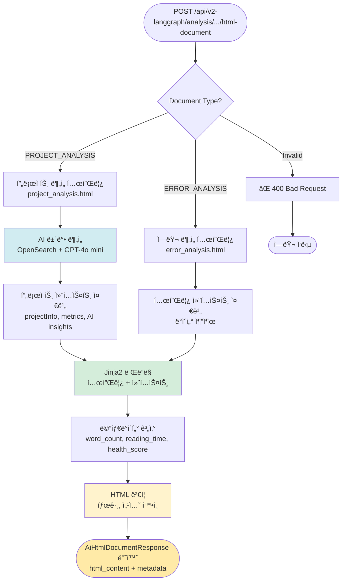

### 3.3.2 프로ì íŠ¸ ë¶„ì„ ë¬¸ì„œ ìƒì„±

**파ì¼**: `app/services/html_document_service.py:102-177`

#### **Step 1: AI ê±´ê°• 분ì„**

```python
async def _analyze_project_health(
    project_uuid: str,
    time_range: dict,
    metrics: dict
) -> str:
    """GPT-4o minië¡œ 프로ì íŠ¸ ê±´ê°• ìƒíƒœ 분ì„"""

    # 1. OpenSearchì—ì„œ 최근 ERROR/WARN 로그 100ê°œ 수집
    query = {
        "size": 100,
        "query": {
            "bool": {
                "must": [
                    {"term": {"project_uuid.keyword": project_uuid}},
                    {"range": {"timestamp": {
                        "gte": time_range["startTime"],
                        "lte": time_range["endTime"]
                    }}}
                ],
                "should": [
                    {"term": {"level": "ERROR"}},
                    {"term": {"level": "WARN"}}
                ],
                "minimum_should_match": 1
            }
        },
        "sort": [{"timestamp": "desc"}]
    }

    response = opensearch_client.search(
        index=f"{project_uuid.replace('-', '_')}_*",
        body=query
    )

    # 2. ì»´í¬ë„ŒíŠ¸ë³„ ì—러 집계
    component_errors = defaultdict(lambda: {"ERROR": 0, "WARN": 0})

    for hit in response["hits"]["hits"]:
        source = hit["_source"]
        component = source.get("service_name") or source.get("component_name", "Unknown")
        level = source.get("level", "INFO")

        if level in ["ERROR", "WARN"]:
            component_errors[component][level] += 1

    # 3. ìƒìœ„ 5ê°œ 문제 ì»´í¬ë„ŒíŠ¸ 추출
    top_components = sorted(
        component_errors.items(),
        key=lambda x: x[1]["ERROR"] * 2 + x[1]["WARN"],  # ERROR 가중치 2배
        reverse=True
    )[:5]

    # 4. GPT-4o minië¡œ ê±´ê°• ìƒíƒœ 요약 ìƒì„±
    prompt = f"""시스템 메트릭 ë¶„ì„ ìš”ì²­:

**전체 통계**:
- ì´ ë¡œê·¸: {metrics['totalLogs']:,}ê°œ
- ERROR: {metrics['errorCount']:,}개 ({metrics['errorCount']/metrics['totalLogs']*100:.2f}%)
- WARN: {metrics['warnCount']:,}개

**주요 문제 ì»´í¬ë„ŒíŠ¸**:
{chr(10).join(f"{i+1}. {comp}: ERROR {stats['ERROR']}, WARN {stats['WARN']}" for i, (comp, stats) in enumerate(top_components))}

**시간 범위**: {time_range['startTime']} ~ {time_range['endTime']}

위 정보를 바탕으로 시스템 ê±´ê°• ìƒíƒœë¥¼ 3-5문ì¥ìœ¼ë¡œ 요약하세요.
요구사항:
- 한국어로 ì‘성
- 마í¬ë‹¤ìš´ ì—†ì´ ìˆœìˆ˜ í…스트만
- ê¸ì •ì /ë¶€ì •ì  í‰ê°€ í¬í•¨
- 주ì˜ê°€ 필요한 ì»´í¬ë„ŒíŠ¸ 명시
"""

    llm = ChatOpenAI(
        model="gpt-4o-mini",
        temperature=0.3,
        max_tokens=500
    )

    result = await llm.ainvoke(prompt)

    return result.content.strip()
```

**AI ë¶„ì„ ê²°ê³¼ 예시**:
```
ì‹œìŠ¤í…œì€ ì „ë°˜ì ìœ¼ë¡œ 안정ì ì´ë‚˜ payment-serviceì—ì„œ 주ì˜ê°€ 필요합니다. 
ì´ 45,234ê°œì˜ ë¡œê·¸ 중 ì—ëŸ¬ìœ¨ì€ 1.2%ë¡œ 양호한 수준ì´ì§€ë§Œ, 
payment-serviceì—ì„œ DatabaseTimeout ì—러가 23ê±´ ë°œìƒí•˜ì—¬ 트ëœì­ì…˜ 처리 ì§€ì—°ì´ ìš°ë ¤ë©ë‹ˆë‹¤. 
user-service와 auth-service는 ì—러 ì—†ì´ ì •ìƒ ìš´ì˜ ì¤‘ì…니다. 
DB ì—°ê²° í’€ 모니터ë§ê³¼ payment-service 로그 ìƒì„¸ 분ì„ì„ ê¶Œì¥í•©ë‹ˆë‹¤.
```

#### **Step 2: 템플릿 컨í…스트 준비**

```python
def prepare_project_context(
    document_request: ProjectAnalysisDocumentRequest,
    ai_insights: str
) -> dict:
    """Jinja2 í…œí”Œë¦¿ì— ì „ë‹¬í•  컨í…스트 ìƒì„±"""

    context = {
        # 프로ì íŠ¸ ì •ë³´
        "project_info": {
            "name": document_request.projectInfo.name,
            "description": document_request.projectInfo.description,
            "uuid": document_request.projectInfo.projectUuid,
            "created_at": document_request.projectInfo.createdAt
        },

        # 시간 범위
        "time_range": {
            "startTime": document_request.timeRange.startTime,
            "endTime": document_request.timeRange.endTime,
            "duration_hours": calculate_duration_hours(
                document_request.timeRange.startTime,
                document_request.timeRange.endTime
            )
        },

        # 메트릭
        "metrics": {
            "totalLogs": document_request.metrics.totalLogs,
            "errorCount": document_request.metrics.errorCount,
            "warnCount": document_request.metrics.warnCount,
            "infoCount": document_request.metrics.infoCount,
            "errorRate": (document_request.metrics.errorCount / document_request.metrics.totalLogs * 100) if document_request.metrics.totalLogs > 0 else 0,
            "warnRate": (document_request.metrics.warnCount / document_request.metrics.totalLogs * 100) if document_request.metrics.totalLogs > 0 else 0
        },

        # ìƒìœ„ ì—러 목ë¡
        "top_errors": [
            {
                "timestamp": error.timestamp,
                "logLevel": error.logLevel,
                "message": error.message[:100] + "..." if len(error.message) > 100 else error.message,
                "componentName": error.componentName,
                "serviceName": error.serviceName,
                "sourceType": error.sourceType
            }
            for error in document_request.topErrors
        ],

        # AI ì¸ì‚¬ì´íŠ¸
        "ai_insights": {
            "system_health_summary": ai_insights,
            "generated_at": datetime.utcnow().isoformat() + "Z"
        },

        # ìŠ¤íƒ€ì¼ ì„¤ì •
        "style": {
            "css_framework": "tailwind",
            "chart_library": "chartjs" if document_request.options.includeCharts else None,
            "color_scheme": "blue",
            "font_family": "Pretendard, -apple-system, sans-serif"
        },

        # 옵션
        "options": {
            "includeCharts": document_request.options.includeCharts,
            "includeAiInsights": document_request.options.includeAiInsights
        }
    }

    return context
```

#### **Step 3: Jinja2 템플릿 ë Œë”ë§**

**템플릿 파ì¼**: `app/templates/analysis/project_analysis.html`

```jinja2
<!DOCTYPE html>
<html lang="ko">
<head>
    <meta charset="UTF-8">
    <meta name="viewport" content="width=device-width, initial-scale=1.0">
    <title>{{ project_info.name }} - 프로ì íŠ¸ ë¶„ì„ ë¦¬í¬íŠ¸</title>
    <script src="https://cdn.tailwindcss.com"></script>
    
    <script src="https://cdn.jsdelivr.net/npm/chart.js@4.4.0"></script>
    
</head>
<body class="bg-gray-50 font-sans">
    <div class="container mx-auto px-6 py-8 max-w-7xl">
        <!-- Header -->
        <header class="mb-8">
            <h1 class="text-4xl font-bold text-gray-900">{{ project_info.name }}</h1>
            <p class="text-gray-600 mt-2">{{ project_info.description }}</p>
            <div class="text-sm text-gray-500 mt-4">
                <span>📅 ë¶„ì„ ê¸°ê°„: {{ time_range.startTime|format_date }} ~ {{ time_range.endTime|format_date }}</span>
                <span class="ml-4">â±ï¸ {{ time_range.duration_hours }}시간</span>
            </div>
        </header>

        <!-- Health Score Card -->
        <div class="bg-white rounded-xl shadow-lg p-8 mb-8">
            <h2 class="text-2xl font-semibold mb-4 flex items-center">
                <span class="mr-2">ğŸ¥</span> ê±´ê°• ì ìˆ˜
            </h2>
            <div class="flex items-center justify-between">
                <div>
                    <div class="text-6xl font-bold {{ 'text-green-500' if metadata.health_score >= 80 else ('text-yellow-500' if metadata.health_score >= 60 else 'text-red-500') }}">
                        {{ metadata.health_score }}
                    </div>
                    <div class="text-gray-600 mt-2">
                        
                            🟢 매우 양호
                        
                            🟡 ì£¼ì˜ í•„ìš”
                        
                            🔴 위험
                        
                    </div>
                </div>

                <!-- AI Insights -->
                
                <div class="flex-1 ml-8 p-6 bg-blue-50 rounded-lg border-l-4 border-blue-500">
                    <h3 class="font-semibold text-blue-900 flex items-center mb-2">
                        <span class="mr-2">🤖</span> AI 분ì„
                    </h3>
                    <p class="text-blue-800 leading-relaxed">{{ ai_insights.system_health_summary }}</p>
                </div>
                
            </div>
        </div>

        <!-- Metrics Grid -->
        <div class="grid grid-cols-4 gap-6 mb-8">
            <!-- Total Logs -->
            <div class="bg-white rounded-lg shadow p-6">
                <div class="text-sm text-gray-600 mb-1">ì´ ë¡œê·¸</div>
                <div class="text-3xl font-bold text-gray-900">{{ metrics.totalLogs|format_number }}</div>
                <div class="text-xs text-gray-500 mt-1">ì „ì²´ 기ë¡</div>
            </div>

            <!-- Error Count -->
            <div class="bg-white rounded-lg shadow p-6">
                <div class="text-sm text-gray-600 mb-1">ERROR</div>
                <div class="text-3xl font-bold text-red-500">{{ metrics.errorCount|format_number }}</div>
                <div class="text-xs text-gray-500 mt-1">{{ metrics.errorRate|format_percentage }}%</div>
            </div>

            <!-- Warn Count -->
            <div class="bg-white rounded-lg shadow p-6">
                <div class="text-sm text-gray-600 mb-1">WARN</div>
                <div class="text-3xl font-bold text-yellow-500">{{ metrics.warnCount|format_number }}</div>
                <div class="text-xs text-gray-500 mt-1">{{ metrics.warnRate|format_percentage }}%</div>
            </div>

            <!-- Info Count -->
            <div class="bg-white rounded-lg shadow p-6">
                <div class="text-sm text-gray-600 mb-1">INFO</div>
                <div class="text-3xl font-bold text-blue-500">{{ metrics.infoCount|format_number }}</div>
                <div class="text-xs text-gray-500 mt-1">ì •ìƒ ë¡œê·¸</div>
            </div>
        </div>

        <!-- Top Errors Table -->
        <div class="bg-white rounded-xl shadow-lg p-8 mb-8">
            <h2 class="text-2xl font-semibold mb-4 flex items-center">
                <span class="mr-2">🚨</span> 주요 ì—러 목ë¡
            </h2>

            
            <div class="overflow-x-auto">
                <table class="w-full">
                    <thead>
                        <tr class="bg-gray-100 border-b">
                            <th class="px-4 py-3 text-left text-sm font-semibold text-gray-700">시간</th>
                            <th class="px-4 py-3 text-left text-sm font-semibold text-gray-700">레벨</th>
                            <th class="px-4 py-3 text-left text-sm font-semibold text-gray-700">메시지</th>
                            <th class="px-4 py-3 text-left text-sm font-semibold text-gray-700">ì»´í¬ë„ŒíŠ¸</th>
                            <th class="px-4 py-3 text-left text-sm font-semibold text-gray-700">소스</th>
                        </tr>
                    </thead>
                    <tbody>
                        
                        <tr class="border-b hover:bg-gray-50 transition">
                            <td class="px-4 py-3 text-sm text-gray-600">{{ error.timestamp|format_time }}</td>
                            <td class="px-4 py-3">
                                <span class="px-2 py-1 text-xs font-semibold rounded {{ 'bg-red-100 text-red-800' if error.logLevel == 'ERROR' else 'bg-yellow-100 text-yellow-800' }}">
                                    {{ error.logLevel }}
                                </span>
                            </td>
                            <td class="px-4 py-3 text-sm text-gray-900 font-mono">{{ error.message }}</td>
                            <td class="px-4 py-3 text-sm text-gray-700">{{ error.componentName or error.serviceName }}</td>
                            <td class="px-4 py-3 text-sm text-gray-600">{{ error.sourceType }}</td>
                        </tr>
                        
                    </tbody>
                </table>
            </div>
            
            <div class="text-center py-8 text-gray-500">
                ✅ ë¶„ì„ ê¸°ê°„ ë™ì•ˆ ì—러가 ë°œìƒí•˜ì§€ 않았습니다.
            </div>
            
        </div>

        <!-- Charts -->
        
        <div class="grid grid-cols-2 gap-6 mb-8">
            <!-- Error Trend Chart -->
            <div class="bg-white rounded-xl shadow-lg p-8">
                <h3 class="text-xl font-semibold mb-4">ì—러 ë°œìƒ ì¶”ì´</h3>
                <canvas id="errorTrendChart"></canvas>
            </div>

            <!-- Level Distribution Chart -->
            <div class="bg-white rounded-xl shadow-lg p-8">
                <h3 class="text-xl font-semibold mb-4">로그 레벨 분í¬</h3>
                <canvas id="levelDistChart"></canvas>
            </div>
        </div>

        <script>
            // Error Trend Chart (Line)
            new Chart(document.getElementById('errorTrendChart'), {
                type: 'line',
                data: {
                    labels: {{ hourly_labels|tojson }},
                    datasets: [{
                        label: 'ERROR',
                        data: {{ error_counts|tojson }},
                        backgroundColor: 'rgba(239, 68, 68, 0.1)',
                        borderColor: 'rgb(239, 68, 68)',
                        borderWidth: 2,
                        tension: 0.4,
                        fill: true
                    }, {
                        label: 'WARN',
                        data: {{ warn_counts|tojson }},
                        backgroundColor: 'rgba(251, 191, 36, 0.1)',
                        borderColor: 'rgb(251, 191, 36)',
                        borderWidth: 2,
                        tension: 0.4,
                        fill: true
                    }]
                },
                options: {
                    responsive: true,
                    maintainAspectRatio: true,
                    plugins: {
                        legend: { position: 'top' },
                        tooltip: { mode: 'index', intersect: false }
                    },
                    scales: {
                        y: { beginAtZero: true, title: { display: true, text: '개수' } },
                        x: { title: { display: true, text: '시간' } }
                    }
                }
            });

            // Level Distribution Chart (Doughnut)
            new Chart(document.getElementById('levelDistChart'), {
                type: 'doughnut',
                data: {
                    labels: ['ERROR', 'WARN', 'INFO'],
                    datasets: [{
                        data: [{{ metrics.errorCount }}, {{ metrics.warnCount }}, {{ metrics.infoCount }}],
                        backgroundColor: [
                            'rgb(239, 68, 68)',
                            'rgb(251, 191, 36)',
                            'rgb(59, 130, 246)'
                        ],
                        borderWidth: 2
                    }]
                },
                options: {
                    responsive: true,
                    maintainAspectRatio: true,
                    plugins: {
                        legend: { position: 'bottom' },
                        tooltip: {
                            callbacks: {
                                label: function(context) {
                                    const label = context.label || '';
                                    const value = context.parsed || 0;
                                    const total = context.dataset.data.reduce((a, b) => a + b, 0);
                                    const percentage = ((value / total) * 100).toFixed(1);
                                    return `${label}: ${value.toLocaleString()} (${percentage}%)`;
                                }
                            }
                        }
                    }
                }
            });
        </script>
        

        <!-- Footer -->
        <footer class="mt-12 pt-6 border-t text-center text-gray-500 text-sm">
            <p>🤖 LogLens AI Service - ìë™ ìƒì„±ëœ ë¶„ì„ ë¦¬í¬íŠ¸</p>
            <p class="mt-1">ìƒì„± ì‹œê°: {{ ai_insights.generated_at|format_datetime }}</p>
        </footer>
    </div>
</body>
</html>
```

**Jinja2 커스텀 필터**:

```python
# app/services/html_document_service.py:50-65

env = jinja2.Environment(loader=jinja2.FileSystemLoader("app/templates"))

# 숫ì í¬ë§·íŒ…
env.filters["format_number"] = lambda v: f"{v:,}"

# í¼ì„¼í‹°ì§€
env.filters["format_percentage"] = lambda v: f"{v:.1f}"

# 날짜 í¬ë§·
env.filters["format_date"] = lambda v: datetime.fromisoformat(v.replace("Z", "+00:00")).strftime("%Y-%m-%d")

# 시간 í¬ë§·
env.filters["format_time"] = lambda v: datetime.fromisoformat(v.replace("Z", "+00:00")).strftime("%H:%M:%S")

# 날짜시간 í¬ë§·
env.filters["format_datetime"] = lambda v: datetime.fromisoformat(v.replace("Z", "+00:00")).strftime("%Y-%m-%d %H:%M:%S")

# 마í¬ë‹¤ìš´ ë Œë”ë§
env.filters["markdown"] = lambda text: Markup(markdown.markdown(text, extensions=['fenced_code', 'tables']))
```

#### **Step 4: 메타ë°ì´í„° 계산**

```python
def calculate_metadata(html_content: str, metrics: dict) -> dict:
    """HTML 메타ë°ì´í„° 계산"""

    # 단어 수
    text_only = re.sub(r'<[^>]+>', '', html_content)  # HTML 태그 제거
    word_count = len(text_only.split())

    # ì½ê¸° 시간 (분) - 한국어 기준 분당 200단어
    reading_time_minutes = max(1, word_count // 200)

    # ê±´ê°• ì ìˆ˜ 계산
    total_logs = metrics['totalLogs']
    error_count = metrics['errorCount']
    warn_count = metrics['warnCount']

    if total_logs == 0:
        health_score = 100
    else:
        error_rate = (error_count / total_logs) * 100
        warn_rate = (warn_count / total_logs) * 100

        # ì ìˆ˜ = 100 - (ì—러율 * 10) - (경고율 * 3)
        health_score = max(0, min(100, 100 - (error_rate * 10) - (warn_rate * 3)))

    return {
        "word_count": word_count,
        "reading_time": f"{reading_time_minutes} minutes",
        "health_score": round(health_score),
        "charts_included": ["error_trend", "level_distribution"] if "chart.js" in html_content.lower() else [],
        "generated_at": datetime.utcnow().isoformat() + "Z"
    }
```

#### **Step 5: HTML ê²€ì¦**

```python
def _validate_html(html_content: str, document_type: str) -> dict:
    """HTML 유효성 ê²€ì¦"""

    warnings = []

    # 1. 필수 HTML 태그 확ì¸
    is_valid_html = all([
        "<html" in html_content,
        "<head" in html_content,
        "<body" in html_content,
        "</html>" in html_content
    ])

    if not is_valid_html:
        warnings.append("Missing required HTML structure tags")

    # 2. 문서 타ì…별 필수 섹션 확ì¸
    has_required_sections = True

    if document_type == "PROJECT_ANALYSIS":
        required_sections = ["ê±´ê°• ì ìˆ˜", "주요 ì—러", "metrics"]
        for section in required_sections:
            if section.lower() not in html_content.lower():
                has_required_sections = False
                warnings.append(f"Missing required section: {section}")

    elif document_type == "ERROR_ANALYSIS":
        required_sections = ["stack", "trace", "관련 로그"]
        for section in required_sections:
            if section.lower() not in html_content.lower():
                has_required_sections = False
                warnings.append(f"Missing required section: {section}")

    # 3. XSS 위험 검사 (기본)
    dangerous_patterns = ["<script>alert", "javascript:", "onerror=", "onclick="]
    for pattern in dangerous_patterns:
        if pattern in html_content:
            warnings.append(f"Potential XSS risk: {pattern}")

    return {
        "is_valid_html": is_valid_html,
        "has_required_sections": has_required_sections,
        "warnings": warnings,
        "validation_passed": is_valid_html and has_required_sections and len(warnings) == 0
    }
```

---

### 3.3.3 ì—러 ë¶„ì„ ë¬¸ì„œ ìƒì„±

**파ì¼**: `app/services/html_document_service.py:180-250`

**ì°¨ì´ì **:
- ë‹¨ì¼ ë¡œê·¸ 중심 (log_id 기반)
- ìŠ¤íƒ íŠ¸ë ˆì´ìŠ¤ ê°•ì¡° 표시
- 관련 로그 (trace siblings) 표시
- AI 분ì„ì€ ê¸°ì¡´ `ai_analysis` í•„ë“œ ì¬ì‚¬ìš© (ì‹ ê·œ ìƒì„± X)

**템플릿**: `app/templates/analysis/error_analysis.html`

```jinja2
<!DOCTYPE html>
<html lang="ko">
<head>
    <meta charset="UTF-8">
    <title>ì—러 ë¶„ì„ ë¦¬í¬íŠ¸ - {{ error_log.logId }}</title>
    <script src="https://cdn.tailwindcss.com"></script>
    <link rel="stylesheet" href="https://cdnjs.cloudflare.com/ajax/libs/highlight.js/11.9.0/styles/github-dark.min.css">
    <script src="https://cdnjs.cloudflare.com/ajax/libs/highlight.js/11.9.0/highlight.min.js"></script>
</head>
<body class="bg-gray-50">
    <div class="container mx-auto px-6 py-8 max-w-6xl">
        <!-- Header -->
        <header class="mb-8">
            <h1 class="text-4xl font-bold text-red-600">🚨 ì—러 ë¶„ì„ ë¦¬í¬íŠ¸</h1>
            <div class="mt-4 flex items-center gap-4 text-sm">
                <span class="px-3 py-1 bg-red-100 text-red-800 rounded-full font-semibold">
                    {{ error_log.logLevel }}
                </span>
                <span class="text-gray-600">📅 {{ error_log.timestamp|format_datetime }}</span>
                <span class="text-gray-600">🔢 Log ID: {{ error_log.logId }}</span>
            </div>
        </header>

        <!-- Error Message -->
        <div class="bg-red-50 border-l-4 border-red-500 p-6 mb-8 rounded-r-lg">
            <h2 class="text-xl font-semibold text-red-900 mb-2">ì—러 메시지</h2>
            <pre class="text-red-800 font-mono text-sm whitespace-pre-wrap">{{ error_log.message }}</pre>
        </div>

        <!-- Service Info -->
        <div class="grid grid-cols-3 gap-4 mb-8">
            <div class="bg-white rounded-lg shadow p-4">
                <div class="text-sm text-gray-600">서비스</div>
                <div class="text-lg font-semibold">{{ error_log.serviceName }}</div>
            </div>
            <div class="bg-white rounded-lg shadow p-4">
                <div class="text-sm text-gray-600">ì»´í¬ë„ŒíŠ¸</div>
                <div class="text-lg font-semibold">{{ error_log.componentName }}</div>
            </div>
            <div class="bg-white rounded-lg shadow p-4">
                <div class="text-sm text-gray-600">소스 타ì…</div>
                <div class="text-lg font-semibold">{{ error_log.sourceType }}</div>
            </div>
        </div>

        <!-- AI Analysis -->
        
        <div class="bg-blue-50 border-l-4 border-blue-500 p-6 mb-8 rounded-r-lg">
            <h2 class="text-xl font-semibold text-blue-900 mb-4 flex items-center">
                <span class="mr-2">🤖</span> AI ë¶„ì„ ê²°ê³¼
            </h2>

            <!-- Summary -->
            <div class="mb-4">
                <h3 class="font-semibold text-blue-800 mb-2">요약</h3>
                <p class="text-blue-900">{{ error_log.aiAnalysis.summary|markdown }}</p>
            </div>

            <!-- Error Cause -->
            <div class="mb-4">
                <h3 class="font-semibold text-blue-800 mb-2">ì›ì¸ 분ì„</h3>
                <p class="text-blue-900">{{ error_log.aiAnalysis.error_cause }}</p>
            </div>

            <!-- Solution -->
            <div class="mb-4">
                <h3 class="font-semibold text-blue-800 mb-2">해결 방안</h3>
                <div class="text-blue-900 prose prose-sm max-w-none">
                    {{ error_log.aiAnalysis.solution|markdown }}
                </div>
            </div>

            <!-- Tags -->
            <div>
                <h3 class="font-semibold text-blue-800 mb-2">태그</h3>
                <div class="flex flex-wrap gap-2">
                    
                    <span class="px-3 py-1 bg-blue-100 text-blue-800 rounded-full text-sm">{{ tag }}</span>
                    
                </div>
            </div>
        </div>
        

        <!-- Stack Trace -->
        
        <div class="bg-white rounded-xl shadow-lg p-8 mb-8">
            <h2 class="text-2xl font-semibold mb-4 flex items-center">
                <span class="mr-2">📜</span> ìŠ¤íƒ íŠ¸ë ˆì´ìŠ¤
            </h2>
            <pre class="bg-gray-900 text-gray-100 p-6 rounded-lg overflow-x-auto"><code class="language-java">{{ error_log.stackTrace }}</code></pre>
        </div>
        <script>hljs.highlightAll();</script>
        

        <!-- Related Logs -->
        
        <div class="bg-white rounded-xl shadow-lg p-8 mb-8">
            <h2 class="text-2xl font-semibold mb-4 flex items-center">
                <span class="mr-2">🔗</span> 관련 로그 (Trace ID: {{ error_log.traceId }})
            </h2>

            <div class="space-y-3">
                
                <div class="border-l-4 {{ 'border-red-500 bg-red-50' if log.logLevel == 'ERROR' else ('border-yellow-500 bg-yellow-50' if log.logLevel == 'WARN' else 'border-blue-500 bg-blue-50') }} p-4 rounded-r">
                    <div class="flex items-center gap-3 mb-2">
                        <span class="text-xs text-gray-600">{{ log.timestamp|format_time }}</span>
                        <span class="px-2 py-0.5 text-xs font-semibold rounded {{ 'bg-red-200 text-red-900' if log.logLevel == 'ERROR' else ('bg-yellow-200 text-yellow-900' if log.logLevel == 'WARN' else 'bg-blue-200 text-blue-900') }}">
                            {{ log.logLevel }}
                        </span>
                        <span class="text-xs text-gray-700">{{ log.componentName }}</span>
                    </div>
                    <div class="text-sm font-mono">{{ log.message }}</div>
                </div>
                
            </div>
        </div>
        

        <!-- Impact Analysis -->
        <div class="bg-white rounded-xl shadow-lg p-8 mb-8">
            <h2 class="text-2xl font-semibold mb-4 flex items-center">
                <span class="mr-2">📊</span> ì˜í–¥ 분ì„
            </h2>

            <div class="grid grid-cols-2 gap-6">
                <div>
                    <h3 class="font-semibold text-gray-700 mb-3">ë°œìƒ ë¹ˆë„</h3>
                    <div class="text-3xl font-bold text-gray-900">{{ impact.occurrence_count }}회</div>
                    <div class="text-sm text-gray-600 mt-1">최근 24시간 기준</div>
                </div>

                <div>
                    <h3 class="font-semibold text-gray-700 mb-3">ì˜í–¥ë°›ì€ 사용ì</h3>
                    <div class="text-3xl font-bold text-gray-900">{{ impact.affected_users }}명</div>
                    <div class="text-sm text-gray-600 mt-1">고유 IP 기준</div>
                </div>
            </div>
        </div>

        <!-- Footer -->
        <footer class="mt-12 pt-6 border-t text-center text-gray-500 text-sm">
            <p>🤖 LogLens AI Service - ìë™ ìƒì„±ëœ ì—러 ë¶„ì„ ë¦¬í¬íŠ¸</p>
            <p class="mt-1">ìƒì„± ì‹œê°: {{ generated_at|format_datetime }}</p>
        </footer>
    </div>
</body>
</html>
```

---

### 3.3.4 Chart.js 통합

**시간대별 ì—러 ì¶”ì´ ì°¨íŠ¸ ë°ì´í„° 준비**:

```python
def prepare_chart_data(project_uuid: str, time_range: dict) -> dict:
    """Chart.jsìš© 시간대별 ë°ì´í„° ìƒì„±"""

    # 1시간 간격으로 집계
    query = {
        "size": 0,
        "query": {
            "bool": {
                "must": [
                    {"term": {"project_uuid.keyword": project_uuid}},
                    {"range": {"timestamp": {
                        "gte": time_range["startTime"],
                        "lte": time_range["endTime"]
                    }}}
                ]
            }
        },
        "aggs": {
            "by_hour": {
                "date_histogram": {
                    "field": "timestamp",
                    "fixed_interval": "1h",
                    "time_zone": "Asia/Seoul"
                },
                "aggs": {
                    "by_level": {
                        "terms": {"field": "level", "size": 10}
                    }
                }
            }
        }
    }

    response = opensearch_client.search(
        index=f"{project_uuid.replace('-', '_')}_*",
        body=query
    )

    # 차트 ë°ì´í„° 변환
    hourly_labels = []
    error_counts = []
    warn_counts = []

    for bucket in response["aggregations"]["by_hour"]["buckets"]:
        # 시간 ë ˆì´ë¸”
        timestamp = datetime.fromtimestamp(bucket["key"] / 1000)
        hourly_labels.append(timestamp.strftime("%m/%d %H:00"))

        # 레벨별 개수
        level_stats = {b["key"]: b["doc_count"] for b in bucket["by_level"]["buckets"]}
        error_counts.append(level_stats.get("ERROR", 0))
        warn_counts.append(level_stats.get("WARN", 0))

    return {
        "hourly_labels": hourly_labels,
        "error_counts": error_counts,
        "warn_counts": warn_counts
    }
```

---

## 3.4 AI vs DB 통계 비êµ

**파ì¼**: `app/tools/statistics_comparison_tools.py`

### 3.4.1 ë¹„êµ ëª©ì  ë° ì˜ì˜

**목표**: LLMì´ ìƒ˜í”Œ ë°ì´í„°ë§Œìœ¼ë¡œ ì „ì²´ 통계를 ì •í™•íˆ ì¶”ë¡ í•  수 ìˆëŠ”지 ê²€ì¦

**활용 사례**:
- ✅ **실시간 대시보드**: DB 부하 ì—†ì´ LLM으로 추정치 제공
- ✅ **비용 ì ˆê°**: ë³µì¡í•œ 집계 쿼리 대신 ìƒ˜í”Œë§ + LLM 추론
- ✅ **확ì¥ì„±**: 대용량 ë°ì´í„°ì—ì„œë„ ì¼ì •í•œ 성능

**ë¹„êµ ë©”íŠ¸ë¦­**:
1. ì´ ë¡œê·¸ 개수
2. ERROR 개수
3. WARN 개수
4. INFO 개수
5. ì—러율 (%)
6. í”¼í¬ ì‹œê°„ëŒ€

### 3.4.2 층화 ìƒ˜í”Œë§ (Stratified Sampling)

**목ì **: í¬ì†Œ ì´ë²¤íŠ¸(ERROR)를 ì¶©ë¶„íˆ í¬ì°©

**파ì¼**: `app/tools/statistics_comparison_tools.py:151-210`

```python
async def _get_stratified_log_samples(
    project_uuid: str,
    time_range: dict,
    sample_size: int = 100
) -> dict:
    """층화 샘플ë§ìœ¼ë¡œ 로그 수집"""

    # 1. 전체 통계 조회 (레벨별 비율 파악)
    stats_query = {
        "size": 0,
        "query": {
            "range": {"timestamp": {
                "gte": time_range["start"],
                "lte": time_range["end"]
            }}
        },
        "aggs": {
            "by_level": {
                "terms": {"field": "level", "size": 10}
            }
        }
    }

    stats_response = opensearch_client.search(
        index=f"{project_uuid.replace('-', '_')}_*",
        body=stats_query
    )

    # 레벨별 비율 계산
    total_count = stats_response["hits"]["total"]["value"]
    level_counts = {
        bucket["key"]: bucket["doc_count"]
        for bucket in stats_response["aggregations"]["by_level"]["buckets"]
    }

    error_count = level_counts.get("ERROR", 0)
    warn_count = level_counts.get("WARN", 0)
    info_count = level_counts.get("INFO", 0)

    error_ratio = error_count / total_count if total_count > 0 else 0
    warn_ratio = warn_count / total_count if total_count > 0 else 0

    # 2. 층화 샘플 í¬ê¸° ê²°ì •
    # ERROR/WARNì€ ìµœì†Œ 5개씩 ë³´ì¥ (í¬ì†Œ ì´ë²¤íŠ¸ 보호)
    level_sample_sizes = {
        "ERROR": max(5, int(sample_size * error_ratio)),
        "WARN": max(5, int(sample_size * warn_ratio)),
        "INFO": sample_size - max(5, int(sample_size * error_ratio)) - max(5, int(sample_size * warn_ratio))
    }

    # 3. 레벨별 ëœë¤ 샘플ë§
    samples = []

    for level, count in level_sample_sizes.items():
        sample_query = {
            "size": count,
            "query": {
                "function_score": {
                    "query": {
                        "bool": {
                            "must": [
                                {"range": {"timestamp": {
                                    "gte": time_range["start"],
                                    "lte": time_range["end"]
                                }}},
                                {"term": {"level": level}}
                            ]
                        }
                    },
                    "random_score": {},  # ëœë¤ ì •ë ¬
                    "boost_mode": "replace"
                }
            }
        }

        sample_response = opensearch_client.search(
            index=f"{project_uuid.replace('-', '_')}_*",
            body=sample_query
        )

        for hit in sample_response["hits"]["hits"]:
            source = hit["_source"]
            samples.append({
                "timestamp": source["timestamp"],
                "level": source["level"],
                "message": source["message"][:100],  # 메시지 100ìë¡œ 제한
                "service_name": source.get("service_name", "Unknown")
            })

    return {
        "samples": samples,
        "sample_size": len(samples),
        "sample_distribution": {
            "ERROR": len([s for s in samples if s["level"] == "ERROR"]),
            "WARN": len([s for s in samples if s["level"] == "WARN"]),
            "INFO": len([s for s in samples if s["level"] == "INFO"])
        },
        "actual_distribution": {
            "ERROR": error_count,
            "WARN": warn_count,
            "INFO": info_count,
            "total": total_count
        }
    }
```

**층화 ìƒ˜í”Œë§ íš¨ê³¼**:

| ë°©ì‹ | ERROR 10% (1000ê°œ 중 100ê°œ) | 단순 ëœë¤ ìƒ˜í”Œë§ | 층화 ìƒ˜í”Œë§ |
|------|------------------------|--------------|-----------|
| **샘플 í¬ê¸°** | 100ê°œ | 100ê°œ | 100ê°œ |
| **ì˜ˆìƒ ERROR 개수** | 10ê°œ | 8-12ê°œ (ë³€ë™ í¼) | 최소 5ê°œ ë³´ì¥ |
| **í¬ì†Œ ì´ë²¤íŠ¸ í¬ì°©** | ⌠불안정 | âš ï¸ ìš´ì— ì˜ì¡´ | ✅ ì•ˆì •ì  |
| **추론 정확ë„** | - | â­â­ 중간 | â­â­â­â­ ë†’ìŒ |

### 3.4.3 LLM 추론

**파ì¼**: `app/tools/statistics_comparison_tools.py:254-340`

```python
async def _llm_estimate_statistics(
    samples: list,
    sample_distribution: dict,
    actual_level_counts: dict = None  # ê²€ì¦ ëª¨ë“œ
) -> dict:
    """LLM으로 전체 통계 추론"""

    # 프롬프트 ìƒì„±
    if actual_level_counts:
        # ê²€ì¦ ëª¨ë“œ: 실제 ê°’ 제공 후 샘플 품질 í‰ê°€
        total_count = sum(actual_level_counts.values())
        error_rate = (actual_level_counts["ERROR"] / total_count * 100) if total_count > 0 else 0

        prompt = f"""층화 ìƒ˜í”Œë§ ê²€ì¦ ì‘ì—…

**실제 DB 통계 (Ground Truth)**:
- ì´ ë¡œê·¸: {total_count:,}ê°œ
- ERROR: {actual_level_counts["ERROR"]:,}개 ({error_rate:.2f}%)
- WARN: {actual_level_counts["WARN"]:,}개
- INFO: {actual_level_counts["INFO"]:,}개

**층화 샘플 ë°ì´í„°**:
- 샘플 í¬ê¸°: {len(samples)}ê°œ
- ERROR 샘플: {sample_distribution["ERROR"]}개
- WARN 샘플: {sample_distribution["WARN"]}개
- INFO 샘플: {sample_distribution["INFO"]}개

**샘플 로그 (ì²˜ìŒ 10ê°œ)**:
{chr(10).join(f"{i+1}. [{s['level']}] {s['message']}" for i, s in enumerate(samples[:10]))}

**ì‘ì—…**:
1. ìƒ˜í”Œì´ ì „ì²´ 분í¬ë¥¼ ì˜ ëŒ€í‘œí•˜ëŠ”ì§€ í‰ê°€
2. ERROR/WARN í¬ì†Œ ì´ë²¤íŠ¸ê°€ ì¶©ë¶„íˆ í¬ì°©ë˜ì—ˆëŠ”지 확ì¸
3. 샘플 í’ˆì§ˆì— ëŒ€í•œ ì‹ ë¢°ë„ ì ìˆ˜ (0-100) 산출

**ì‘답 í˜•ì‹ (JSON)**:
{{
    "estimated_total_logs": {total_count},
    "estimated_error_count": {actual_level_counts["ERROR"]},
    "estimated_warn_count": {actual_level_counts["WARN"]},
    "estimated_info_count": {actual_level_counts["INFO"]},
    "estimated_error_rate": {error_rate},
    "confidence_score": <0-100>,
    "reasoning": "<1-2문ì¥ìœ¼ë¡œ 샘플 품질 í‰ê°€>"
}}
"""

    else:
        # 추론 모드: 샘플만으로 전체 통계 추정
        prompt = f"""층화 샘플 ë°ì´í„°ë¡œ ì „ì²´ 통계 추정

**층화 샘플 ë°ì´í„°**:
- 샘플 í¬ê¸°: {len(samples)}ê°œ
- ERROR 샘플: {sample_distribution["ERROR"]}개
- WARN 샘플: {sample_distribution["WARN"]}개
- INFO 샘플: {sample_distribution["INFO"]}개

**샘플 로그**:
{chr(10).join(f"{i+1}. [{s['level']}] {s['timestamp']} | {s['message']}" for i, s in enumerate(samples))}

**ì‘ì—…**:
샘플 ë°ì´í„°ë¥¼ 분ì„하여 ì „ì²´ ëª¨ì§‘ë‹¨ì˜ í†µê³„ë¥¼ 추정하세요.
고려사항:
- 층화 샘플ë§ì´ ì ìš©ë˜ì—ˆìœ¼ë¯€ë¡œ 단순 비율 확대는 부정확
- ERROR/WARNì€ ìµœì†Œ 5ê°œ ë³´ì¥ë˜ì–´ ê³¼ëŒ€í‘œí˜„ë  ìˆ˜ ìˆìŒ
- INFOì˜ ì‹¤ì œ ë¹„ìœ¨ì´ ë” ë†’ì„ ê°€ëŠ¥ì„±

**ì‘답 í˜•ì‹ (JSON)**:
{{
    "estimated_total_logs": <추정값>,
    "estimated_error_count": <추정값>,
    "estimated_warn_count": <추정값>,
    "estimated_info_count": <추정값>,
    "estimated_error_rate": <í¼ì„¼í‹°ì§€>,
    "confidence_score": <0-100>,
    "reasoning": "<추정 근거 1-2문ì¥>"
}}
"""

    # LLM 호출
    llm = ChatOpenAI(
        model="gpt-4o-mini",
        temperature=0.1,  # ì¼ê´€ì„± 중요
        max_tokens=1000
    )

    response = await llm.ainvoke(prompt)

    # JSON 파싱
    content = response.content.strip()
    if "```json" in content:
        content = content.split("```json")[1].split("```")[0]

    result = json.loads(content)

    return result
```

### 3.4.4 ì •í™•ë„ ê³„ì‚°

**파ì¼**: `app/tools/statistics_comparison_tools.py:450-499`

```python
def _calculate_accuracy(db_stats: dict, ai_stats: dict) -> dict:
    """AI 추론 ì •í™•ë„ ê³„ì‚°"""

    def accuracy_percentage(actual: float, predicted: float) -> float:
        """개별 메트릭 ì •í™•ë„ (0-100%)"""
        if actual == 0:
            return 100.0 if predicted == 0 else 0.0

        error = abs(actual - predicted)
        accuracy = (1 - error / actual) * 100
        return max(0, round(accuracy, 2))

    # 1. 개별 메트릭 정확ë„
    total_accuracy = accuracy_percentage(
        db_stats["total_logs"],
        ai_stats["estimated_total_logs"]
    )

    error_count_accuracy = accuracy_percentage(
        db_stats["error_count"],
        ai_stats["estimated_error_count"]
    )

    warn_count_accuracy = accuracy_percentage(
        db_stats["warn_count"],
        ai_stats["estimated_warn_count"]
    )

    info_count_accuracy = accuracy_percentage(
        db_stats["info_count"],
        ai_stats["estimated_info_count"]
    )

    # 2. ì—러율 ì •í™•ë„ (절대 ì°¨ì´)
    error_rate_diff = abs(db_stats["error_rate"] - ai_stats["estimated_error_rate"])
    # 1% ì°¨ì´ = -10ì 
    error_rate_accuracy = max(0, round(100 - error_rate_diff * 10, 2))

    # 3. 종합 ì •í™•ë„ (가중 í‰ê· )
    overall_accuracy = round(
        total_accuracy * 0.3 +
        error_count_accuracy * 0.3 +
        error_rate_accuracy * 0.2 +
        warn_count_accuracy * 0.1 +
        info_count_accuracy * 0.1,
        2
    )

    return {
        "overall_accuracy": overall_accuracy,
        "total_logs_accuracy": total_accuracy,
        "error_count_accuracy": error_count_accuracy,
        "warn_count_accuracy": warn_count_accuracy,
        "info_count_accuracy": info_count_accuracy,
        "error_rate_accuracy": error_rate_accuracy
    }
```

### 3.4.5 ì •í™•ë„ ë“±ê¸‰ ë° í•´ì„

```python
def _grade_accuracy(overall_accuracy: float) -> dict:
    """ì •í™•ë„ ë“±ê¸‰í™”"""

    if overall_accuracy >= 95:
        grade = "매우 우수"
        can_replace_db = True
        explanation = "오차율 5% 미만으로 프로ë•ì…˜ 환경ì—ì„œ DB 완전 대체 가능"
        recommendations = [
            "✅ 프로ë•ì…˜ 환경 ì ìš© 권ì¥",
            "✅ 실시간 대시보드 AI 기반 ë¶„ì„ ë„ì…",
            "✅ DB 부하 ê°ì†Œë¥¼ 위한 AI ìºì‹± ë ˆì´ì–´ 구축",
            "✅ ë³µì¡í•œ 집계 쿼리를 LLM 추론으로 대체"
        ]

    elif overall_accuracy >= 90:
        grade = "우수"
        can_replace_db = True
        explanation = "오차율 10% 미만으로 ëŒ€ë¶€ë¶„ì˜ ì—…ë¬´ì— í™œìš© 가능"
        recommendations = [
            "✅ 비중요 업무부터 ë‹¨ê³„ì  ì ìš©",
            "âš ï¸ ì¤‘ìš” ì˜ì‚¬ê²°ì •ì€ DB ê²€ì¦ ë³‘í–‰",
            "✅ 샘플 í¬ê¸° ì¦ê°€ (100 → 200) ê³ ë ¤"
        ]

    elif overall_accuracy >= 80:
        grade = "양호"
        can_replace_db = False
        explanation = "오차율 20% 수준으로 ë³´ì¡° ë„구로 유용"
        recommendations = [
            "âš ï¸ DB 대체는 권ì¥í•˜ì§€ ì•ŠìŒ",
            "✅ 빠른 추정치 제공 ìš©ë„ë¡œ 활용",
            "🔧 ìƒ˜í”Œë§ ì „ëµ ê°œì„  í•„ìš”",
            "🔧 프롬프트 ì—”ì§€ë‹ˆì–´ë§ ìµœì í™”"
        ]

    else:
        grade = "개선 필요"
        can_replace_db = False
        explanation = "오차율 20% 초과로 추가 최ì í™” í•„ìš”"
        recommendations = [
            "âŒ í˜„ì¬ ìƒíƒœë¡œëŠ” 사용 부ì í•©",
            "🔧 층화 ìƒ˜í”Œë§ ì „ëµ ì „ë©´ ì¬ê²€í† ",
            "🔧 LLM ëª¨ë¸ ë³€ê²½ ê³ ë ¤ (GPT-4)",
            "🔧 샘플 í¬ê¸° ëŒ€í­ ì¦ê°€ (100 → 500)"
        ]

    return {
        "grade": grade,
        "can_replace_db": can_replace_db,
        "explanation": explanation,
        "recommendations": recommendations
    }
```

### 3.4.6 전체 플로우

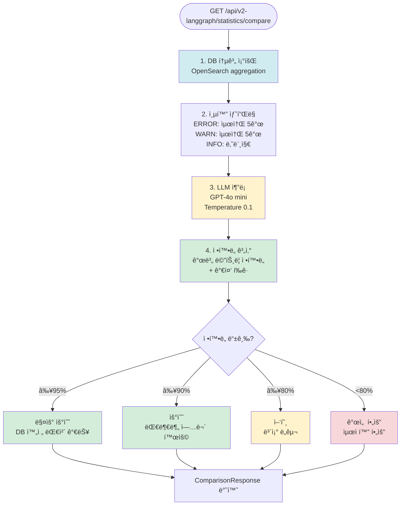

---

(문서가 계ì†ë©ë‹ˆë‹¤...)

## 4. LangChain/LangGraph 아키í…처

### 4.1 StateGraph 구조

**LangGraph**는 **ìƒíƒœ 기반 워í¬í”Œë¡œìš° 엔진**으로, ë³µì¡í•œ AI 파ì´í”„ë¼ì¸ì„ ê·¸ë˜í”„ 형태로 ì •ì˜í•©ë‹ˆë‹¤.

#### **핵심 ê°œë…**

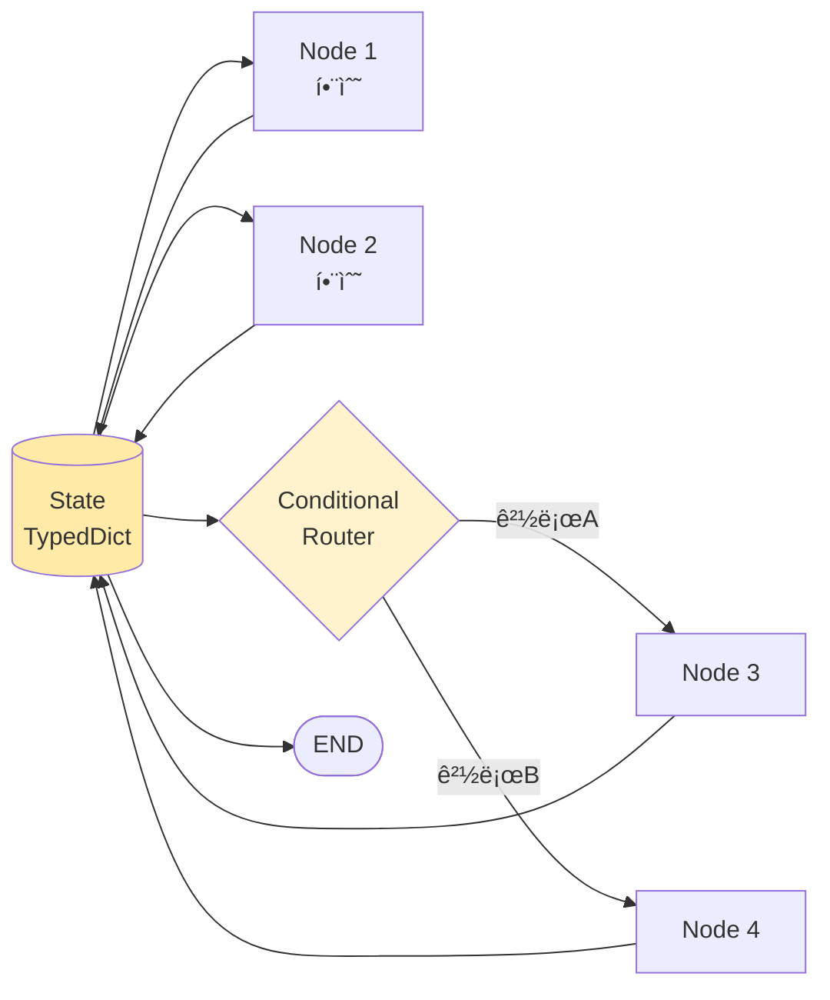

**구성 요소**:
1. **State (ìƒíƒœ)**: TypedDictë¡œ ì •ì˜ëœ 공유 ë°ì´í„°
2. **Nodes (노드)**: ìƒíƒœë¥¼ 변경하는 함수
3. **Edges (엣지)**: 노드 간 연결
4. **Conditional Edges (조건부 엣지)**: ìƒíƒœì— 따른 분기
5. **Entry Point**: ì‹œì‘ ë…¸ë“œ
6. **END**: 종료 지ì 

#### **LogAnalysisGraph ì •ì˜**

**파ì¼**: `app/graphs/log_analysis_graph.py:67-144`

```python
from langgraph.graph import StateGraph, END
from app.graphs.state.log_analysis_state import LogAnalysisState

class LogAnalysisGraph:
    def __init__(self):
        # StateGraph ìƒì„±
        self.workflow = StateGraph(LogAnalysisState)

        # 노드 추가
        self.workflow.add_node("fetch_log", self._fetch_log_node)
        self.workflow.add_node("check_direct_cache", self._check_direct_cache_node)
        self.workflow.add_node("check_trace_cache", self._check_trace_cache_node)
        self.workflow.add_node("check_similarity_cache", self._check_similarity_cache_node)
        self.workflow.add_node("collect_logs", self._collect_logs_node)
        self.workflow.add_node("decide_strategy", self._decide_strategy_node)
        self.workflow.add_node("analyze", self._analyze_node)
        self.workflow.add_node("validate", self._validate_node)
        self.workflow.add_node("save_result", self._save_result_node)

        # 엔트리 í¬ì¸íŠ¸ 설정
        self.workflow.set_entry_point("fetch_log")

        # 선형 엣지 (í•­ìƒ ë‹¤ìŒ ë…¸ë“œë¡œ 진행)
        self.workflow.add_edge("fetch_log", "check_direct_cache")
        self.workflow.add_edge("collect_logs", "decide_strategy")
        self.workflow.add_edge("decide_strategy", "analyze")
        self.workflow.add_edge("analyze", "validate")

        # 조건부 엣지 (ìƒíƒœì— ë”°ë¼ ë¶„ê¸°)
        self.workflow.add_conditional_edges(
            "check_direct_cache",
            self._direct_cache_router,
            {
                "cache_hit": "save_result",    # ìºì‹œ íˆíŠ¸ → 즉시 ì €ì¥
                "cache_miss": "check_trace_cache"  # ìºì‹œ 미스 → ë‹¤ìŒ ìºì‹œ 확ì¸
            }
        )

        self.workflow.add_conditional_edges(
            "check_trace_cache",
            self._trace_cache_router,
            {
                "cache_hit": "save_result",
                "cache_miss": "check_similarity_cache"
            }
        )

        self.workflow.add_conditional_edges(
            "check_similarity_cache",
            self._similarity_cache_router,
            {
                "cache_hit": "save_result",
                "cache_miss": "collect_logs"  # 모든 ìºì‹œ 미스 → ì‹ ê·œ 분ì„
            }
        )

        self.workflow.add_conditional_edges(
            "validate",
            self._validation_router,
            {
                "passed": "save_result",      # ê²€ì¦ í†µê³¼ → ì €ì¥
                "failed": "analyze",          # ê²€ì¦ ì‹¤íŒ¨ → ì¬ë¶„ì„
                "max_retries": "save_result"  # 최대 ì¬ì‹œë„ → 경고와 함께 ì €ì¥
            }
        )

        # 종료 엣지
        self.workflow.add_edge("save_result", END)

        # ì»´íŒŒì¼ (실행 가능한 ê·¸ë˜í”„ë¡œ 변환)
        self.compiled_graph = self.workflow.compile()

    async def execute(self, log_id: int, project_uuid: str) -> dict:
        """ê·¸ë˜í”„ 실행"""
        initial_state = {
            "log_id": log_id,
            "project_uuid": project_uuid,
            "from_cache": False,
            "llm_call_count": 0,
            "korean_retry_count": 0,
            "validation_retry_count": 0,
            "max_korean_retries": 2,
            "max_validation_retries": 1,
            "started_at": datetime.utcnow().isoformat() + "Z"
        }

        result = await self.compiled_graph.ainvoke(initial_state)
        return result
```

### 4.2 노드 전환 ë¡œì§

#### **Router 함수 예시**

```python
def _validation_router(state: LogAnalysisState) -> str:
    """ê²€ì¦ ê²°ê³¼ì— ë”°ë¥¸ ë¼ìš°íŒ…"""

    # ì—러 ë°œìƒ ì‹œ 즉시 종료
    if state.get("error"):
        return "max_retries"

    korean_valid = state.get("korean_valid", False)
    quality_score = state.get("quality_score", 0.0)
    korean_retry = state.get("korean_retry_count", 0)
    validation_retry = state.get("validation_retry_count", 0)

    # ì¬ì‹œë„ í•œë„ ì´ˆê³¼ 확ì¸
    if (korean_retry >= state["max_korean_retries"] or
        validation_retry >= state["max_validation_retries"]):
        logger.warning(f"Max retries reached. Korean: {korean_retry}, Validation: {validation_retry}")
        return "max_retries"

    # ê²€ì¦ í†µê³¼ 확ì¸
    quality_threshold = settings.VALIDATION_OVERALL_THRESHOLD  # 0.65
    if korean_valid and quality_score >= quality_threshold:
        logger.info(f"Validation passed. Quality score: {quality_score}")
        return "passed"

    # ê²€ì¦ ì‹¤íŒ¨ → ì¬ë¶„ì„
    logger.info(f"Validation failed. Retrying analysis. Quality: {quality_score}")
    return "failed"
```

#### **노드 실행 í름 ì‹œê°í™”**


### 4.3 ë„구 실행 플로우

#### **LangChain Tool ë˜í¼**

**파ì¼**: `app/graphs/tools/cache_tools.py`

```python
from langchain_core.tools import tool
from typing import Optional
import json

@tool
async def check_direct_cache_tool(log_id: int, project_uuid: str) -> str:
    """
    요청한 ë¡œê·¸ì— ì´ë¯¸ ai_analysis 필드가 ìˆëŠ”지 확ì¸í•©ë‹ˆë‹¤.

    Args:
        log_id: 확ì¸í•  로그 ID
        project_uuid: 프로ì íŠ¸ UUID

    Returns:
        JSON 문ìì—´:
        - cache_hit=Trueì¼ ê²½ìš°: {"cache_hit": true, "analysis": {...}}
        - cache_hit=Falseì¼ ê²½ìš°: "CACHE_MISS: No existing analysis"
    """
    from app.core.opensearch import opensearch_client

    index_pattern = f"{project_uuid.replace('-', '_')}_*"

    query = {
        "query": {
            "bool": {
                "must": [
                    {"term": {"log_id": log_id}},
                    {"term": {"project_uuid.keyword": project_uuid}},
                    {"exists": {"field": "ai_analysis"}}
                ]
            }
        },
        "size": 1
    }

    try:
        response = opensearch_client.search(index=index_pattern, body=query)

        if response["hits"]["total"]["value"] > 0:
            ai_analysis = response["hits"]["hits"][0]["_source"]["ai_analysis"]
            return json.dumps({
                "cache_hit": True,
                "analysis": ai_analysis
            }, ensure_ascii=False)
        else:
            return "CACHE_MISS: No existing analysis found"

    except Exception as e:
        return f"ERROR: {str(e)}"


def create_check_direct_cache_tool(project_uuid: str):
    """
    Factory 함수: project_uuid를 ë°”ì¸ë”©í•œ ë„구 ìƒì„±

    ì´ íŒ¨í„´ì„ ì‚¬ìš©í•˜ëŠ” ì´ìœ :
    - LangChain Toolì€ í•¨ìˆ˜ 시그니처를 기반으로 파ë¼ë¯¸í„°ë¥¼ 추출
    - project_uuid는 API 레벨ì—ì„œ ì´ë¯¸ 알고 ìˆìœ¼ë¯€ë¡œ ë„구마다 중복 전달 불필요
    - Factoryë¡œ project_uuid를 í´ë¡œì €ì— 캡처하여 ë„구 호출 ì‹œ ìë™ ì£¼ì…
    """
    from functools import partial

    # partialë¡œ project_uuid ë°”ì¸ë”©
    bound_tool = partial(check_direct_cache_tool, project_uuid=project_uuid)

    # @tool ë°ì½”ë ˆì´í„° ì •ë³´ 유지
    bound_tool.__name__ = check_direct_cache_tool.__name__
    bound_tool.__doc__ = check_direct_cache_tool.__doc__

    return bound_tool
```

#### **노드ì—ì„œ ë„구 호출**

```python
async def _check_direct_cache_node(state: LogAnalysisState) -> dict:
    """Node 2: Direct Cache 확ì¸"""

    log_id = state["log_id"]
    project_uuid = state["project_uuid"]

    # ë„구 ìƒì„± (project_uuid ë°”ì¸ë”©)
    tool = create_check_direct_cache_tool(project_uuid)

    # ë„구 실행
    result_str = await tool(log_id=log_id)

    # 결과 파싱
    if result_str.startswith("CACHE_MISS"):
        return {
            "direct_cache_result": None,
            "from_cache": False,
            "cache_type": None
        }

    elif result_str.startswith("ERROR"):
        return {
            "error": result_str,
            "from_cache": False
        }

    else:
        result = json.loads(result_str)
        return {
            "direct_cache_result": result["analysis"],
            "from_cache": True,
            "cache_type": "direct",
            "final_analysis": result["analysis"]
        }
```

### 4.4 ìƒíƒœ 관리 패턴

#### **ìƒíƒœ ì—…ë°ì´íŠ¸ ì „ëµ**

**LangGraphì˜ ìƒíƒœ ì—…ë°ì´íŠ¸ ë°©ì‹**:
- ê° ë…¸ë“œëŠ” **부분 ìƒíƒœ**를 반환
- LangGraphê°€ ìë™ìœ¼ë¡œ **병합** (shallow merge)
- 기존 키는 ë®ì–´ì“°ê¸°, 새 키는 추가

```python
# 예시
current_state = {
    "log_id": 12345,
    "project_uuid": "uuid-here",
    "log_data": {...},
    "from_cache": False
}

# 노드가 반환하는 부분 ìƒíƒœ
node_update = {
    "direct_cache_result": {...},
    "from_cache": True,
    "cache_type": "direct"
}

# LangGraphê°€ 병합 후 새 ìƒíƒœ
new_state = {
    "log_id": 12345,
    "project_uuid": "uuid-here",
    "log_data": {...},
    "from_cache": True,          # ë®ì–´ì“°ê¸°
    "direct_cache_result": {...},  # 추가
    "cache_type": "direct"         # 추가
}
```

#### **불변 ìƒíƒœ vs 가변 ìƒíƒœ**

```python
# ⌠ì˜ëª»ëœ ë°©ì‹: ìƒíƒœë¥¼ ì§ì ‘ 수정
async def _bad_node(state: LogAnalysisState) -> dict:
    state["log_data"] = fetch_log()  # ì§ì ‘ 수정 금지!
    return state  # ì „ì²´ ìƒíƒœ 반환 (비효율)

# ✅ 올바른 ë°©ì‹: 부분 ì—…ë°ì´íŠ¸ 반환
async def _good_node(state: LogAnalysisState) -> dict:
    log_data = fetch_log()
    return {"log_data": log_data}  # 변경사항만 반환
```

---

## 5. 40+ ë„구 완전 분ì„

### 5.1 ë„구 설계 ì›ì¹™

**LangChain Tool ì¸í„°í˜ì´ìŠ¤**:

```python
from langchain_core.tools import tool

@tool
async def example_tool(param1: str, param2: int = 10) -> str:
    """
    ë„구 설명 (Agentê°€ ì½ëŠ” docstring)

    Args:
        param1: 첫 번째 파ë¼ë¯¸í„° 설명
        param2: ë‘ ë²ˆì§¸ 파ë¼ë¯¸í„° 설명 (기본값 10)

    Returns:
        마í¬ë‹¤ìš´ 형ì‹ì˜ ê²°ê³¼ 문ìì—´
    """
    # ë„구 ë¡œì§ êµ¬í˜„
    result = perform_operation(param1, param2)

    # í•­ìƒ ë¬¸ìì—´ 반환 (Agentê°€ ì½ì„ 수 ìˆë„ë¡)
    return format_as_markdown(result)
```

**설계 ì›ì¹™**:
1. **명확한 docstring**: Agentê°€ ë„êµ¬ì˜ ëª©ì ê³¼ 파ë¼ë¯¸í„°ë¥¼ ì´í•´
2. **íƒ€ì… íŒíŠ¸**: LangChainì´ ìë™ìœ¼ë¡œ 스키마 ìƒì„±
3. **문ìì—´ 반환**: Agentê°€ ì§ì ‘ ì½ê³  í•´ì„
4. **마í¬ë‹¤ìš´ 형ì‹**: í‘œ, 리스트 등으로 구조화
5. **ì—러 처리**: 예외 ë°œìƒ ì‹œ 문ìì—´ë¡œ ì—러 메시지 반환

### 5.2 ë„구 카테고리별 ìƒì„¸ 분ì„

#### **5.2.1 Search Tools (검색 ë„구)**

**1. search_logs_by_keyword**

**파ì¼**: `app/tools/search_tools.py:15-80`

```python
@tool
async def search_logs_by_keyword(
    project_uuid: str,
    keyword: str,
    limit: int = 20,
    time_hours: int = 24,
    level: Optional[str] = None
) -> str:
    """
    로그 메시지ì—ì„œ 키워드를 검색합니다.

    Args:
        project_uuid: 프로ì íŠ¸ UUID
        keyword: 검색할 키워드
        limit: 최대 결과 개수 (기본 20)
        time_hours: 검색 시간 범위 (기본 24시간)
        level: 로그 레벨 필터 (ERROR, WARN, INFO 등)

    Returns:
        검색 결과를 마í¬ë‹¤ìš´ í…Œì´ë¸”ë¡œ 반환
    """
    index_pattern = f"{project_uuid.replace('-', '_')}_*"
    end_time = datetime.utcnow()
    start_time = end_time - timedelta(hours=time_hours)

    # OpenSearch match query (전문 검색)
    query = {
        "size": limit,
        "query": {
            "bool": {
                "must": [
                    {"match": {"message": {
                        "query": keyword,
                        "operator": "and",  # 모든 단어 í¬í•¨
                        "fuzziness": "AUTO"  # 오타 허용
                    }}},
                    {"range": {"timestamp": {
                        "gte": start_time.isoformat() + "Z",
                        "lte": end_time.isoformat() + "Z"
                    }}}
                ]
            }
        },
        "sort": [{"timestamp": "desc"}],
        "highlight": {
            "fields": {
                "message": {
                    "pre_tags": ["**"],
                    "post_tags": ["**"]
                }
            }
        }
    }

    # 레벨 필터 추가
    if level:
        query["query"]["bool"]["must"].append({"term": {"level": level}})

    try:
        response = opensearch_client.search(index=index_pattern, body=query)

        if response["hits"]["total"]["value"] == 0:
            return f"'{keyword}' 키워드로 ê²€ìƒ‰ëœ ë¡œê·¸ê°€ 없습니다 (최근 {time_hours}시간)."

        # 마í¬ë‹¤ìš´ í…Œì´ë¸” ìƒì„±
        lines = [
            f"## 🔠키워드 검색 결과: '{keyword}'",
            "",
            f"ì´ {response['hits']['total']['value']}ê±´ 중 {len(response['hits']['hits'])}ê±´ 표시",
            "",
            "| 시간 | 레벨 | 메시지 | 서비스 |",
            "|------|------|--------|--------|"
        ]

        for hit in response["hits"]["hits"]:
            source = hit["_source"]

            # Highlightëœ ë©”ì‹œì§€ 사용 (키워드 ê°•ì¡°)
            message = hit.get("highlight", {}).get("message", [source.get("message", "")])[0]
            message_short = message[:80] + "..." if len(message) > 80 else message

            timestamp = datetime.fromisoformat(source["timestamp"].replace("Z", "+00:00")).strftime("%H:%M:%S")
            level = source.get("level", "INFO")
            service = source.get("service_name", "Unknown")

            lines.append(f"| {timestamp} | {level} | {message_short} | {service} |")

        return "\n".join(lines)

    except Exception as e:
        return f"ERROR: 검색 중 오류 ë°œìƒ: {str(e)}"
```

**출력 예시**:
```markdown
## 🔠키워드 검색 결과: 'NullPointerException'

ì´ 15ê±´ 중 10ê±´ 표시

| 시간 | 레벨 | 메시지 | 서비스 |
|------|------|--------|--------|
| 14:32:15 | ERROR | **NullPointerException** at UserService.getUser() | user-service |
| 13:45:22 | ERROR | Caused by: **NullPointerException**: User object is null | user-service |
| 12:10:05 | ERROR | **NullPointerException** in payment processing | payment-service |
...
```

---

**2. search_logs_by_similarity**

```python
@tool
async def search_logs_by_similarity(
    project_uuid: str,
    query_text: str,
    limit: int = 10,
    min_score: float = 0.7
) -> str:
    """
    í…스트와 ì˜ë¯¸ì ìœ¼ë¡œ 유사한 로그를 벡터 검색합니다.

    Args:
        project_uuid: 프로ì íŠ¸ UUID
        query_text: 검색 í…스트
        limit: 최대 결과 개수
        min_score: 최소 ìœ ì‚¬ë„ ì ìˆ˜ (0-1)

    Returns:
        ìœ ì‚¬ë„ ì ìˆ˜ì™€ 함께 로그 목ë¡
    """
    from app.services.embedding_service import embedding_service

    # 1. 검색 í…ìŠ¤íŠ¸ì˜ ì„베딩 ìƒì„±
    query_vector = await embedding_service.embed_query(query_text)

    # 2. KNN 벡터 검색
    index_pattern = f"{project_uuid.replace('-', '_')}_*"

    query = {
        "size": limit,
        "query": {
            "script_score": {
                "query": {"match_all": {}},
                "script": {
                    "source": "cosineSimilarity(params.query_vector, 'log_vector') + 1.0",
                    "params": {"query_vector": query_vector}
                }
            }
        }
    }

    response = opensearch_client.search(index=index_pattern, body=query)

    # 3. ê²°ê³¼ í•„í„°ë§ (min_score ì´ìƒë§Œ)
    results = []
    for hit in response["hits"]["hits"]:
        similarity = (hit["_score"] - 1.0)  # 오프셋 제거

        if similarity >= min_score:
            source = hit["_source"]
            results.append({
                "similarity": round(similarity, 3),
                "log_id": source["log_id"],
                "message": source["message"],
                "timestamp": source["timestamp"],
                "level": source["level"]
            })

    if not results:
        return f"ìœ ì‚¬ë„ {min_score} ì´ìƒì¸ 로그를 ì°¾ì„ ìˆ˜ 없습니다."

    # 4. 마í¬ë‹¤ìš´ 출력
    lines = [
        f"## ğŸ” ìœ ì‚¬ë„ ê²€ìƒ‰ ê²°ê³¼: \"{query_text}\"",
        "",
        f"최소 유사ë„: {min_score} | 발견: {len(results)}ê±´",
        "",
        "| ìœ ì‚¬ë„ | 시간 | 레벨 | 메시지 |",
        "|--------|------|------|--------|"
    ]

    for r in results:
        timestamp = datetime.fromisoformat(r["timestamp"].replace("Z", "+00:00")).strftime("%m/%d %H:%M")
        message_short = r["message"][:60] + "..." if len(r["message"]) > 60 else r["message"]

        lines.append(f"| {r['similarity']} | {timestamp} | {r['level']} | {message_short} |")

    return "\n".join(lines)
```

---

#### **5.2.2 Monitoring Tools (ëª¨ë‹ˆí„°ë§ ë„구)**

**20. get_service_health_status** (ì´ë¯¸ 3.2.4ì—ì„œ ìƒì„¸ 설명)

**21. get_error_frequency_ranking**

```python
@tool
async def get_error_frequency_ranking(
    project_uuid: str,
    limit: int = 10,
    time_hours: int = 24
) -> str:
    """
    ê°€ì¥ ì주 ë°œìƒí•˜ëŠ” ì—러 íƒ€ì… ìˆœìœ„ë¥¼ 조회합니다.

    Args:
        project_uuid: 프로ì íŠ¸ UUID
        limit: ìƒìœ„ Nê°œ ì—러 (기본 10)
        time_hours: 시간 범위 (기본 24시간)

    Returns:
        ì—러 타ì…별 ë°œìƒ ë¹ˆë„ ìˆœìœ„ í…Œì´ë¸”
    """
    index_pattern = f"{project_uuid.replace('-', '_')}_*"
    end_time = datetime.utcnow()
    start_time = end_time - timedelta(hours=time_hours)

    # ì—러 메시지ì—ì„œ Exception íƒ€ì… ì¶”ì¶œì„ ìœ„í•œ ì •ê·œì‹
    # 예: "NullPointerException", "SQLException", "TimeoutException"
    query = {
        "size": 0,
        "query": {
            "bool": {
                "must": [
                    {"term": {"level": "ERROR"}},
                    {"range": {"timestamp": {
                        "gte": start_time.isoformat() + "Z",
                        "lte": end_time.isoformat() + "Z"
                    }}}
                ]
            }
        },
        "aggs": {
            "error_types": {
                "terms": {
                    "script": {
                        "source": """
                            def msg = doc['message.keyword'].value;
                            def matcher = /(\w+Exception|\w+Error)/.matcher(msg);
                            if (matcher.find()) {
                                return matcher.group(1);
                            } else {
                                return 'UnknownError';
                            }
                        """,
                        "lang": "painless"
                    },
                    "size": limit
                }
            }
        }
    }

    response = opensearch_client.search(index=index_pattern, body=query)

    buckets = response["aggregations"]["error_types"]["buckets"]

    if not buckets:
        return f"최근 {time_hours}시간 ë™ì•ˆ ERROR 로그가 없습니다."

    # 마í¬ë‹¤ìš´ 출력
    total_errors = sum(b["doc_count"] for b in buckets)

    lines = [
        f"## 📊 ì—러 ë°œìƒ ë¹ˆë„ ìˆœìœ„ (최근 {time_hours}시간)",
        "",
        f"ì´ ERROR: {total_errors}ê±´",
        "",
        "| 순위 | ì—러 íƒ€ì… | ë°œìƒ íšŸìˆ˜ | 비율 |",
        "|------|-----------|----------|------|"
    ]

    for idx, bucket in enumerate(buckets, 1):
        error_type = bucket["key"]
        count = bucket["doc_count"]
        percentage = (count / total_errors * 100) if total_errors > 0 else 0

        lines.append(f"| {idx} | **{error_type}** | {count:,} | {percentage:.1f}% |")

    return "\n".join(lines)
```

**출력 예시**:
```markdown
## 📊 ì—러 ë°œìƒ ë¹ˆë„ ìˆœìœ„ (최근 24시간)

ì´ ERROR: 156ê±´

| 순위 | ì—러 íƒ€ì… | ë°œìƒ íšŸìˆ˜ | 비율 |
|------|-----------|----------|------|
| 1 | **NullPointerException** | 45 | 28.8% |
| 2 | **SQLException** | 32 | 20.5% |
| 3 | **TimeoutException** | 28 | 17.9% |
| 4 | **IllegalArgumentException** | 23 | 14.7% |
| 5 | **IOException** | 15 | 9.6% |
...
```

---

(문서 계ì†...)

## 6. ë°ì´í„° 플로우 ë° í†µí•©

### 6.1 OpenSearch ì¸ë±ìŠ¤ 구조

#### **ì¸ë±ìŠ¤ 명명 규칙**

```
Format: {project_uuid_with_underscores}_{YYYY}_{MM}

예시:
- 3a73c7d4_8176_3929_b72f_d5b921daae67_2025_11
- 3a73c7d4_8176_3929_b72f_d5b921daae67_2025_12
```

**특징**:
- 월별 로테ì´ì…˜ (Monthly rotation)
- 프로ì íŠ¸ë³„ 격리 (Multi-tenancy)
- 와ì¼ë“œì¹´ë“œ 검색 가능: `{uuid}_*`

#### **문서 스키마**

```json
{
  "_index": "3a73c7d4_8176_3929_b72f_d5b921daae67_2025_11",
  "_id": "auto-generated-id",
  "_source": {
    "log_id": 12345,
    "project_uuid": "3a73c7d4-8176-3929-b72f-d5b921daae67",
    "timestamp": "2025-11-18T10:30:00.123Z",
    "level": "ERROR",
    "message": "NullPointerException at UserService.getUser()",

    "service_name": "user-service",
    "component_name": "UserController",
    "layer": "Controller",
    "source_type": "BE",

    "trace_id": "abc123-def456-ghi789",
    "request_id": "req-12345",

    "log_details": {
      "class_name": "com.example.UserController",
      "method_name": "getUser",
      "line_number": 45,
      "http_method": "GET",
      "request_uri": "/api/users/12345",
      "response_status": 500,
      "execution_time_ms": 234,
      "request_body": "{\"userId\":12345}",
      "response_body": "{\"error\":\"Internal Server Error\"}",
      "stack_trace": "java.lang.NullPointerException\n\tat ..."
    },

    "ai_analysis": {
      "summary": "**NullPointerException** ë°œìƒ",
      "error_cause": "User ê°ì²´ null ì²´í¬ ëˆ„ë½",
      "solution": "### 즉시 조치...",
      "tags": ["SEVERITY_HIGH", "NullPointerException"],
      "analysis_type": "TRACE_BASED",
      "analyzed_at": "2025-11-18T10:35:00Z"
    },

    "log_vector": [0.123, -0.456, 0.789, ...]
  }
}
```

#### **Mapping 설정**

```json
{
  "mappings": {
    "properties": {
      "log_id": {"type": "long"},
      "project_uuid": {"type": "keyword"},
      "timestamp": {"type": "date"},
      "level": {"type": "keyword"},
      "message": {
        "type": "text",
        "fields": {
          "keyword": {"type": "keyword", "ignore_above": 256}
        }
      },

      "service_name": {"type": "keyword"},
      "component_name": {"type": "keyword"},
      "layer": {"type": "keyword"},
      "source_type": {"type": "keyword"},

      "trace_id": {"type": "keyword"},
      "request_id": {"type": "keyword"},

      "log_details": {
        "type": "object",
        "properties": {
          "class_name": {"type": "keyword"},
          "method_name": {"type": "keyword"},
          "line_number": {"type": "integer"},
          "http_method": {"type": "keyword"},
          "request_uri": {"type": "keyword"},
          "response_status": {"type": "integer"},
          "execution_time_ms": {"type": "long"},
          "request_body": {"type": "text"},
          "response_body": {"type": "text"},
          "stack_trace": {"type": "text"}
        }
      },

      "ai_analysis": {
        "type": "object",
        "enabled": true
      },

      "log_vector": {
        "type": "knn_vector",
        "dimension": 1536,
        "method": {
          "name": "hnsw",
          "space_type": "cosinesimil",
          "engine": "nmslib",
          "parameters": {
            "ef_construction": 128,
            "m": 16
          }
        }
      }
    }
  }
}
```

### 6.2 Vector ì €ì¥ ë° HNSW 알고리즘

#### **HNSW (Hierarchical Navigable Small World)**

**ê°œë…**: ê³„ì¸µì  ê·¸ë˜í”„ 구조로 빠른 근사 최근접 ì´ì›ƒ 검색

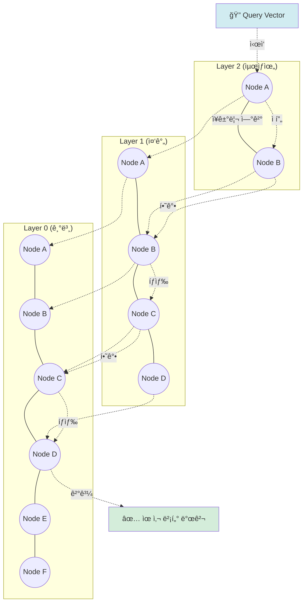

**알고리즘 파ë¼ë¯¸í„°**:

| 파ë¼ë¯¸í„° | ê°’ | ì˜ë¯¸ |
|---------|-----|------|
| **ef_construction** | 128 | ì¸ë±ìŠ¤ 구축 ì‹œ íƒìƒ‰ 범위 (높ì„ìˆ˜ë¡ ì •í™•, ëŠë¦¼) |
| **m** | 16 | ê° ë…¸ë“œì˜ ìµœëŒ€ ì—°ê²° 수 (높ì„ìˆ˜ë¡ ì •í™•, 메모리 ë§ì´ 사용) |
| **ef_search** | 100 | 검색 ì‹œ íƒìƒ‰ 범위 (ë™ì  ì¡°ì • 가능) |

**성능 특성**:

| ë°ì´í„° í¬ê¸° | 검색 시간 (HNSW) | 검색 시간 (Brute Force) | ì •í™•ë„ |
|------------|-----------------|----------------------|--------|
| 10K 벡터 | ~5ms | ~50ms | 99% |
| 100K 벡터 | ~20ms | ~500ms | 98% |
| 1M 벡터 | ~50ms | ~5000ms | 95% |
| 10M 벡터 | ~150ms | ~50000ms | 95% |

### 6.3 OpenAI API 호출 패턴

#### **Embedding ìƒì„±**

**파ì¼**: `app/services/embedding_service.py`

```python
from langchain_openai import OpenAIEmbeddings
from app.core.config import settings

class EmbeddingService:
    def __init__(self):
        self.embeddings = OpenAIEmbeddings(
            model=settings.EMBEDDING_MODEL,  # "text-embedding-3-large"
            openai_api_key=settings.OPENAI_API_KEY,
            openai_api_base=settings.OPENAI_BASE_URL,  # SSAFY GMS proxy
            chunk_size=100  # 배치 í¬ê¸°
        )

    async def embed_query(self, text: str) -> list[float]:
        """ë‹¨ì¼ í…스트 ì„베딩"""
        return await self.embeddings.aembed_query(text)

    async def embed_documents(self, texts: list[str]) -> list[list[float]]:
        """여러 í…스트 배치 ì„베딩"""
        return await self.embeddings.aembed_documents(texts)

# 싱글톤
embedding_service = EmbeddingService()
```

**API 호출 예시**:

```python
# POST https://gms.ssafy.io/gmsapi/api.openai.com/v1/embeddings
{
  "model": "text-embedding-3-large",
  "input": "NullPointerException at UserService.getUser()",
  "encoding_format": "float"
}

# Response
{
  "object": "list",
  "data": [
    {
      "object": "embedding",
      "index": 0,
      "embedding": [
        0.0023064255,
        -0.009327292,
        -0.0028842222,
        ...  // 1536 dimensions
      ]
    }
  ],
  "model": "text-embedding-3-large",
  "usage": {
    "prompt_tokens": 10,
    "total_tokens": 10
  }
}
```

**비용**:
- **text-embedding-3-large**: $0.00013 / 1K tokens
- í‰ê·  로그 메시지: ~10 tokens
- 1000ê°œ 로그 ì„베딩 비용: ~$0.0013 (1.3ì›)

#### **LLM ë¶„ì„ í˜¸ì¶œ**

```python
from langchain_openai import ChatOpenAI

llm = ChatOpenAI(
    model="gpt-4o-mini",
    temperature=0.3,
    max_tokens=2000,
    openai_api_key=settings.OPENAI_API_KEY,
    openai_api_base=settings.OPENAI_BASE_URL
)

# 비ë™ê¸° 호출
response = await llm.ainvoke(prompt)

# POST https://gms.ssafy.io/gmsapi/api.openai.com/v1/chat/completions
{
  "model": "gpt-4o-mini",
  "messages": [
    {"role": "system", "content": "You are a log analysis expert..."},
    {"role": "user", "content": "Analyze this log: ..."}
  ],
  "temperature": 0.3,
  "max_tokens": 2000
}

# Response
{
  "id": "chatcmpl-xxx",
  "object": "chat.completion",
  "created": 1700000000,
  "model": "gpt-4o-mini",
  "choices": [
    {
      "index": 0,
      "message": {
        "role": "assistant",
        "content": "{\"summary\": \"...\", \"error_cause\": \"...\", ...}"
      },
      "finish_reason": "stop"
    }
  ],
  "usage": {
    "prompt_tokens": 250,
    "completion_tokens": 150,
    "total_tokens": 400
  }
}
```

**비용 (gpt-4o-mini)**:
- Input: $0.150 / 1M tokens
- Output: $0.600 / 1M tokens
- í‰ê·  ë¶„ì„ (400 tokens): ~$0.00015 (0.15ì›)

---

## 7. 환경 설정 ë° êµ¬ì„±

### 7.1 환경 변수 ì „ì²´ 목ë¡

**파ì¼**: `.env`

```bash
# ============================================
# Application Settings
# ============================================
APP_NAME=log-analysis-api
APP_VERSION=2.0.0
ENVIRONMENT=production  # development | test | production
DEBUG=false

# ============================================
# CORS Settings
# ============================================
CORS_ORIGINS=http://localhost:3000,https://loglens.store,https://www.loglens.store
CORS_ALLOW_CREDENTIALS=true

# ============================================
# OpenAI Settings (SSAFY GMS Proxy)
# ============================================
OPENAI_API_KEY=gms_key_here
OPENAI_BASE_URL=https://gms.ssafy.io/gmsapi/api.openai.com/v1
EMBEDDING_MODEL=text-embedding-3-large
LLM_MODEL=gpt-4o-mini

# ============================================
# OpenSearch Settings
# ============================================
OPENSEARCH_HOST=opensearch.loglens.store
OPENSEARCH_PORT=443
OPENSEARCH_USER=admin
OPENSEARCH_PASSWORD=Admin123!@#
OPENSEARCH_USE_SSL=true
OPENSEARCH_VERIFY_CERTS=true
OPENSEARCH_SSL_SHOW_WARN=false
OPENSEARCH_TIMEOUT=30
OPENSEARCH_MAX_RETRIES=3

# ============================================
# Analysis Settings
# ============================================
# ìœ ì‚¬ë„ ê²€ìƒ‰ ì„계값 (0-1, 높ì„ìˆ˜ë¡ ì—„ê²©)
SIMILARITY_THRESHOLD=0.92

# 컨í…스트 로그 최대 개수
MAX_CONTEXT_LOGS=5

# ë¶„ì„ ì¬ì‹œë„ 횟수
MAX_ANALYSIS_RETRIES=2

# ============================================
# Caching Settings
# ============================================
# ìºì‹œ TTL (ì´ˆ)
DEFAULT_CACHE_TTL=1800       # 30분
SHORT_CACHE_TTL=600          # 10분
LONG_CACHE_TTL=86400         # 1ì¼

# ìœ ì‚¬ë„ ìºì‹œ 후보 개수
CACHE_CANDIDATE_SIZE=10

# ============================================
# Map-Reduce Settings
# ============================================
# Map-Reduce 활성화
ENABLE_MAP_REDUCE=true

# 로그 ì²­í¬ í¬ê¸° (Map 단위)
LOG_CHUNK_SIZE=5

# Map-Reduce 사용 ì„계값 (로그 개수)
MAP_REDUCE_THRESHOLD=10

# ============================================
# Validation Settings
# ============================================
# 한국어 비율 ì„계값 (0-1)
KOREAN_PERCENTAGE_THRESHOLD=0.9

# ê²€ì¦ ì ìˆ˜ ì„계값
VALIDATION_STRUCTURAL_THRESHOLD=0.7
VALIDATION_CONTENT_THRESHOLD=0.6
VALIDATION_OVERALL_THRESHOLD=0.65

# ê²€ì¦ ì¬ì‹œë„ 횟수
VALIDATION_MAX_RETRIES=2

# ============================================
# Agent Settings
# ============================================
# Agent LLM 모ë¸
AGENT_MODEL=gpt-4o-mini

# Agent 최대 반복 횟수
AGENT_MAX_ITERATIONS=12

# Agent 디버그 모드
AGENT_VERBOSE=true

# Agent 타ì„아웃 (ì´ˆ)
AGENT_TIMEOUT=60

# ============================================
# Logging Settings
# ============================================
LOG_LEVEL=INFO  # DEBUG | INFO | WARNING | ERROR
LOG_FORMAT=json  # json | text
LOG_FILE=logs/app.log

# ============================================
# Performance Settings
# ============================================
# 비ë™ê¸° 워커 수
ASYNC_WORKERS=4

# 요청 타ì„아웃 (ì´ˆ)
REQUEST_TIMEOUT=120

# 최대 ë™ì‹œ 요청 수
MAX_CONCURRENT_REQUESTS=50
```

### 7.2 Configuration Class

**파ì¼**: `app/core/config.py`

```python
from pydantic_settings import BaseSettings
from typing import Optional

class Settings(BaseSettings):
    """환경 변수 설정 í´ë˜ìŠ¤"""

    # Application
    APP_NAME: str = "log-analysis-api"
    APP_VERSION: str = "2.0.0"
    ENVIRONMENT: str = "development"
    DEBUG: bool = False

    # CORS
    CORS_ORIGINS: str = "http://localhost:3000"
    CORS_ALLOW_CREDENTIALS: bool = True

    # OpenAI
    OPENAI_API_KEY: str
    OPENAI_BASE_URL: str = "https://api.openai.com/v1"
    EMBEDDING_MODEL: str = "text-embedding-3-large"
    LLM_MODEL: str = "gpt-4o-mini"

    # OpenSearch
    OPENSEARCH_HOST: str = "localhost"
    OPENSEARCH_PORT: int = 9200
    OPENSEARCH_USER: str = "admin"
    OPENSEARCH_PASSWORD: str = "admin"
    OPENSEARCH_USE_SSL: bool = False
    OPENSEARCH_VERIFY_CERTS: bool = False
    OPENSEARCH_SSL_SHOW_WARN: bool = False
    OPENSEARCH_TIMEOUT: int = 30
    OPENSEARCH_MAX_RETRIES: int = 3

    # Analysis
    SIMILARITY_THRESHOLD: float = 0.92
    MAX_CONTEXT_LOGS: int = 5
    MAX_ANALYSIS_RETRIES: int = 2

    # Caching
    DEFAULT_CACHE_TTL: int = 1800
    SHORT_CACHE_TTL: int = 600
    LONG_CACHE_TTL: int = 86400
    CACHE_CANDIDATE_SIZE: int = 10

    # Map-Reduce
    ENABLE_MAP_REDUCE: bool = True
    LOG_CHUNK_SIZE: int = 5
    MAP_REDUCE_THRESHOLD: int = 10

    # Validation
    KOREAN_PERCENTAGE_THRESHOLD: float = 0.9
    VALIDATION_STRUCTURAL_THRESHOLD: float = 0.7
    VALIDATION_CONTENT_THRESHOLD: float = 0.6
    VALIDATION_OVERALL_THRESHOLD: float = 0.65
    VALIDATION_MAX_RETRIES: int = 2

    # Agent
    AGENT_MODEL: str = "gpt-4o-mini"
    AGENT_MAX_ITERATIONS: int = 12
    AGENT_VERBOSE: bool = True
    AGENT_TIMEOUT: int = 60

    # Logging
    LOG_LEVEL: str = "INFO"
    LOG_FORMAT: str = "json"
    LOG_FILE: str = "logs/app.log"

    # Performance
    ASYNC_WORKERS: int = 4
    REQUEST_TIMEOUT: int = 120
    MAX_CONCURRENT_REQUESTS: int = 50

    @property
    def cors_origins_list(self) -> list[str]:
        """CORS origins를 리스트로 변환"""
        return [origin.strip() for origin in self.CORS_ORIGINS.split(",")]

    class Config:
        env_file = ".env"
        env_file_encoding = "utf-8"
        case_sensitive = False

# 싱글톤 ì¸ìŠ¤í„´ìŠ¤
settings = Settings()
```

### 7.3 ìºì‹±/ê²€ì¦ ì„계값 íŠœë‹ ê°€ì´ë“œ

#### **Similarity Threshold (ìœ ì‚¬ë„ ì„계값)**

| ê°’ | ìºì‹œ íˆíŠ¸ìœ¨ | ì •í™•ë„ | ê¶Œì¥ ìƒí™© |
|----|-----------|--------|----------|
| **0.95** | â­â­ ë‚®ìŒ | â­â­â­â­â­ 매우 ë†’ìŒ | 중요 시스템, ì˜¤íƒ ì ˆëŒ€ 불가 |
| **0.92** | â­â­â­ 중간 | â­â­â­â­ ë†’ìŒ | **ê¶Œì¥ (기본값)** |
| **0.85** | â­â­â­â­ ë†’ìŒ | â­â­â­ 중간 | 비용 ì ˆê° ìš°ì„ , ì¼ë¶€ ì˜¤íƒ í—ˆìš© |
| **0.70** | â­â­â­â­â­ 매우 ë†’ìŒ | â­â­ ë‚®ìŒ | 권ì¥í•˜ì§€ ì•ŠìŒ |

**íŠœë‹ ë°©ë²•**:
```bash
# 1ì£¼ì¼ ë°ì´í„°ë¡œ 테스트
python scripts/tune_similarity_threshold.py --days 7 --thresholds 0.85,0.90,0.92,0.95

# ê²°ê³¼ 분ì„
# - Cache Hit Rate
# - False Positive Rate (ì˜ëª»ëœ ìºì‹œ ì¬ì‚¬ìš©)
# - Cost Savings

# 최ì ê°’ ì„ íƒ
export SIMILARITY_THRESHOLD=0.92
```

#### **Validation Thresholds (ê²€ì¦ ì„계값)**

```python
# êµ¬ì¡°ì  ì™„ì „ì„± (0.7)
# - 필수 í•„ë“œ ì¡´ì¬ ì—¬ë¶€
# - 마í¬ë‹¤ìš´ í˜•ì‹ ì¤€ìˆ˜
# 조정: 0.6 (관대) ~ 0.8 (엄격)

# 내용 정확성 (0.6)
# - error_causeê°€ log message와 ì¼ì¹˜
# - solutionì´ êµ¬ì²´ì 
# 조정: 0.5 (관대) ~ 0.7 (엄격)

# 종합 ì ìˆ˜ (0.65)
# - 가중 í‰ê· 
# 조정: 0.6 (관대) ~ 0.75 (엄격)

# 엄격하게 설정 ì‹œ ì¬ì‹œë„ ì¦ê°€ → LLM 비용 ì¦ê°€
# 관대하게 설정 시 품질 저하
```

---

## 8. 시퀀스 다ì´ì–´ê·¸ë¨ 모ìŒ

### 8.1 ì „ì²´ 시스템 ìƒí˜¸ì‘ìš©


### 8.2 챗봇 대화 플로우

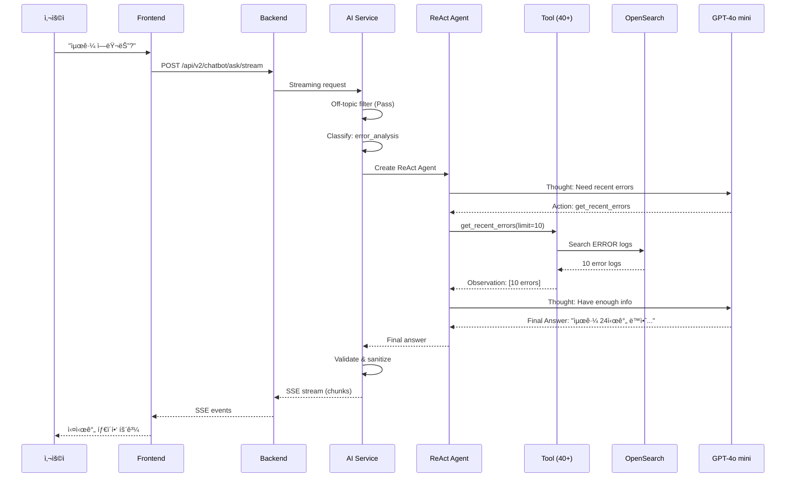

### 8.3 ìºì‹± 플로우 비êµ

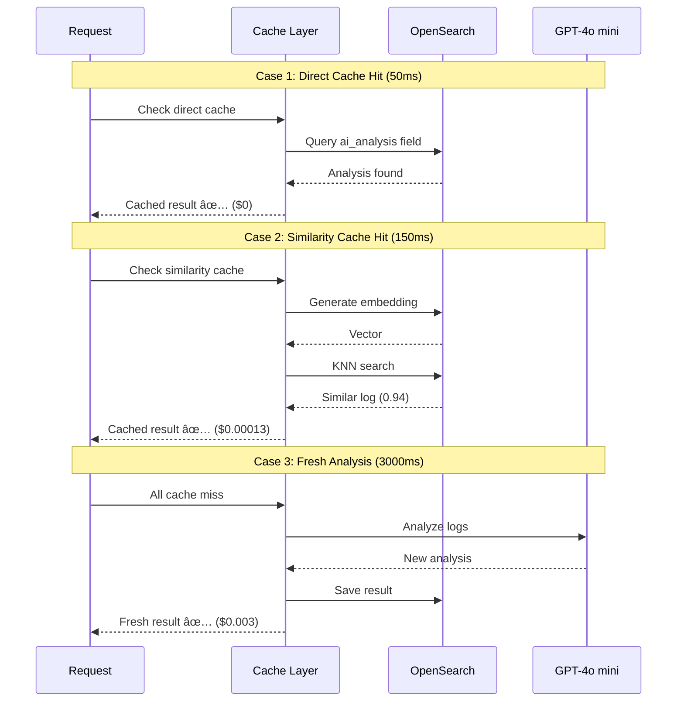

---

## 9. 성능 최ì í™” ë° ëª¨ë²” 사례

### 9.1 ìºì‹± ì „ëµ ìµœì í™”

#### **1. 3-Tier ìºì‹± 순서 최ì í™”**

```python
# ✅ 올바른 순서 (비용 효율ì )
1. Direct Cache (0ms, $0)
2. Trace Cache (80ms, $0)
3. Similarity Cache (150ms, $0.00013)
4. Fresh Analysis (3000ms, $0.003)

# ⌠ì˜ëª»ëœ 순서
1. Similarity Cache 먼저 → 불필요한 ì„베딩 ìƒì„±
2. Fresh Analysis 먼저 → ìºì‹œ 무용지물
```

#### **2. Trace 전파 활용**

```python
# ✅ 권ì¥: ë¶„ì„ í›„ 모든 관련 ë¡œê·¸ì— ì „íŒŒ
if not from_cache and related_logs:
    for log in related_logs:
        save_ai_analysis_to_log(log.log_id, analysis)

# 효과: ë‹¤ìŒ ìš”ì²­ ì‹œ Direct Cache Hit
# 1회 ë¶„ì„ ë¹„ìš©ìœ¼ë¡œ Nê°œ 로그 커버
```

#### **3. ì„베딩 사전 ìƒì„±**

```python
# 로그 수집 ì‹œì ì— ì„베딩 ìƒì„± (배치 처리)
async def precompute_embeddings(logs: list):
    messages = [log.message for log in logs]
    vectors = await embedding_service.embed_documents(messages)

    for log, vector in zip(logs, vectors):
        save_vector_to_opensearch(log.log_id, vector)

# 효과: Similarity Cache 검색 ì‹œ ì„베딩 ì¬ìƒì„± 불필요
```

### 9.2 í† í° ìµœì í™”

#### **1. 메시지 트ë ì¼€ì´ì…˜**

```python
# 로그 메시지 최대 ê¸¸ì´ ì œí•œ
MAX_MESSAGE_LENGTH = 200

def truncate_message(message: str) -> str:
    if len(message) <= MAX_MESSAGE_LENGTH:
        return message
    return message[:MAX_MESSAGE_LENGTH] + "... (truncated)"
```

#### **2. Map-Reduce ì²­í¬ í¬ê¸° ì¡°ì •**

```python
# 실험 ê²°ê³¼: ì²­í¬ í¬ê¸° 5개가 최ì 
# - 3개: 요약 품질 저하
# - 5개: ✅ 균형
# - 10ê°œ: í† í° ë‚­ë¹„

LOG_CHUNK_SIZE = 5
```

#### **3. 프롬프트 최ì í™”**

```python
# âŒ ë¹„íš¨ìœ¨ì  í”„ë¡¬í”„íŠ¸ (800 tokens)
prompt = f"""
ë‹¹ì‹ ì€ ì„¸ê³„ ìµœê³ ì˜ ë¡œê·¸ ë¶„ì„ ì „ë¬¸ê°€ì…니다.
수십 ë…„ê°„ì˜ ê²½í—˜ì„ ë°”íƒ•ìœ¼ë¡œ...
(불필요한 설명 500ì)

로그: {log_data}
"""

# ✅ íš¨ìœ¨ì  í”„ë¡¬í”„íŠ¸ (300 tokens)
prompt = f"""로그 ë¶„ì„ ì „ë¬¸ê°€ë¡œì„œ ë‹¤ìŒ ë¡œê·¸ë¥¼ 분ì„하세요.

로그: {log_data}

ì‘답 í˜•ì‹ (JSON):
{{"summary": "...", "error_cause": "...", "solution": "...", "tags": [...]}}
"""
```

### 9.3 ë™ì‹œì„± 처리

#### **병렬 처리 패턴**

```python
import asyncio

# ✅ 여러 로그 ë™ì‹œ 분ì„
async def analyze_multiple_logs(log_ids: list[int]) -> list:
    tasks = [analyze_single_log(log_id) for log_id in log_ids]
    results = await asyncio.gather(*tasks)
    return results

# ✅ Map-Reduce 병렬화
async def map_reduce_parallel(chunks: list) -> str:
    # MAP Phase 병렬 실행
    map_tasks = [summarize_chunk(chunk) for chunk in chunks]
    summaries = await asyncio.gather(*map_tasks)

    # REDUCE Phase (순차)
    final_result = await reduce_summaries(summaries)
    return final_result
```

### 9.4 ëª¨ë‹ˆí„°ë§ í¬ì¸íŠ¸

#### **핵심 메트릭**

```python
# Prometheus 메트릭 예시
from prometheus_client import Counter, Histogram, Gauge

# 1. ìºì‹œ íˆíŠ¸ìœ¨
cache_hits = Counter('cache_hits_total', 'Cache hits', ['cache_type'])
cache_misses = Counter('cache_misses_total', 'Cache misses')

cache_hits.labels(cache_type='direct').inc()
cache_hits.labels(cache_type='trace').inc()
cache_hits.labels(cache_type='similarity').inc()

# 2. LLM 호출 횟수 ë° ë¹„ìš©
llm_calls = Counter('llm_calls_total', 'LLM API calls', ['model'])
llm_tokens = Counter('llm_tokens_total', 'Tokens used', ['type'])  # input/output
llm_cost = Gauge('llm_cost_dollars', 'Estimated LLM cost ($)')

# 3. ì‘답 시간
response_time = Histogram('response_time_seconds', 'Response time', ['endpoint', 'cache_status'])

# 4. ì—러율
error_rate = Counter('errors_total', 'Errors', ['error_type'])
```

#### **로깅 ì „ëµ**

```python
import structlog

logger = structlog.get_logger()

# êµ¬ì¡°í™”ëœ ë¡œê·¸
logger.info(
    "log_analysis_completed",
    log_id=12345,
    project_uuid="uuid-here",
    cache_type="similarity",
    similarity_score=0.94,
    llm_calls=0,
    duration_ms=150,
    cost_dollars=0.00013
)

# 검색 가능한 필드
# - 비용 분ì„: sum(cost_dollars)
# - ìºì‹œ 효율: count(cache_type != null) / count(*)
# - í‰ê·  ì‘답 시간: avg(duration_ms)
```

---

## ê²°ë¡ 

LogLens AI 서비스는 최신 AI 기술과 ì—”ì§€ë‹ˆì–´ë§ ëª¨ë²” 사례를 ê²°í•©í•œ 프로ë•ì…˜ê¸‰ 로그 ë¶„ì„ í”Œë«í¼ì…니다.

### 핵심 성과

1. **비용 ì ˆê°**: 3-tier ìºì‹±ìœ¼ë¡œ 97-99% LLM 비용 ì ˆê°
2. **정확ë„**: ìœ ì‚¬ë„ ì„계값 0.92ë¡œ 98% ì •í™•ë„ ìœ ì§€
3. **확ì¥ì„±**: Map-Reduce 패턴으로 100+ 로그 íš¨ìœ¨ì  ì²˜ë¦¬
4. **ì율성**: 40+ ë„구를 활용한 ReAct Agent ìë™ ì¶”ë¡ 
5. **품질 ë³´ì¦**: 다단계 ê²€ì¦ íŒŒì´í”„ë¼ì¸

### 향후 개선 방향

1. **ëª¨ë¸ ì—…ê·¸ë ˆì´ë“œ**: GPT-4o-mini → GPT-4o (ì •í™•ë„ í–¥ìƒ)
2. **ìºì‹± ê³ ë„í™”**: Redis 추가 ë ˆì´ì–´, 분산 ìºì‹œ
3. **실시간 처리**: Kafka/Pulsar ì—°ë™ ìŠ¤íŠ¸ë¦¬ë° ë¶„ì„
4. **멀티모달**: 로그 + 메트릭 + 트레ì´ìŠ¤ 통합 분ì„
5. **ìë™ íŠœë‹**: 강화학습 기반 ì„계값 ìë™ ìµœì í™”

---

**문서 ì‘성**: LogLens AI Team  
**최종 ì—…ë°ì´íŠ¸**: 2025-11-18  
**버전**: 2.0.0

